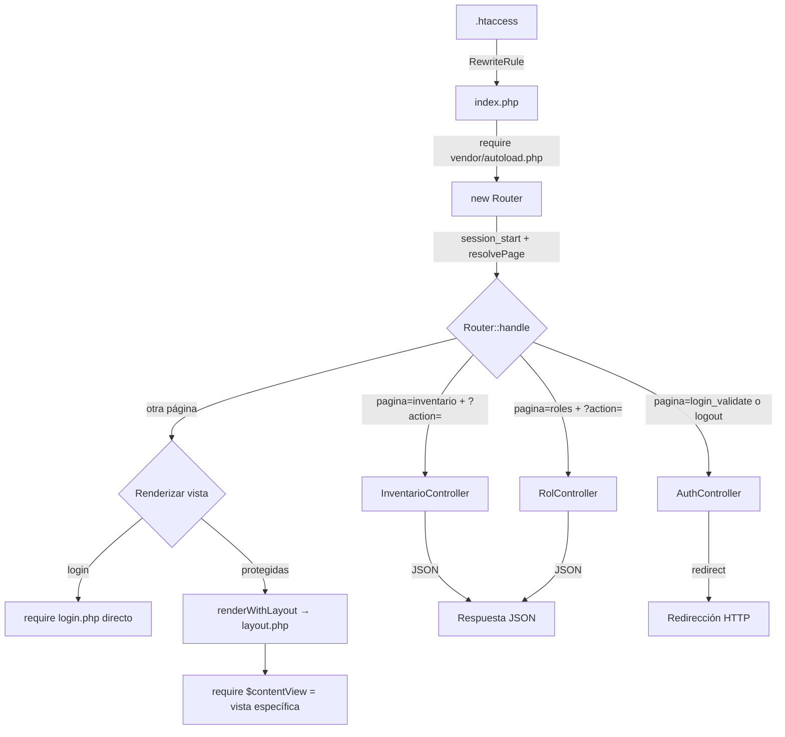

# Diagrama de Clases — EIS Zona Web Lara (Estado OOP Actual)

## Visión General

La aplicación ha sido migrada parcialmente de procedural a POO con **10 clases OOP actuales** organizadas bajo el namespace `App\` (PSR-4), más **2 archivos procedurales legacy** en proceso de reemplazo.

---

## Diagrama de Clases (Mermaid)

```mermaid
classDiagram
    %% ==================== CORE ====================
    class Database {
        <<singleton>>
        -static ?PDO $instance
        +static getConnection() PDO
    }

    class Model {
        <<abstract>>
        #PDO $db
        +__construct()
    }

    class Router {
        -string $pagina
        +__construct()
        +handle() void
        -resolvePage() string
        -isAjaxInventario() bool
        -isAjaxRoles() bool
        -isAuthAction() bool
        -requireAuth() void
        -runInventarioController() void
        -runRolController() void
        -runAuthAction() void
        -renderView() void
        -renderWithLayout(string $contentView) void
    }

    %% ==================== MODELS ====================
    class Usuario {
        +crear(string $username, string $password, string $nombre, string $email, ?string $telefono, int $rol_id) bool
        +obtenerTodos() array
        +obtenerPorId(int $id) array|false
        +obtenerPorUsername(string $username) array|false
        +autenticar(string $username, string $password) array|false
        +actualizar(int $id, string $nombre, string $email, ?string $telefono, ?int $rol_id, bool $activo) bool
        +actualizarPassword(int $id, string $password) bool
        +eliminar(int $id) bool
    }

    class Rol {
        +listarRoles() array
        +obtenerRolPorId(int $id) array|false
        +crearRol(string $nombre, string $descripcion) bool
        +actualizarRol(int $id, string $nombre, string $descripcion) bool
        +eliminarRol(int $id) bool
        +obtenerPermisos() array
        +obtenerPermisosPorRol(int $rol_id) array
        +guardarPermisosRol(int $rol_id, array $permiso_ids) bool
        +obtenerRoles() array
        +obtenerUsuarios() array
        +asignarRolAUsuario(int $usuario_id, int $rol_id) bool
        +totalRoles() int
        +totalPermisos() int
    }

    class inventario {
        +crearProducto(string $codigo, string $nombre, int $categoria_id, int $stock, int $stock_minimo, float $costo_compra, float $precio_venta) bool
        +obtenerProductos() array
        +obtenerProductoPorId(int $id) array|false
        +buscarProductos(string $termino) array
        +actualizarProducto(int $id, string $codigo, string $nombre, int $categoria_id, int $stock, int $stock_minimo, float $costo_compra, float $precio_venta) bool
        +eliminarProducto(int $id) bool
        +totalProductos() int
        +stockCritico() int
        +stockBajo() int
        +valorTotalInventario() float
        +obtenerCategorias() array
        +obtenerSubcategorias() array
        +obtenerMarcas() array
        +obtenerModelos() array
        +registrarEntrada(int $producto_id, int $cantidad, int $usuario_id, string $motivo) bool
        +registrarSalida(int $producto_id, int $cantidad, int $usuario_id, string $motivo) bool
        +obtenerMovimientos(int $producto_id) array
    }

    class Asesoria {
        +crear(string $ciudadano, string $cedula, string $documento, string $descripcion, string $estado, ?int $usuario_id) bool
        +obtenerTodas() array
        +obtenerPorEstado(string $estado) array
        +obtenerPorId(int $id) array|false
        +buscarPorCedula(string $cedula) array
        +actualizar(int $id, string $ciudadano, string $cedula, string $documento, string $descripcion, string $estado) bool
        +eliminar(int $id) bool
        +contarPorEstado() array
    }

    %% ==================== CONTROLLERS ====================
    class AuthController {
        -Usuario $model
        +__construct()
        +login() void
        +logout() void
    }

    class RolController {
        -Rol $model
        +__construct()
        +handle() void
        -listar() void
        -detalle() void
        -crear() void
        -actualizar() void
        -eliminar() void
        -permisos() void
        -permisosRol() void
        -guardarPermisos() void
        -usuarios() void
        -asignarRol() void
        -json(bool $success, mixed $data, string $error) void
    }

    class InventarioController {
        -inventario $model
        +__construct()
        +handle() void
        -listar() void
        -kpis() void
        -categorias() void
        -detalle() void
        -movimientos() void
        -buscar() void
        -crear() void
        -actualizar() void
        -eliminar() void
        -entrada() void
        -salida() void
        -json(bool $success, mixed $data, string $error) void
    }

    %% ==================== LEGACY PROCEDURAL ====================
    class crud_users_php {
        <<procedural legacy>>
        +crearUsuario($pdo, ...) bool
        +obtenerUsuarios($pdo) array
        +obtenerUsuarioPorId($pdo, $id) array~false
        +obtenerUsuarioPorUsername($pdo, $username) array~false
        +autenticarUsuario($pdo, $username, $password) array~false
        +actualizarUsuario($pdo, $id, ...) bool
        +actualizarPassword($pdo, $id, $password) bool
        +eliminarUsuario($pdo, $id) bool
    }

    class crud_asesorias_php {
        <<procedural legacy>>
        +crearAsesoria($pdo, ...) bool
        +obtenerAsesorias($pdo) array
        +obtenerAsesoriasPorEstado($pdo, $estado) array
        +obtenerAsesoriaPorId($pdo, $id) array~false
        +buscarAsesoriasPorCedula($pdo, $cedula) array
        +actualizarAsesoria($pdo, $id, ...) bool
        +eliminarAsesoria($pdo, $id) bool
        +contarAsesoriasPorEstado($pdo) array
    }

    %% ==================== RELACIONES ====================

    %% Herencia (Model ← Models)
    Model <|-- Usuario : extends
    Model <|-- Rol : extends
    Model <|-- inventario : extends
    Model <|-- Asesoria : extends

    %% Dependencia Model → Database
    Model --> Database : getConnection()

    %% Dependencia Controllers → Models
    AuthController --> Usuario : usa
    RolController --> Rol : usa
    InventarioController --> inventario : usa

    %% Front Controller → Controllers
    Router --> InventarioController : instancia
    Router --> RolController : instancia
    Router --> AuthController : instancia
```



---

## Estructura de Archivos (Namespaces PSR-4)

```
src/
├── index.php                              # Front Controller (entry point)
├── app/
│   ├── core/
│   │   ├── Database.php                   # App\Core\Database (Singleton PDO)
│   │   ├── Model.php                      # App\Core\Model (abstract)
│   │   └── router.php                     # App\Core\Router
│   ├── Controllers/
│   │   ├── AuthController.php             # App\Controllers\AuthController
│   │   ├── inventarioController.php       # App\Controllers\InventarioController
│   │   └── RolController.php              # App\Controllers\RolController
│   ├── Models/
│   │   ├── Usuario.php                    # App\Models\Usuario extends Model
│   │   ├── Rol.php                        # App\Models\Rol extends Model
│   │   ├── Inventario.php                 # App\Models\inventario extends Model
│   │   ├── Asesoria.php                   # App\Models\Asesoria extends Model
│   │   ├── crud_users.php                 # Legacy procedural (en reemplazo)
│   │   └── crud_asesorias.php             # Legacy procedural (en reemplazo)
│   ├── template/
│   │   └── layout.php                     # Master layout
│   └── Views/                             # PHP view templates
│       ├── login.php
│       ├── dashboard.php
│       ├── inventario.php
│       ├── ventas.php
│       ├── proveedores.php
│       ├── reportes.php
│       ├── activos.php
│       ├── ciberControl.php
│       ├── asesorias.php
│       ├── roles.php
│       └── usuarios.php
└── Config/
    └── database.php                       # Legacy DB config (sin clase)
```

---

## Jerarquía de Herencia

```
App\Core\Model (abstract)
    ├── App\Models\Usuario
    ├── App\Models\Rol
    ├── App\Models\inventario
    └── App\Models\Asesoria
```

Todas las demás clases son independientes (no extienden ninguna clase):
- `App\Core\Database`
- `App\Core\Router`
- `App\Controllers\AuthController`
- `App\Controllers\RolController`
- `App\Controllers\InventarioController`

---

## Flujo de Petición Actual



---

## Tablas de Base de Datos Utilizadas

| Tabla | Modelo que la usa |
|-------|-------------------|
| `usuarios` | Usuario, Rol, crud_users |
| `roles` | Rol, crud_users |
| `rol_permiso` | Rol |
| `permisos` | Rol |
| `productos` | inventario |
| `categorias` | inventario |
| `subcategorias` | inventario |
| `marcas` | inventario |
| `modelos` | inventario |
| `bitacora_movimientos_stock` | inventario |
| `asesorias` | Asesoria, crud_asesorias |

---

## Contraste con Documentación Existente

| Aspecto | `Diagrama de clases.md` | `Diagrama de clases futuro.md` | **Este documento** |
|---------|------------------------|-------------------------------|-------------------|
| **Enfoque** | Estado procedural anterior + MVC planeado | Arquitectura futura (44 clases) | **Estado OOP actual (10 clases)** |
| **Controllers** | 0 (planeados) | 10 | **3 (Auth, Inventario, Rol)** |
| **Models OOP** | 0 (planeados) | 23 | **4 (Usuario, Rol, inventario, Asesoria)** |
| **Services** | 0 | 5 | **0** |
| **Core** | Router procedural + config | Router, Database, Model, Request, Middleware | **Router, Database, Model** |

---

## Leyenda

| Símbolo | Significado |
|---------|-------------|
| `+` | Público |
| `-` | Privado |
| `#` | Protegido |
| `<< >>` | Estereotipo (abstract, singleton, procedural) |
| `-->` | Asociación / dependencia |
| `<|--` | Herencia (extends) |
