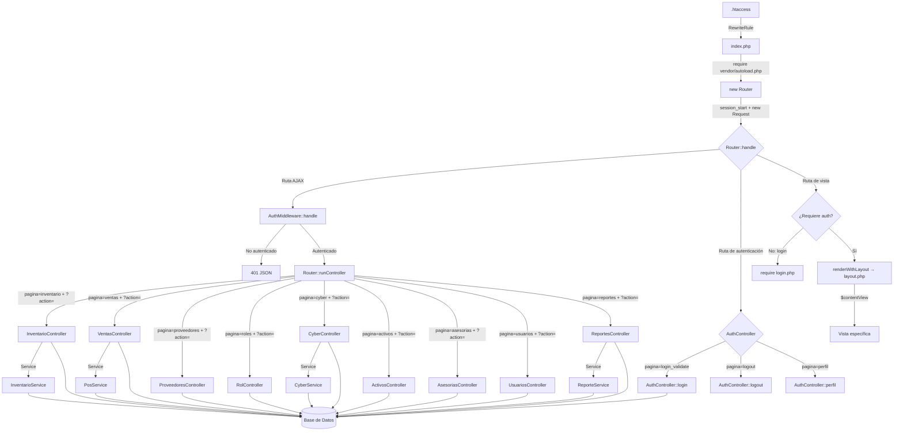

# Diagrama de Clases Completo — EIS Zona Web Lara (Arquitectura 100% Operativa)

## Visión General de la Arquitectura por Capas

```
┌──────────────────────────────────────────────────────────────────────────────────┐
│                        PRESENTACIÓN (Views — 13 plantillas)                      │
│  ┌──────────┐ ┌──────────┐ ┌──────────┐ ┌──────────┐ ┌──────────┐ ┌──────────┐  │
│  │  login   │ │dashboard │ │inventario│ │  ventas  │ │proveedores││ reportes │  │
│  │  .php    │ │  .php    │ │  .php    │ │  .php    │ │  .php    ││  .php    │  │
│  └──────────┘ └──────────┘ └──────────┘ └──────────┘ └──────────┘ └──────────┘  │
│  ┌──────────┐ ┌──────────┐ ┌──────────┐ ┌──────────┐ ┌──────────┐ ┌──────────┐  │
│  │  activos │ │ciberControl││asesorias ││ usuarios  ││  roles   ││  menu    │  │
│  │  .php    │ │  .php    │ │  .php    │ │  .php    │ │  .php    ││  .php    │  │
│  └──────────┘ └──────────┘ └──────────┘ └──────────┘ └──────────┘ └──────────┘  │
│       │            │            │            │            │                      │
│       └────────────┴────────────┴────────────┴────────────┴── Layout.php ────────│
├──────────────────────────────────────────────────────────────────────────────────┤
│                        CONTROLADORES (Controllers — 10 clases)                   │
│  ┌──────────┐ ┌──────────┐ ┌──────────┐ ┌──────────┐ ┌──────────┐ ┌──────────┐  │
│  │   Auth   │ │Dashboard │ │Inventario│ │  Ventas  │ │Proveedores││  Cyber   │  │
│  │Controller│ │Controller│ │Controller│ │Controller│ │Controller ││Controller│  │
│  └────┬─────┘ └────┬─────┘ └────┬─────┘ └────┬─────┘ └────┬─────┘ └────┬─────┘  │
│  ┌──────────┐ ┌──────────┐ ┌──────────┐ ┌──────────┐                           │
│  │  Activos │ │Asesorias │ │ Usuarios │ │ Reportes │                           │
│  │Controller│ │Controller│ │Controller│ │Controller│                           │
│  └────┬─────┘ └────┬─────┘ └────┬─────┘ └────┬─────┘                           │
├───────┼────────────┼────────────┼────────────┼──────────────────────────────────┤
│       ▼            ▼            ▼            ▼                                  │
│                        SERVICIOS (Services — 5 clases)                          │
│  ┌──────────┐ ┌──────────┐ ┌──────────┐ ┌──────────┐ ┌──────────┐              │
│  │   Auth   │ │Inventario│ │   POS    │ │  Cyber   │ │ Reportes │              │
│  │ Service  │ │ Service  │ │ Service  │ │ Service  │ │ Service  │              │
│  └────┬─────┘ └────┬─────┘ └────┬─────┘ └────┬─────┘ └────┬─────┘              │
├───────┼────────────┼────────────┼────────────┼────────────┼──────────────────────┤
│       ▼            ▼            ▼            ▼            ▼                      │
│                        MODELOS (Models — 23 clases)                             │
│  ┌──────────────────────────────────────────────────────────────────────────┐   │
│  │  Model (abstract) — App\Core\Model                                      │   │
│  │  ├── Catálogo (8): Rol, Permiso, Subcategoria, Categoria, Marca,        │   │
│  │  │                 ModeloProducto, TipoActivo, TarifaCyber              │   │
│  │  ├── Maestras (7): Usuario, Cliente, ClienteAsesoria, Proveedor,        │   │
│  │  │                 Producto, Activo, EstacionCyber                      │   │
│  │  ├── Transaccionales (6): Venta, DetalleVenta, Solicitud,              │   │
│  │  │                      DetalleSolicitud, SesionCyber, Asesoria        │   │
│  │  ├── Bitácora (1): BitacoraStock                                       │   │
│  │  └── Puente (3): ProductoProveedor, RolPermiso, UsuarioAsesoria        │   │
│  └──────────────────────────────────────────────────────────────────────────┘   │
├──────────────────────────────────────────────────────────────────────────────────┤
│                     INFRAESTRUCTURA (Core — 6 clases)                            │
│  ┌──────────┐ ┌──────────┐ ┌──────────┐ ┌──────────┐ ┌──────────┐ ┌──────────┐ │
│  │  Router  │ │ Database │ │  Model   │ │ Request  │ │Middleware│ │   Auth   │ │
│  │          │ │(Singleton)│ │(Abstract)│ │          │ │(interface)│ │Middleware│ │
│  └──────────┘ └──────────┘ └──────────┘ └──────────┘ └──────────┘ └──────────┘ │
│  ┌──────────┐                                                                   │
│  │   CSRF   │                                                                   │
│  │Middleware │                                                                   │
│  └──────────┘                                                                   │
└──────────────────────────────────────────────────────────────────────────────────┘
```

---

## Diagrama de Clases Completo (Mermaid)

```mermaid
classDiagram
    %% ========================================================================
    %% CORE — INFRAESTRUCTURA
    %% ========================================================================

    class Database {
        <<singleton>>
        -static ?PDO $instance
        +static getConnection() PDO
    }

    class Model {
        <<abstract>>
        #PDO $db
        +__construct()
    }

    class Router {
        -string $pagina
        +__construct()
        +handle() void
        -resolvePage() string
        -isAjaxInventario() bool
        -isAjaxRoles() bool
        -isAuthAction() bool
        -requireAuth() void
        -runController(string $name) void
        -renderView() void
        -renderWithLayout(string $contentView) void
    }

    class Request {
        -array $get
        -array $post
        -array $session
        -array $files
        -string $method
        +__construct()
        +input(string $key) mixed
        +method() string
        +validate(array $rules) array
        +isAjax() bool
    }

    class Middleware {
        <<interface>>
        +handle(Request $request) bool
    }

    class AuthMiddleware {
        +handle(Request $request) bool
    }

    class CsrfMiddleware {
        +handle(Request $request) bool
    }

    %% ========================================================================
    %% MODELOS — CATÁLOGO (Lookup Tables)
    %% ========================================================================

    class Rol {
        +int $id
        +string $nombre
        +string $descripcion
        +listarRoles() array
        +obtenerRolPorId(int $id) array|false
        +crearRol(string $nombre, string $descripcion) bool
        +actualizarRol(int $id, string $nombre, string $descripcion) bool
        +eliminarRol(int $id) bool
        +totalRoles() int
    }

    class Permiso {
        +int $id
        +string $nombre
        +string $descripcion
        +string $icono
        +obtenerTodos() array
        +obtenerPorId(int $id) array|false
        +obtenerPorRol(int $rol_id) array
        +totalPermisos() int
    }

    class RolPermiso {
        +int $rol_id
        +int $permiso_id
        +guardarPermisosRol(int $rol_id, array $permiso_ids) bool
        +obtenerPermisosPorRol(int $rol_id) array
        +tienePermiso(int $rol_id, int $permiso_id) bool
    }

    class Subcategoria {
        +int $id
        +string $nombre
        +string $descripcion
        +bool $activa
        +obtenerTodas() array
        +obtenerPorId(int $id) array|false
        +crear(string $nombre, string $descripcion) bool
        +actualizar(int $id, string $nombre, string $descripcion, bool $activa) bool
        +eliminar(int $id) bool
    }

    class Categoria {
        +int $id
        +int $subcategoria_id
        +string $nombre
        +string $descripcion
        +bool $activa
        +obtenerTodas() array
        +obtenerPorId(int $id) array|false
        +obtenerPorSubcategoria(int $subcategoria_id) array
        +crear(string $nombre, int $subcategoria_id, string $descripcion) bool
        +actualizar(int $id, string $nombre, int $subcategoria_id, string $descripcion, bool $activa) bool
        +eliminar(int $id) bool
    }

    class Marca {
        +int $id
        +string $nombre
        +string $descripcion
        +obtenerTodas() array
        +obtenerPorId(int $id) array|false
        +crear(string $nombre, string $descripcion) bool
        +actualizar(int $id, string $nombre, string $descripcion) bool
        +eliminar(int $id) bool
    }

    class ModeloProducto {
        +int $id
        +int $marca_id
        +string $nombre
        +string $descripcion
        +obtenerTodas() array
        +obtenerPorId(int $id) array|false
        +obtenerPorMarca(int $marca_id) array
        +crear(string $nombre, int $marca_id, string $descripcion) bool
        +actualizar(int $id, string $nombre, int $marca_id, string $descripcion) bool
        +eliminar(int $id) bool
    }

    class TipoActivo {
        +int $id
        +string $nombre
        +string $descripcion
        +obtenerTodas() array
        +obtenerPorId(int $id) array|false
        +crear(string $nombre, string $descripcion) bool
        +actualizar(int $id, string $nombre, string $descripcion) bool
        +eliminar(int $id) bool
    }

    class TarifaCyber {
        +int $id
        +string $nombre
        +float $precio_por_hora
        +int $tiempo_minimo
        +bool $activa
        +obtenerTodas() array
        +obtenerActivas() array
        +obtenerPorId(int $id) array|false
        +crear(string $nombre, float $precio_por_hora, int $tiempo_minimo) bool
        +actualizar(int $id, string $nombre, float $precio_por_hora, int $tiempo_minimo, bool $activa) bool
        +eliminar(int $id) bool
    }

    %% ========================================================================
    %% MODELOS — MAESTRAS PRINCIPALES
    %% ========================================================================

    class Usuario {
        +int $id
        +string $username
        +string $password_hash
        +string $nombre
        +string $email
        +string $telefono
        +bool $activo
        +int $rol_id
        +string $ultimo_acceso
        +autenticar(string $username, string $password) array|false
        +crear(string $username, string $password, string $nombre, string $email, ?string $telefono, int $rol_id) bool
        +obtenerTodos() array
        +obtenerPorId(int $id) array|false
        +obtenerPorUsername(string $username) array|false
        +actualizar(int $id, string $nombre, string $email, ?string $telefono, ?int $rol_id, bool $activo) bool
        +actualizarPassword(int $id, string $password) bool
        +eliminar(int $id) bool
    }

    class Cliente {
        +int $id
        +string $cedula_rif
        +string $nombre
        +string $telefono
        +string $email
        +string $direccion
        +bool $activo
        +obtenerTodos() array
        +obtenerPorId(int $id) array|false
        +buscar(string $termino) array
        +crear(array $data) bool
        +actualizar(int $id, array $data) bool
        +eliminar(int $id) bool
    }

    class ClienteAsesoria {
        +int $id
        +string $cedula
        +string $nombre
        +string $email
        +string $telefono
        +string $direccion
        +string $notas_expediente
        +obtenerTodos() array
        +obtenerPorId(int $id) array|false
        +buscarPorCedula(string $cedula) array
        +crear(array $data) bool
        +actualizar(int $id, array $data) bool
        +eliminar(int $id) bool
    }

    class Proveedor {
        +int $id
        +string $nombre
        +string $rif
        +string $tipo_documento
        +string $contacto
        +string $email
        +string $telefono
        +string $direccion
        +bool $es_proveedor_principal
        +bool $activo
        +obtenerTodos() array
        +obtenerPorId(int $id) array|false
        +buscar(string $termino) array
        +crear(array $data) bool
        +actualizar(int $id, array $data) bool
        +eliminar(int $id) bool
    }

    class Producto {
        +int $id
        +string $codigo
        +string $codigo_barras
        +string $nombre
        +string $descripcion
        +int $categoria_id
        +int $modelo_id
        +string $unidad_medida
        +int $stock
        +int $stock_minimo
        +string $ubicacion
        +float $costo_compra
        +float $precio_venta
        +bool $permite_descuento
        +string $estado_venta
        +bool $activo
        +crear(string $codigo, string $nombre, int $categoria_id, int $stock, int $stock_minimo, float $costo_compra, float $precio_venta) bool
        +obtenerTodos() array
        +obtenerPorId(int $id) array|false
        +buscar(string $termino) array
        +actualizar(int $id, string $codigo, string $nombre, int $categoria_id, int $stock, int $stock_minimo, float $costo_compra, float $precio_venta) bool
        +eliminar(int $id) bool
        +totalProductos() int
        +stockCritico() int
        +stockBajo() int
        +valorTotalInventario() float
        +obtenerCategorias() array
        +obtenerSubcategorias() array
        +obtenerMarcas() array
        +obtenerModelos() array
    }

    class Activo {
        +int $id
        +string $nombre
        +string $descripcion
        +int $tipo_activo_id
        +string $estado
        +string $ubicacion
        +float $valor_adquisicion
        +string $fecha_adquisicion
        +string $fecha_vencimiento
        +int $responsable_id
        +string $notas
        +obtenerTodos() array
        +obtenerPorId(int $id) array|false
        +obtenerPorTipo(int $tipo_id) array
        +crear(array $data) bool
        +actualizar(int $id, array $data) bool
        +eliminar(int $id) bool
    }

    class EstacionCyber {
        +int $id
        +string $nombre
        +string $estado
        +int $tarifa_id
        +string $especificaciones
        +string $ip_local
        +string $mac_address
        +obtenerTodas() array
        +obtenerPorEstado(string $estado) array
        +cambiarEstado(int $id, string $estado) bool
        +crear(array $data) bool
        +actualizar(int $id, array $data) bool
        +eliminar(int $id) bool
    }

    %% ========================================================================
    %% MODELOS — TRANSACCIONALES
    %% ========================================================================

    class Venta {
        +int $id
        +string $fecha
        +int $usuario_id
        +int $cliente_id
        +float $subtotal
        +float $descuento
        +float $total
        +string $estado
        +string $notas
        +obtenerTodas() array
        +obtenerPorId(int $id) array|false
        +obtenerPorFecha(string $desde, string $hasta) array
        +crear(array $data, array $detalles) int
        +actualizarEstado(int $id, string $estado) bool
        +anular(int $id) bool
        +obtenerEstadisticas() array
    }

    class DetalleVenta {
        +int $id
        +int $venta_id
        +int $producto_id
        +int $cantidad
        +float $precio_unitario
        +float $descuento
        +float $subtotal
        +obtenerPorVenta(int $venta_id) array
        +crear(array $data) bool
    }

    class Solicitud {
        +int $id
        +string $codigo
        +int $proveedor_id
        +string $fecha
        +string $fecha_estimada_entrega
        +int $tiempo_entrega_dias
        +float $subtotal
        +float $total
        +string $estado
        +int $usuario_id
        +string $notas
        +obtenerTodas() array
        +obtenerPorId(int $id) array|false
        +obtenerPorEstado(string $estado) array
        +crear(array $data, array $detalles) int
        +actualizarEstado(int $id, string $estado) bool
        +aprobar(int $id) bool
        +recibir(int $id) bool
        +cancelar(int $id) bool
    }

    class DetalleSolicitud {
        +int $id
        +int $solicitud_id
        +int $producto_id
        +int $cantidad_solicitada
        +int $cantidad_recibida
        +float $precio_unitario_estimado
        +float $subtotal
        +obtenerPorSolicitud(int $solicitud_id) array
        +actualizarCantidadRecibida(int $id, int $cantidad) bool
    }

    class SesionCyber {
        +int $id
        +int $estacion_id
        +int $usuario_id
        +int $cliente_id
        +string $hora_inicio
        +string $hora_fin
        +float $costo_total
        +string $estado
        +obtenerActivas() array
        +obtenerPorId(int $id) array|false
        +iniciar(array $data) int
        +cerrar(int $id) bool
        +calcularCosto(int $sesion_id) float
        +obtenerSesionesDelDia() array
    }

    class Asesoria {
        +int $id
        +int $cliente_asesoria_id
        +string $documento
        +string $descripcion
        +string $estado
        +string $fecha_registro
        +string $fecha_cierre
        +crear(string $ciudadano, string $cedula, string $documento, string $descripcion, string $estado, ?int $usuario_id) bool
        +obtenerTodas() array
        +obtenerPorEstado(string $estado) array
        +obtenerPorId(int $id) array|false
        +buscarPorCedula(string $cedula) array
        +actualizar(int $id, string $ciudadano, string $cedula, string $documento, string $descripcion, string $estado) bool
        +eliminar(int $id) bool
        +contarPorEstado() array
    }

    %% ========================================================================
    %% MODELOS — BITÁCORA
    %% ========================================================================

    class BitacoraStock {
        +int $id
        +int $producto_id
        +string $tipo
        +int $cantidad
        +int $stock_anterior
        +int $stock_nuevo
        +float $precio_unitario
        +float $costo_total
        +string $fecha
        +int $usuario_id
        +string $referencia_tipo
        +int $referencia_id
        +string $motivo
        +obtenerPorProducto(int $producto_id) array
        +obtenerPorFecha(string $desde, string $hasta) array
        +registrarMovimiento(int $producto_id, string $tipo, int $cantidad, int $usuario_id, string $motivo, string $ref_tipo, ?int $ref_id) bool
    }

    %% ========================================================================
    %% MODELOS — PUENTE (M:N)
    %% ========================================================================

    class ProductoProveedor {
        +int $producto_id
        +int $proveedor_id
        +string $codigo_proveedor
        +float $precio_compra
        +int $tiempo_entrega_dias
        +obtenerPorProducto(int $producto_id) array
        +obtenerPorProveedor(int $proveedor_id) array
        +asociar(array $data) bool
        +desasociar(int $producto_id, int $proveedor_id) bool
    }

    class UsuarioAsesoria {
        +int $usuario_id
        +int $asesoria_id
        +string $rol_en_asesoria
        +obtenerPorAsesoria(int $asesoria_id) array
        +obtenerPorUsuario(int $usuario_id) array
        +asignar(int $usuario_id, int $asesoria_id, string $rol) bool
        +remover(int $usuario_id, int $asesoria_id) bool
    }

    %% ========================================================================
    %% CONTROLADORES
    %% ========================================================================

    class AuthController {
        -Usuario $usuarioModel
        -AuthService $authService
        +__construct()
        +login() void
        +logout() void
        +perfil() void
    }

    class DashboardController {
        -Venta $ventaModel
        -Producto $productoModel
        -SesionCyber $sesionModel
        -Solicitud $solicitudModel
        +__construct()
        +index() void
        +obtenerKpis() void
    }

    class InventarioController {
        -Producto $productoModel
        -BitacoraStock $bitacoraModel
        -Categoria $categoriaModel
        -InventarioService $inventarioService
        +__construct()
        +handle() void
        -listar() void
        -kpis() void
        -categorias() void
        -detalle() void
        -movimientos() void
        -buscar() void
        -crear() void
        -actualizar() void
        -eliminar() void
        -entrada() void
        -salida() void
        -json(bool $success, mixed $data, string $error) void
    }

    class VentasController {
        -Venta $ventaModel
        -DetalleVenta $detalleModel
        -Producto $productoModel
        -Cliente $clienteModel
        -PosService $posService
        +__construct()
        +index() void
        +listarProductos() void
        +registrarVenta() void
        +obtenerHistorial() void
        +obtenerDetalle(int $id) void
        +anularVenta(int $id) void
    }

    class ProveedoresController {
        -Proveedor $proveedorModel
        -Solicitud $solicitudModel
        -DetalleSolicitud $detalleModel
        -Producto $productoModel
        +__construct()
        +index() void
        +listar() void
        +listarProveedores() void
        +crearSolicitud() void
        +aprobarSolicitud(int $id) void
        +recibirSolicitud(int $id) void
        +cancelarSolicitud(int $id) void
    }

    class CyberController {
        -EstacionCyber $estacionModel
        -SesionCyber $sesionModel
        -TarifaCyber $tarifaModel
        -Cliente $clienteModel
        -CyberService $cyberService
        +__construct()
        +index() void
        +listarEstaciones() void
        +iniciarSesion() void
        +cerrarSesion(int $id) void
        +obtenerSesionesActivas() void
        +listarTarifas() void
    }

    class ActivosController {
        -Activo $activoModel
        -TipoActivo $tipoActivoModel
        -Usuario $usuarioModel
        +__construct()
        +index() void
        +listar() void
        +crear() void
        +actualizar(int $id) void
        +cambiarEstado(int $id) void
        +eliminar(int $id) void
    }

    class AsesoriasController {
        -Asesoria $asesoriaModel
        -ClienteAsesoria $clienteModel
        -UsuarioAsesoria $uaModel
        +__construct()
        +index() void
        +listar() void
        +listarPorEstado() void
        +buscar(string $termino) void
        +crear() void
        +actualizar(int $id) void
        +eliminar(int $id) void
    }

    class UsuariosController {
        -Usuario $usuarioModel
        -Rol $rolModel
        -Permiso $permisoModel
        -RolPermiso $rolPermisoModel
        +__construct()
        +index() void
        +listar() void
        +crear() void
        +actualizar(int $id) void
        +actualizarPassword(int $id) void
        +eliminar(int $id) void
    }

    class ReportesController {
        -Venta $ventaModel
        -Producto $productoModel
        -SesionCyber $sesionModel
        -ReporteService $reporteService
        +__construct()
        +index() void
        +ventas(string $desde, string $hasta) void
        +inventario() void
        +cyber(string $desde, string $hasta) void
        +exportarPdf(string $tipo) void
        +exportarExcel(string $tipo) void
    }

    %% ========================================================================
    %% SERVICIOS
    %% ========================================================================

    class AuthService {
        -Usuario $usuarioModel
        -RolPermiso $rolPermisoModel
        +__construct(Usuario $usuarioModel, RolPermiso $rolPermisoModel)
        +autenticar(string $username, string $password) array|false
        +estaAutenticado() bool
        +tienePermiso(string $permiso) bool
        +generarTokenCsrf() string
        +verificarTokenCsrf(string $token) bool
    }

    class InventarioService {
        -Producto $productoModel
        -BitacoraStock $bitacoraModel
        +__construct(Producto $productoModel, BitacoraStock $bitacoraModel)
        +registrarEntrada(int $producto_id, int $cantidad, int $usuario_id, string $motivo) bool
        +registrarSalida(int $producto_id, int $cantidad, int $usuario_id, string $motivo) bool
        +ajustarStock(int $producto_id, int $nuevo_stock, int $usuario_id, string $motivo) bool
        +obtenerKpis() array
        +obtenerProductosCriticos() array
    }

    class PosService {
        -Venta $ventaModel
        -DetalleVenta $detalleModel
        -Producto $productoModel
        -BitacoraStock $bitacoraModel
        +__construct(Venta $ventaModel, DetalleVenta $detalleModel, Producto $productoModel, BitacoraStock $bitacoraModel)
        +procesarVenta(array $carrito, int $usuario_id, ?int $cliente_id, float $descuento) int
        +calcularSubtotal(array $items) float
        +validarStock(array $items) array
        +anularVenta(int $venta_id) bool
    }

    class CyberService {
        -SesionCyber $sesionModel
        -EstacionCyber $estacionModel
        -TarifaCyber $tarifaModel
        +__construct(SesionCyber $sesionModel, EstacionCyber $estacionModel, TarifaCyber $tarifaModel)
        +abrirSesion(int $estacion_id, int $usuario_id, ?int $cliente_id) int
        +cerrarSesion(int $sesion_id) array
        +calcularCosto(int $sesion_id) float
        +obtenerEstacionesDisponibles() array
        +obtenerResumenDelDia() array
    }

    class ReporteService {
        -Venta $ventaModel
        -Producto $productoModel
        -SesionCyber $sesionModel
        +__construct(Venta $ventaModel, Producto $productoModel, SesionCyber $sesionModel)
        +ventasPorPeriodo(string $desde, string $hasta) array
        +productosMasVendidos(int $limite) array
        +inventarioValorizado() array
        +cierreDiario(string $fecha) array
        +generarPdf(string $template, array $data) string
        +generarExcel(string $template, array $data) string
    }

    %% ========================================================================
    %% RELACIONES — HERENCIA
    %% ========================================================================

    Model <|-- Rol : extends
    Model <|-- Permiso : extends
    Model <|-- Subcategoria : extends
    Model <|-- Categoria : extends
    Model <|-- Marca : extends
    Model <|-- ModeloProducto : extends
    Model <|-- TipoActivo : extends
    Model <|-- TarifaCyber : extends
    Model <|-- Usuario : extends
    Model <|-- Cliente : extends
    Model <|-- ClienteAsesoria : extends
    Model <|-- Proveedor : extends
    Model <|-- Producto : extends
    Model <|-- Activo : extends
    Model <|-- EstacionCyber : extends
    Model <|-- Venta : extends
    Model <|-- DetalleVenta : extends
    Model <|-- Solicitud : extends
    Model <|-- DetalleSolicitud : extends
    Model <|-- SesionCyber : extends
    Model <|-- Asesoria : extends
    Model <|-- BitacoraStock : extends
    Model <|-- ProductoProveedor : extends
    Model <|-- UsuarioAsesoria : extends

    %% ========================================================================
    %% RELACIONES — CORE
    %% ========================================================================

    Database <-- Model : getConnection()
    Router --> Request : usa
    Router "1" *--> "*" Middleware : ejecuta
    Middleware <|.. AuthMiddleware : implementa
    Middleware <|.. CsrfMiddleware : implementa

    %% ========================================================================
    %% RELACIONES — CONTROLLERS → MODELS
    %% ========================================================================

    AuthController --> Usuario : usa
    AuthController --> AuthService : usa
    DashboardController --> Venta : usa
    DashboardController --> Producto : usa
    DashboardController --> SesionCyber : usa
    DashboardController --> Solicitud : usa
    InventarioController --> Producto : usa
    InventarioController --> BitacoraStock : usa
    InventarioController --> Categoria : usa
    InventarioController --> InventarioService : usa
    VentasController --> Venta : usa
    VentasController --> DetalleVenta : usa
    VentasController --> Producto : usa
    VentasController --> Cliente : usa
    VentasController --> PosService : usa
    ProveedoresController --> Proveedor : usa
    ProveedoresController --> Solicitud : usa
    ProveedoresController --> DetalleSolicitud : usa
    ProveedoresController --> Producto : usa
    CyberController --> EstacionCyber : usa
    CyberController --> SesionCyber : usa
    CyberController --> TarifaCyber : usa
    CyberController --> Cliente : usa
    CyberController --> CyberService : usa
    ActivosController --> Activo : usa
    ActivosController --> TipoActivo : usa
    ActivosController --> Usuario : usa
    AsesoriasController --> Asesoria : usa
    AsesoriasController --> ClienteAsesoria : usa
    AsesoriasController --> UsuarioAsesoria : usa
    UsuariosController --> Usuario : usa
    UsuariosController --> Rol : usa
    UsuariosController --> Permiso : usa
    UsuariosController --> RolPermiso : usa
    ReportesController --> Venta : usa
    ReportesController --> Producto : usa
    ReportesController --> SesionCyber : usa
    ReportesController --> ReporteService : usa

    %% ========================================================================
    %% RELACIONES — SERVICES → MODELS
    %% ========================================================================

    AuthService --> Usuario : usa
    AuthService --> RolPermiso : usa
    InventarioService --> Producto : usa
    InventarioService --> BitacoraStock : usa
    PosService --> Venta : usa
    PosService --> DetalleVenta : usa
    PosService --> Producto : usa
    PosService --> BitacoraStock : usa
    CyberService --> SesionCyber : usa
    CyberService --> EstacionCyber : usa
    CyberService --> TarifaCyber : usa
    ReporteService --> Venta : usa
    ReporteService --> Producto : usa
    ReporteService --> SesionCyber : usa

    %% ========================================================================
    %% RELACIONES — ENTRE MODELOS (BD)
    %% ========================================================================

    Categoria --> Subcategoria : pertenece a
    ModeloProducto --> Marca : pertenece a
    Producto --> Categoria : clasificado en
    Producto --> ModeloProducto : tiene modelo
    Activo --> TipoActivo : categorizado como
    Activo --> Usuario : responsable
    EstacionCyber --> TarifaCyber : aplica tarifa
    Venta --> Usuario : registrada por
    Venta --> Cliente : comprada por
    DetalleVenta --> Venta : pertenece a
    DetalleVenta --> Producto : contiene
    Solicitud --> Proveedor : dirigida a
    Solicitud --> Usuario : creada por
    DetalleSolicitud --> Solicitud : pertenece a
    DetalleSolicitud --> Producto : contiene
    SesionCyber --> EstacionCyber : usa
    SesionCyber --> Usuario : atendida por
    SesionCyber --> Cliente : pertenece a
    Asesoria --> ClienteAsesoria : solicitada por
    BitacoraStock --> Producto : audita
    BitacoraStock --> Usuario : generada por
    ProductoProveedor --> Producto : vincula
    ProductoProveedor --> Proveedor : vincula
    RolPermiso --> Rol : asigna
    RolPermiso --> Permiso : asigna
    UsuarioAsesoria --> Usuario : asigna
    UsuarioAsesoria --> Asesoria : asigna
    Usuario --> Rol : tiene
```

---

## Mapa de Paquetes (Namespaces)

```
App\
├── Core\                              # Infraestructura base
│   ├── Router.php                     # Enrutador principal (Front Controller)
│   ├── Database.php                   # Conexión PDO (Singleton)
│   ├── Model.php                      # Clase abstracta base para modelos
│   ├── Request.php                    # Encapsulador de la petición HTTP
│   ├── Middleware.php                 # Interfaz de middleware
│   ├── AuthMiddleware.php             # Middleware de autenticación
│   └── CsrfMiddleware.php             # Middleware de protección CSRF
│
├── Controllers\                       # Controladores (10)
│   ├── AuthController.php             # Login, logout, perfil
│   ├── DashboardController.php        # Panel de control con KPIs
│   ├── InventarioController.php       # CRUD inventario + movimientos stock
│   ├── VentasController.php           # POS, registro y anulación de ventas
│   ├── ProveedoresController.php      # Solicitudes de compra a proveedores
│   ├── CyberController.php            # Estaciones, sesiones, tarifas cyber
│   ├── ActivosController.php          # CRUD activos fijos
│   ├── AsesoriasController.php        # CRUD asesorías legales
│   ├── UsuariosController.php         # CRUD usuarios, roles y permisos
│   └── ReportesController.php         # Generación de reportes y exportación
│
├── Services\                          # Capa de servicios (5)
│   ├── AuthService.php                # Lógica de autenticación y permisos
│   ├── InventarioService.php          # Lógica de movimientos de stock y KPIs
│   ├── PosService.php                 # Lógica de procesamiento de ventas POS
│   ├── CyberService.php               # Lógica de gestión de cybercafé
│   └── ReporteService.php             # Lógica de generación de reportes
│
├── Models\                            # Modelos (23)
│   │
│   │   ── CATÁLOGO (8) ──
│   ├── Rol.php                        # roles — ID, nombre, descripción
│   ├── Permiso.php                    # permisos — ID, nombre, descripción, icono
│   ├── Subcategoria.php               # subcategorias — ID, nombre, descripción, activa
│   ├── Categoria.php                  # categorias — ID, subcategoria_id, nombre, descripción, activa
│   ├── Marca.php                      # marcas — ID, nombre, descripción
│   ├── ModeloProducto.php             # modelos — ID, marca_id, nombre, descripción
│   ├── TipoActivo.php                 # tipos_activo — ID, nombre, descripción
│   ├── TarifaCyber.php                # tarifas_cyber — ID, nombre, precio_por_hora, tiempo_minimo, activa
│   │
│   │   ── MAESTRAS (7) ──
│   ├── Usuario.php                    # usuarios — credenciales, datos personales, rol
│   ├── Cliente.php                    # clientes — datos de clientes de ventas
│   ├── ClienteAsesoria.php            # clientes_asesorias — datos de clientes de asesoría legal
│   ├── Proveedor.php                  # proveedores — datos de proveedores
│   ├── Producto.php                   # productos — catálogo de productos con stock y precios
│   ├── Activo.php                     # activos — activos fijos de la empresa
│   ├── EstacionCyber.php              # estaciones_cyber — estaciones del cybercafé
│   │
│   │   ── TRANSACCIONALES (6) ──
│   ├── Venta.php                      # ventas — cabecera de ventas POS
│   ├── DetalleVenta.php               # detalle_ventas — líneas de detalle de cada venta
│   ├── Solicitud.php                  # solicitudes — cabecera de solicitudes a proveedores
│   ├── DetalleSolicitud.php           # detalle_solicitudes — líneas de cada solicitud
│   ├── SesionCyber.php                # sesiones_cyber — sesiones de estaciones cyber
│   ├── Asesoria.php                   # asesorias — casos de asesoría legal
│   │
│   │   ── BITÁCORA (1) ──
│   ├── BitacoraStock.php              # bitacora_movimientos_stock — historial de cambios de stock
│   │
│   │   ── PUENTE (3) ──
│   ├── RolPermiso.php                 # rol_permiso — asignación de permisos a roles
│   ├── ProductoProveedor.php          # producto_proveedor — productos por proveedor
│   └── UsuarioAsesoria.php            # usuario_asesoria — abogados asignados a casos
│
└── Views\                             # Plantillas PHP (13)
    ├── layout.php                     # Layout maestro (template)
    ├── login.php                      # Pantalla de inicio de sesión
    ├── dashboard.php                  # Panel de control principal
    ├── inventario.php                 # Gestión de inventario
    ├── ventas.php                     # Punto de venta (POS)
    ├── proveedores.php                # Solicitudes a proveedores
    ├── reportes.php                   # Reportes y estadísticas
    ├── activos.php                    # Gestión de activos fijos
    ├── ciberControl.php               # Control de cybercafé
    ├── asesorias.php                  # Asesoría legal
    ├── usuarios.php                   # Gestión de usuarios
    ├── roles.php                      # Gestión de roles y permisos
    └── menu.php                       # Menú de navegación lateral
```

---

## Mapeo Base de Datos → Modelos

| Tabla | Tipo | Modelo | Controlador |
|-------|------|--------|-------------|
| `roles` | Catálogo | `Rol` | `UsuariosController` |
| `permisos` | Catálogo | `Permiso` | `UsuariosController` |
| `rol_permiso` | Puente M:N | `RolPermiso` | `UsuariosController` |
| `subcategorias` | Catálogo | `Subcategoria` | `InventarioController` |
| `categorias` | Catálogo | `Categoria` | `InventarioController` |
| `marcas` | Catálogo | `Marca` | `InventarioController` |
| `modelos` | Catálogo | `ModeloProducto` | `InventarioController` |
| `tipos_activo` | Catálogo | `TipoActivo` | `ActivosController` |
| `tarifas_cyber` | Catálogo | `TarifaCyber` | `CyberController` |
| `usuarios` | Maestra | `Usuario` | `AuthController`, `UsuariosController`, `DashboardController` |
| `clientes` | Maestra | `Cliente` | `VentasController`, `CyberController` |
| `clientes_asesorias` | Maestra | `ClienteAsesoria` | `AsesoriasController` |
| `proveedores` | Maestra | `Proveedor` | `ProveedoresController` |
| `productos` | Maestra | `Producto` | `InventarioController`, `VentasController`, `ProveedoresController` |
| `activos` | Maestra | `Activo` | `ActivosController` |
| `estaciones_cyber` | Maestra | `EstacionCyber` | `CyberController` |
| `ventas` | Transaccional | `Venta` | `VentasController`, `DashboardController`, `ReportesController` |
| `detalle_ventas` | Transaccional | `DetalleVenta` | `VentasController` |
| `solicitudes` | Transaccional | `Solicitud` | `ProveedoresController`, `DashboardController` |
| `detalle_solicitudes` | Transaccional | `DetalleSolicitud` | `ProveedoresController` |
| `sesiones_cyber` | Transaccional | `SesionCyber` | `CyberController`, `DashboardController`, `ReportesController` |
| `asesorias` | Transaccional | `Asesoria` | `AsesoriasController` |
| `bitacora_movimientos_stock` | Bitácora | `BitacoraStock` | `InventarioController` |
| `producto_proveedor` | Puente M:N | `ProductoProveedor` | `ProveedoresController` |
| `usuario_asesoria` | Puente M:N | `UsuarioAsesoria` | `AsesoriasController` |

---

## Jerarquía de Herencia

```
App\Core\Model (abstract)                          # Proporciona $this->db (PDO)
│
├── App\Models\Rol                                 # roles
├── App\Models\Permiso                             # permisos
├── App\Models\Subcategoria                        # subcategorias
├── App\Models\Categoria                           # categorias (FK → subcategorias)
├── App\Models\Marca                               # marcas
├── App\Models\ModeloProducto                      # modelos (FK → marcas)
├── App\Models\TipoActivo                          # tipos_activo
├── App\Models\TarifaCyber                         # tarifas_cyber
├── App\Models\Usuario                             # usuarios (FK → roles)
├── App\Models\Cliente                             # clientes
├── App\Models\ClienteAsesoria                     # clientes_asesorias
├── App\Models\Proveedor                           # proveedores
├── App\Models\Producto                            # productos (FK → categorias, modelos)
├── App\Models\Activo                              # activos (FK → tipos_activo, usuarios)
├── App\Models\EstacionCyber                       # estaciones_cyber (FK → tarifas_cyber)
├── App\Models\Venta                               # ventas (FK → usuarios, clientes)
├── App\Models\DetalleVenta                        # detalle_ventas (FK → ventas, productos)
├── App\Models\Solicitud                           # solicitudes (FK → proveedores, usuarios)
├── App\Models\DetalleSolicitud                    # detalle_solicitudes (FK → solicitudes, productos)
├── App\Models\SesionCyber                         # sesiones_cyber (FK → estaciones, usuarios, clientes)
├── App\Models\Asesoria                            # asesorias (FK → clientes_asesorias)
├── App\Models\BitacoraStock                       # bitacora_movimientos_stock (FK → productos, usuarios)
├── App\Models\ProductoProveedor                   # producto_proveedor (PK compuesta)
└── App\Models\UsuarioAsesoria                     # usuario_asesoria (PK compuesta)
```

Clases independientes (sin herencia):
- `App\Core\Database` (Singleton)
- `App\Core\Router` (Front Controller)
- `App\Core\Request`
- `App\Core\Middleware` (interface)
- `App\Core\AuthMiddleware`
- `App\Core\CsrfMiddleware`
- `App\Controllers\AuthController`
- `App\Controllers\DashboardController`
- `App\Controllers\InventarioController`
- `App\Controllers\VentasController`
- `App\Controllers\ProveedoresController`
- `App\Controllers\CyberController`
- `App\Controllers\ActivosController`
- `App\Controllers\AsesoriasController`
- `App\Controllers\UsuariosController`
- `App\Controllers\ReportesController`
- `App\Services\AuthService`
- `App\Services\InventarioService`
- `App\Services\PosService`
- `App\Services\CyberService`
- `App\Services\ReporteService`

---

## Flujo de Petición Completo



---

## Resumen de Clases

| Categoría | Cantidad | Clases |
|-----------|:--------:|--------|
| **Core** | 7 | `Router`, `Database` (Singleton), `Model` (abstract), `Request`, `Middleware` (interface), `AuthMiddleware`, `CsrfMiddleware` |
| **Controllers** | 10 | `AuthController`, `DashboardController`, `InventarioController`, `VentasController`, `ProveedoresController`, `CyberController`, `ActivosController`, `AsesoriasController`, `UsuariosController`, `ReportesController` |
| **Models** | 23 | `Rol`, `Permiso`, `Subcategoria`, `Categoria`, `Marca`, `ModeloProducto`, `TipoActivo`, `TarifaCyber`, `Usuario`, `Cliente`, `ClienteAsesoria`, `Proveedor`, `Producto`, `Activo`, `EstacionCyber`, `Venta`, `DetalleVenta`, `Solicitud`, `DetalleSolicitud`, `SesionCyber`, `Asesoria`, `BitacoraStock`, `ProductoProveedor`, `UsuarioAsesoria` |
| **Services** | 5 | `AuthService`, `InventarioService`, `PosService`, `CyberService`, `ReporteService` |
| **Views** | 13 | `login`, `dashboard`, `inventario`, `ventas`, `proveedores`, `reportes`, `activos`, `ciberControl`, `asesorias`, `usuarios`, `roles`, `menu`, `layout` |
| **Total (clases)** | **45** | |

---

## Leyenda

| Símbolo | Significado |
|---------|-------------|
| `+` | Público |
| `-` | Privado |
| `#` | Protegido |
| `<< >>` | Estereotipo (abstract, singleton, interface) |
| `-->` | Asociación / dependencia (usa) |
| `<|--` | Herencia (extends) |
| `<|..` | Implementación (implements) |
| `*-->` | Composición |
