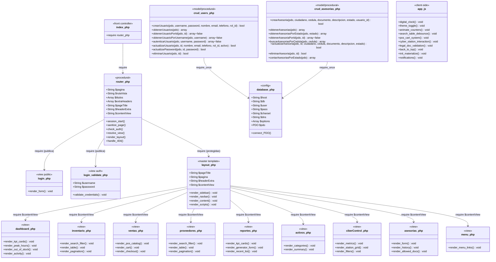
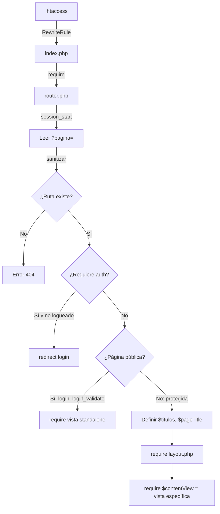
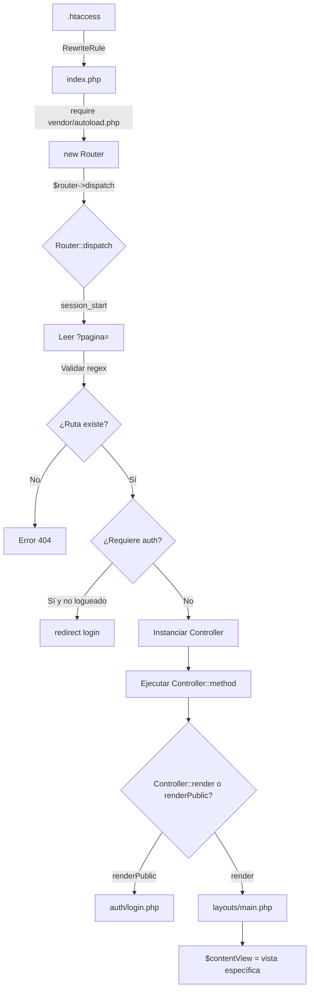

# Diagrama de Clases — EIS Zona Web Lara

## 1. Estado Actual (Arquitectura Procedural)

La aplicación actual está implementada con **código procedural** (funciones globales, sin clases de aplicación). Solo existen dos clases en el proyecto, ambas pertenecientes al autoloader de Composer (`Composer\Autoload\ClassLoader` y `ComposerStaticInit...`), que no forman parte de la lógica de negocio.

A continuación, se modelan los **módulos procedurales** como si fueran clases lógicas para representar la estructura real del código:

---

## 2. Arquitectura Objetivo (MVC con Namespaces PSR-4)

La documentación del proyecto describe una **arquitectura MVC planeada** con clases con namespace `App\`, cargadas vía Composer PSR-4. Actualmente **ninguna de estas clases existe en el código**, pero representan el diseño objetivo del sistema:

```mermaid
classDiagram
    class Router {
        -array $routes
        +__construct()
        +dispatch() void
    }

    class Controller {
        <<abstract>>
        #array $pageTitles
        #array $extraHeaders
        #string $currentPage
        +__construct()
        #render(viewPath, data) void
        #renderPublic(viewPath, data) void
    }

    class LoginController {
        +index() void
        +validate() void
    }

    class DashboardController {
        +index() void
    }

    class InventarioController {
        +index() void
    }

    class VentasController {
        +index() void
    }

    class ProveedoresController {
        +index() void
    }

    class ReportesController {
        +index() void
    }

    class ActivosController {
        +index() void
    }

    class CiberControlController {
        +index() void
    }

    class AsesoriasController {
        +index() void
    }

    class MenuController {
        +index() void
    }

    class UserModel {
        <<planeado>>
        +crear(data) bool
        +obtenerTodos() array
        +obtenerPorId(id) array~false
        +obtenerPorUsername(username) array~false
        +autenticar(username, password) array~false
        +actualizar(id, data) bool
        +actualizarPassword(id, password) bool
        +eliminar(id) bool
    }

    class AsesoriaModel {
        <<planeado>>
        +crear(data) bool
        +obtenerTodas() array
        +obtenerPorEstado(estado) array
        +obtenerPorId(id) array~false
        +buscarPorCedula(cedula) array
        +actualizar(id, data) bool
        +eliminar(id) bool
        +contarPorEstado() array
    }

    class Database {
        <<planeado>>
        +getConnection() PDO
    }

    class layout_main_php {
        <<view>>
        +render(data) void
    }

    class auth_login_php {
        <<view>>
        +render(data) void
    }

    class dashboard_index_php {
        <<view>>
        +render(data) void
    }

    class inventario_index_php {
        <<view>>
        +render(data) void
    }

    class ventas_index_php {
        <<view>>
        +render(data) void
    }

    class proveedores_index_php {
        <<view>>
        +render(data) void
    }

    class reportes_index_php {
        <<view>>
        +render(data) void
    }

    class activos_index_php {
        <<view>>
        +render(data) void
    }

    class ciber_control_index_php {
        <<view>>
        +render(data) void
    }

    class asesorias_index_php {
        <<view>>
        +render(data) void
    }

    class menu_index_php {
        <<view>>
        +render(data) void
    }

    index_php --> Router : new Router() + dispatch()
    Router --> LoginController : instancia
    Router --> DashboardController : instancia
    Router --> InventarioController : instancia
    Router --> VentasController : instancia
    Router --> CiberControlController : instancia
    Router --> ProveedoresController : instancia
    Router --> ReportesController : instancia
    Router --> ActivosController : instancia
    Router --> AsesoriasController : instancia
    Router --> MenuController : instancia

    Controller <|-- LoginController : extends
    Controller <|-- DashboardController : extends
    Controller <|-- InventarioController : extends
    Controller <|-- VentasController : extends
    Controller <|-- CiberControlController : extends
    Controller <|-- ProveedoresController : extends
    Controller <|-- ReportesController : extends
    Controller <|-- ActivosController : extends
    Controller <|-- AsesoriasController : extends
    Controller <|-- MenuController : extends

    Controller --> layout_main_php : render()
    Controller --> auth_login_php : renderPublic()
    Controller --> dashboard_index_php : render()
    Controller --> inventario_index_php : render()
    Controller --> ventas_index_php : render()
    Controller --> ciber_control_index_php : render()
    Controller --> proveedores_index_php : render()
    Controller --> reportes_index_php : render()
    Controller --> activos_index_php : render()
    Controller --> asesorias_index_php : render()
    Controller --> menu_index_php : render()

    LoginController --> UserModel : usa
    DashboardController --> UserModel : usa
    AsesoriasController --> AsesoriaModel : usa
    UserModel --> Database : getConnection
    AsesoriaModel --> Database : getConnection
```

---

## 3. Mapa de Transición: Archivos Actuales → MVC Objetivo

| Archivo Actual (Procedural) | Clase/Archivo Objetivo (MVC) | Estado |
|---|---|---|
| `index.php` (front controller simple) | `index.php` (con autoloader + Router) | Parcial |
| `app/core/router.php` (procedural) | `app/Core/Router.php` (clase con namespace) | Planeado |
| — | `app/Core/Controller.php` (clase base abstracta) | Planeado |
| — | `app/Controllers/*.php` (10 controladores) | Planeado |
| `app/Models/crud_users.php` (funciones) | `app/Models/User.php` (clase PSR-4) | Planeado |
| `app/Models/crud_asesorias.php` (funciones) | `app/Models/Asesoria.php` (clase PSR-4) | Planeado |
| `Config/database.php` (config suelta) | `app/Config/Database.php` (clase singleton) | Planeado |
| `app/template/layout.php` | `app/Views/layouts/main.php` | Planeado |
| `app/Views/*.php` (raíz) | `app/Views/{modulo}/index.php` (subdirectorios) | Planeado |

---

## 4. Flujo de Petición Actual

---

## 5. Flujo de Petición Objetivo (MVC)

---

## Leyenda

| Símbolo | Significado |
|---------|-------------|
| `+` | Público |
| `-` | Privado |
| `#` | Protegido |
| `<< >>` | Estereotipo (abstract, interface, procedural, etc.) |
| `-->` | Asociación / dependencia |
| `<|--` | Herencia (extends) |
| `require` | Inclusión de archivo PHP |
