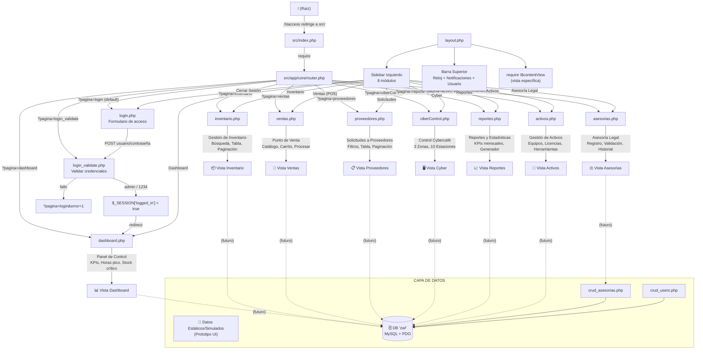

# Mapa Navegacional — EIS Zona Web Lara (ZWL)

  

> Diagrama de navegación de la aplicación PHP generado con Mermaid.

  

---

  

## Diagrama

  



  

---

  

## Tabla de rutas

  

| Ruta | Tipo | Vista | Descripción |

|------|------|-------|-------------|

| `?pagina=login` | 🔓 Pública | `login.php` | Formulario de acceso |

| `?pagina=login_validate` | 🔓 Pública | `login_validate.php` | Valida admin/1234, crea sesión |

| `?pagina=dashboard` | 🔒 Privada | `dashboard.php` | Panel de control con KPIs |

| `?pagina=inventario` | 🔒 Privada | `inventario.php` | Gestión de inventario |

| `?pagina=ventas` | 🔒 Privada | `ventas.php` | Punto de venta (POS) |

| `?pagina=proveedores` | 🔒 Privada | `proveedores.php` | Solicitudes a proveedores |

| `?pagina=ciberControl` | 🔒 Privada | `ciberControl.php` | Control de cybercafé |

| `?pagina=reportes` | 🔒 Privada | `reportes.php` | Reportes y estadísticas |

| `?pagina=activos` | 🔒 Privada | `activos.php` | Gestión de activos |

| `?pagina=asesorias` | 🔒 Privada | `asesorias.php` | Asesoría legal |

  

---

  

## Flujo de navegación

  

```

INICIO

  │

  ├─ /  →  .htaccess  →  src/index.php  →  router.php

  │

  ├─ [No autenticado]

  │    └─ ?pagina=login (default)

  │         └─ POST credentials → login_validate.php

  │              ├─ éxito → $_SESSION['logged_in'] → redirect /dashboard

  │              └─ fallo → redirect /login?error=1

  │

  └─ [Autenticado] → layout.php (sidebar + topbar + contenido)

       │

       ├─ /dashboard        →  Panel de Control

       ├─ /inventario       →  Gestión de Inventario

       ├─ /ventas           →  Punto de Venta (POS)

       ├─ /proveedores      →  Solicitudes a Proveedores

       ├─ /ciberControl     →  Control de Cybercafé

       ├─ /reportes         →  Reportes y Estadísticas

       ├─ /activos          →  Gestión de Activos

       ├─ /asesorias        →  Asesoría Legal

       └─ "Cerrar Sesión"   →  /login

```

  

---

  

## Mecanismo de ruteo

  

1. **Apache rewrite** (`.htaccess` en `src/`): `/dashboard` → `index.php?pagina=dashboard`

2. **Front controller** (`index.php`): Requiere `router.php`

3. **Router** (`router.php`):

   - Sanitiza el parámetro `?pagina=` (solo alfanumérico + guiones)

   - Si es página pública (`login`, `login_validate`): renderiza standalone

   - Si es página privada: verifica `$_SESSION['logged_in']`, redirige a login si no existe

   - Si la vista no existe: HTTP 404

   - Para páginas privadas: renderiza dentro de `layout.php` vía `require $contentView`

  

---

  

## Layout principal (`layout.php`)

  

| Componente | Descripción |

|------------|-------------|

| **Sidebar** | Menú lateral fijo con 8 módulos + modo oscuro + cerrar sesión |

| **Topbar** | Barra superior con título de página, reloj, notificaciones, usuario |

| **Contenido** | `<div class="container">` con `require $contentView` |

| **Back-to-top** | Botón flotante en esquina inferior derecha |

| **Scripts** | Materialize JS + `app.js` |