# Documentación de la Base de Datos — ZWL v2.1

> Sistema de Gestión Empresarial — Zona Web Lara  
> Documentación para asesoría sobre diseño de base de datos

---

## 📋 Índice

1. [Introducción y alcance](#1-introducción-y-alcance)
2. [Diagrama entidad-relación completo (Mermaid)](#2-diagrama-entidad-relación-completo-mermaid)
3. [Panorama general: los 4 módulos](#3-panorama-general-los-4-módulos)
4. [Decisiones de diseño fundamentales](#4-decisiones-de-diseño-fundamentales)
5. [Entidades de catálogo (lookup tables)](#5-entidades-de-catálogo-lookup-tables)
6. [Entidades maestras](#6-entidades-maestras)
7. [Entidades transaccionales](#7-entidades-transaccionales)
8. [Tablas puente (relaciones M:N)](#8-tablas-puente-relaciones-mn)
9. [Bitácoras y auditoría](#9-bitácoras-y-auditoría)
10. [Diagramas de máquina de estado](#10-diagramas-de-máquina-de-estado)
11. [Diagramas de flujo de procesos](#11-diagramas-de-flujo-de-procesos)
12. [Análisis de relaciones por módulo](#12-análisis-de-relaciones-por-módulo)
13. [Análisis de cardinalidades](#13-análisis-de-cardinalidades)
14. [Guía de integridad referencial](#14-guía-de-integridad-referencial)
15. [Vistas del sistema](#15-vistas-del-sistema)
16. [Procedimientos almacenados](#16-procedimientos-almacenados)
17. [Disparadores (triggers)](#17-disparadores-triggers)
18. [Análisis de índices y rendimiento](#18-análisis-de-índices-y-rendimiento)
19. [Análisis de normalización](#19-análisis-de-normalización)
20. [Patrones de diseño y justificaciones](#20-patrones-de-diseño-y-justificaciones)
21. [Posibles mejoras y advertencias](#21-posibles-mejoras-y-advertencias)

---

## 1. Introducción y alcance

### 1.1 Propósito de este documento

Este documento tiene dos objetivos:

1. **Documentar** la base de datos del Sistema ZWL v2.1 de forma completa y detallada.
2. **Asesorar** sobre las decisiones de diseño tomadas, explicando el porqué de cada elección, las alternativas consideradas y las implicaciones de cada decisión.

Está dirigido a:
- Desarrolladores que mantendrán el sistema.
- Arquitectos de datos que evaluarán el diseño.
- Estudiantes o consultores que analizarán la base de datos como caso de estudio.

### 1.2 El negocio

**Zona Web Lara (EIS)** es un negocio con 3 líneas operativas:

```
┌──────────────────────────────────────────────────────────────────┐
│                       ZONA WEB LARA (EIS)                        │
├────────────────┬────────────────────────┬────────────────────────┤
│  INVENTARIO    │      CYBERCAFÉ         │   ASESORÍAS LEGALES    │
│  Y VENTAS      │                        │                        │
├────────────────┼────────────────────────┼────────────────────────┤
│ • Productos    │ • Estaciones de        │ • Clientes legales     │
│ • Proveedores  │   cómputo              │ • Casos/expedientes    │
│ • Clientes     │ • Tarifas por tiempo   │ • Asignación de        │
│ • Ventas       │ • Sesiones de uso      │   personal             │
│ • Solicitudes  │                        │ • Seguimiento por      │
│   de compra    │                        │   estado               │
└────────────────┴────────────────────────┴────────────────────────┘
```

### 1.3 Ficha técnica

| Aspecto | Valor |
|---------|-------|
| Nombre de la BD | `zwl_V2` |
| Motor | MySQL 8.0+ / MariaDB 10.3+ |
| Motor de almacenamiento | **InnoDB** |
| Charset | `utf8mb4` |
| Collation | `utf8mb4_unicode_ci` |
| Capa de acceso | PDO con prepared statements |
| Total de tablas | 19 |
| Vistas | 3 |
| Procedimientos | 2 |
| Disparadores | 2 |

---

## 2. Diagrama entidad-relación completo (Mermaid)

```mermaid
erDiagram
    %% ==================== CATALOGO ====================
    roles {
        tinyint id PK
        varchar nombre UK
        varchar descripcion
        timestamp created_at
    }

    subcategorias {
        smallint id PK
        varchar nombre UK
        varchar descripcion
        boolean activa
        timestamp created_at
    }

    categorias {
        smallint id PK
        smallint subcategoria_id FK
        varchar nombre
        varchar descripcion
        boolean activa
        timestamp created_at
    }

    marcas {
        smallint id PK
        varchar nombre UK
        varchar descripcion
        timestamp created_at
    }

    modelos {
        int id PK
        smallint marca_id FK
        varchar nombre
        varchar descripcion
        timestamp created_at
    }

    tipos_activo {
        tinyint id PK
        varchar nombre UK
        varchar descripcion
        timestamp created_at
    }

    tarifas_cyber {
        smallint id PK
        varchar nombre UK
        decimal precio_por_hora
        int tiempo_minimo
        boolean activa
        timestamp created_at
        timestamp updated_at
    }

    %% ==================== MAESTRAS ====================
    usuarios {
        int id PK
        varchar username UK
        varchar password_hash
        varchar nombre
        varchar email UK
        varchar telefono
        boolean activo
        tinyint rol_id FK
        datetime ultimo_acceso
        timestamp created_at
        timestamp updated_at
    }

    clientes {
        int id PK
        varchar cedula_rif UK
        varchar nombre
        varchar telefono
        varchar email
        text direccion
        boolean activo
        timestamp created_at
        timestamp updated_at
    }

    clientes_asesorias {
        int id PK
        varchar cedula UK
        varchar nombre
        varchar email
        varchar telefono
        text direccion
        text notas_expediente
        timestamp created_at
        timestamp updated_at
    }

    proveedores {
        int id PK
        varchar nombre
        varchar rif UK
        enum tipo_documento
        varchar contacto
        varchar email
        varchar telefono
        text direccion
        boolean es_proveedor_principal
        boolean activo
        timestamp created_at
        timestamp updated_at
    }

    productos {
        int id PK
        varchar codigo UK
        varchar codigo_barras UK
        varchar nombre
        text descripcion
        smallint categoria_id FK
        int modelo_id FK
        enum unidad_medida
        int stock
        int stock_minimo
        varchar ubicacion
        decimal costo_compra
        decimal precio_venta
        boolean permite_descuento
        enum estado_venta
        boolean activo
        timestamp created_at
        timestamp updated_at
    }

    activos {
        int id PK
        varchar nombre
        text descripcion
        tinyint tipo_activo_id FK
        enum estado
        varchar ubicacion
        decimal valor_adquisicion
        date fecha_adquisicion
        date fecha_vencimiento
        int responsable_id FK
        text notas
        timestamp created_at
        timestamp updated_at
    }

    estaciones_cyber {
        int id PK
        varchar nombre UK
        enum estado
        smallint tarifa_id FK
        varchar especificaciones
        varchar ip_local
        varchar mac_address
        timestamp created_at
        timestamp updated_at
    }

    %% ==================== TRANSACCIONALES ====================
    ventas {
        int id PK
        datetime fecha
        int usuario_id FK
        int cliente_id FK
        decimal subtotal
        decimal descuento
        decimal total
        enum estado
        text notas
        timestamp created_at
        timestamp updated_at
    }

    detalle_ventas {
        int id PK
        int venta_id FK
        int producto_id FK
        int cantidad
        decimal precio_unitario
        decimal descuento
        decimal subtotal
        timestamp created_at
    }

    solicitudes {
        int id PK
        varchar codigo UK
        int proveedor_id FK
        date fecha
        date fecha_estimada_entrega
        smallint tiempo_entrega_dias
        decimal subtotal
        decimal total
        enum estado
        int usuario_id FK
        text notas
        timestamp created_at
        timestamp updated_at
    }

    detalle_solicitudes {
        int id PK
        int solicitud_id FK
        int producto_id FK
        int cantidad_solicitada
        int cantidad_recibida
        decimal precio_unitario_estimado
        decimal subtotal
        timestamp created_at
    }

    sesiones_cyber {
        int id PK
        int estacion_id FK
        int usuario_id FK
        int cliente_id FK
        datetime hora_inicio
        datetime hora_fin
        decimal costo_total
        enum estado
        timestamp created_at
        timestamp updated_at
    }

    asesorias {
        int id PK
        int cliente_asesoria_id FK
        varchar documento
        text descripcion
        enum estado
        datetime fecha_registro
        datetime fecha_cierre
        timestamp created_at
        timestamp updated_at
    }

    %% ==================== PUENTE (M:N) ====================
    producto_proveedor {
        int producto_id PK
        int proveedor_id PK
        varchar codigo_proveedor
        decimal precio_compra
        smallint tiempo_entrega_dias
        timestamp created_at
    }

    usuario_asesoria {
        int usuario_id PK
        int asesoria_id PK
        varchar rol_en_asesoria
        timestamp created_at
    }

    %% ==================== BITACORA ====================
    bitacora_movimientos_stock {
        bigint id PK
        int producto_id FK
        enum tipo
        int cantidad
        int stock_anterior
        int stock_nuevo
        decimal precio_unitario
        decimal costo_total
        datetime fecha
        int usuario_id FK
        varchar referencia_tipo
        int referencia_id
        varchar motivo
        timestamp created_at
    }

    %% ==================== RELACIONES ====================
    %% -- Catalogos --
    roles ||--o{ usuarios : "asigna"
    subcategorias ||--o{ categorias : "contiene"
    categorias ||--o{ productos : "clasifica"
    marcas ||--o{ modelos : "tiene"
    modelos ||--o{ productos : "especifica"
    tipos_activo ||--o{ activos : "categoriza"
    tarifas_cyber ||--o{ estaciones_cyber : "aplica_tarifa"

    %% -- Maestras -> Transaccionales --
    usuarios ||--o{ ventas : "registra"
    usuarios ||--o{ solicitudes : "crea"
    usuarios ||--o{ sesiones_cyber : "atiende"
    usuarios ||--o{ bitacora_movimientos_stock : "genera"
    usuarios ||--o{ activos : "custodia"
    usuarios ||--o{ usuario_asesoria : "participa"

    clientes ||--o{ ventas : "compra"
    clientes ||--o{ sesiones_cyber : "usa"

    clientes_asesorias ||--o{ asesorias : "solicita"

    proveedores ||--o{ solicitudes : "abastece"
    proveedores ||--o{ producto_proveedor : "suministra"

    %% -- Transaccionales -> Detalle --
    ventas ||--o{ detalle_ventas : "contiene"
    solicitudes ||--o{ detalle_solicitudes : "contiene"
    estaciones_cyber ||--o{ sesiones_cyber : "opera"

    %% -- M:N y Detalle -> Productos --
    productos ||--o{ detalle_ventas : "se_vende"
    productos ||--o{ detalle_solicitudes : "se_solicita"
    productos ||--o{ producto_proveedor : "se_abastece"
    productos ||--o{ bitacora_movimientos_stock : "audita"

    %% -- M:N Asesorias --
    asesorias ||--o{ usuario_asesoria : "asigna"
```

---

## 3. Panorama general: los 4 módulos

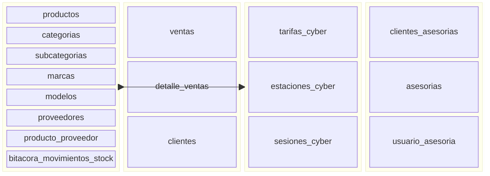

### 3.1 Mapa de navegación de la base de datos

```
╔══════════════════════════════════════════════════════════════╗
║                      SISTEMA ZWL v2.1                       ║
║                      19 Tablas · 26 FKs                     ║
╠══════════════════════════════════════════════════════════════╣
║                                                              ║
║  ┌──────────────────────────────────────────────────────┐   ║
║  │              MÓDULO DE INVENTARIO                    │   ║
║  │                                                      │   ║
║  │  subcategorias ──< categorias ──< productos >──      │   ║
║  │                                     │                │   ║
║  │  marcas ──< modelos >───────────────┘                │   ║
║  │                                     │                │   ║
║  │  proveedores ──< producto_proveedor >┘              │   ║
║  │                                     │                │   ║
║  │  bitacora_movimientos_stock >───────┘               │   ║
║  └──────────────────────────────────────────────────────┘   ║
║                          │                                    ║
║                          ▼                                    ║
║  ┌──────────────────────────────────────────────────────┐   ║
║  │              MÓDULO DE VENTAS                        │   ║
║  │                                                      │   ║
║  │  usuarios ──< ventas >──< detalle_ventas >──> prod.  │   ║
║  │              │                                       │   ║
║  │              └── clientes                            │   ║
║  └──────────────────────────────────────────────────────┘   ║
║                                                              ║
║  ┌──────────────────────────────────────────────────────┐   ║
║  │              MÓDULO CYBERCAFÉ                        │   ║
║  │                                                      │   ║
║  │  tarifas_cyber ──< estaciones_cyber ──< sesiones    │   ║
║  │                                     │                │   ║
║  │                                     ├── clientes     │   ║
║  │                                     └── usuarios     │   ║
║  └──────────────────────────────────────────────────────┘   ║
║                                                              ║
║  ┌──────────────────────────────────────────────────────┐   ║
║  │            MÓDULO DE ASESORÍAS                       │   ║
║  │                                                      │   ║
║  │  clientes_asesorias ──< asesorias ──< usuario        │   ║
║  │                              │         _asesoria     │   ║
║  │                              └──> usuarios           │   ║
║  └──────────────────────────────────────────────────────┘   ║
║                                                              ║
║  ┌──────────────────────────────────────────────────────┐   ║
║  │              MÓDULO DE ACTIVOS FIJOS                 │   ║
║  │                                                      │   ║
║  │  tipos_activo ──< activos >── usuarios               │   ║
║  └──────────────────────────────────────────────────────┘   ║
║                                                              ║
╚══════════════════════════════════════════════════════════════╝
```

---

## 4. Decisiones de diseño fundamentales

Esta sección explica **por qué** se tomaron las decisiones más importantes del diseño. Es útil tanto para quien hereda el proyecto como para quien evalúa la calidad del diseño.

### 4.1 ¿Por qué InnoDB y no MyISAM?

| Aspecto | InnoDB (elegido) | MyISAM (descartado) |
|---------|------------------|---------------------|
| Transacciones | ✅ Soporte ACID (COMMIT/ROLLBACK) | ❌ No soporta |
| Claves foráneas | ✅ FOREIGN KEY + ON DELETE | ❌ No soporta |
| Bloqueo | 🔒 Por fila (ROW LEVEL) | 🔒 Por tabla (TABLE LEVEL) |
| Recuperación | ✅ Write-ahead log (crash-safe) | ❌ Propenso a corrupción |
| COUNT(*) rápido | ❌ Más lento | ✅ Muy rápido |

**Conclusión:** Para un sistema de gestión empresarial con transacciones de venta, control de inventario concurrente ( `sp_registrar_movimiento_stock` usa `FOR UPDATE` ), y relaciones complejas, InnoDB es la **única opción viable**. MyISAM no podría garantizar la integridad stock-venta ni las relaciones entre tablas.

### 4.2 ¿Por qué utf8mb4 y no utf8 (utf8mb3)?

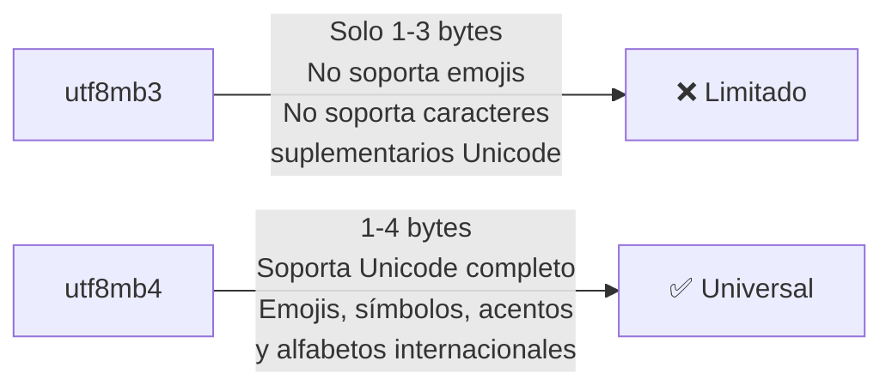

**Razones:**
- `utf8` en MySQL es en realidad `utf8mb3` (máximo 3 bytes), que no cubre todo Unicode.
- `utf8mb4` cubre el estándar Unicode completo (incluyendo emojis, símbolos matemáticos, caracteres de idiomas orientales).
- `utf8mb4_unicode_ci` usa el algoritmo UCA (Unicode Collation Algorithm) para ordenamiento y comparación lingüísticamente correctos.
- En Venezuela (donde opera Zona Web Lara), es común usar acentos, ñ, y caracteres especiales en nombres de personas y empresas.

### 4.3 ¿Por qué usar ENUM en lugar de tablas separadas?

En la base de datos hay **8 columnas ENUM**:

| Tabla | Columna ENUM | Valores posibles |
|-------|-------------|------------------|
| `proveedores` | `tipo_documento` | 'J', 'V', 'E', 'G' |
| `productos` | `unidad_medida` | 'Unidades', 'Kg', 'Litros', 'Metros', 'Packs' |
| `productos` | `estado_venta` | 'Activo', 'Inactivo' |
| `activos` | `estado` | 'Activo', 'Mantenimiento', 'Vencida', 'Baja' |
| `estaciones_cyber` | `estado` | 'Disponible', 'Ocupada', 'Mantenimiento' |
| `sesiones_cyber` | `estado` | 'activa', 'cerrada', 'interrumpida' |
| `ventas` | `estado` | 'completada', 'pendiente', 'cancelada', 'reembolsada' |
| `solicitudes` | `estado` | 'Pendiente', 'Aprobada', 'Enviada', 'Recibida', 'Cancelada' |
| `asesorias` | `estado` | 'Pendiente', 'En Proceso', 'Finalizada', 'Archivada' |
| `bitacora_movimientos_stock` | `tipo` | 'entrada', 'salida', 'ajuste' |

**¿Por qué ENUM y no una tabla lookup?**

| Criterio | ENUM | Tabla lookup separada |
|----------|------|----------------------|
| Conjunto de valores | Fijo, pequeño, no cambia | Variable, puede crecer |
| Rendimiento | Almacenamiento interno (1-2 bytes) | JOIN adicional |
| Mantenibilidad | Cambiar requiere ALTER TABLE | INSERT/UPDATE simple |
| Consultas | `WHERE estado = 'Activo'` (legible) | Requiere JOIN o subconsulta |

**Regla práctica usada en este diseño:**
- **ENUM** → Cuando los valores son fijos, bien conocidos y con pocas probabilidades de cambio (ej: tipos de documento V/J/E/G, estados de ciclo de vida).
- **Tabla lookup** → Cuando los valores pueden crecer con el tiempo (ej: `roles`, `subcategorias`, `marcas`).

> **Advertencia para asesoría:** ENUM en MySQL tiene limitaciones. Si en el futuro se necesitan nuevos estados (ej: "En Espera" para asesorías), se requerirá un `ALTER TABLE`. Para equipos pequeños esto es manejable, pero en sistemas grandes puede justificarse migrar a tablas lookup.

### 4.4 ¿Por qué separar `clientes` y `clientes_asesorias`?

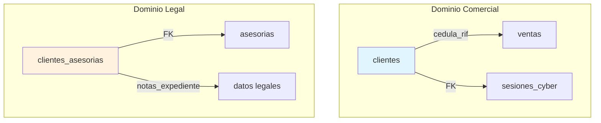

**Razones de la separación:**

| Motivo | Explicación |
|--------|-------------|
| **Dominios distintos** | Un cliente de ventas compra productos; un cliente de asesorías recibe servicios legales. Son relaciones comerciales fundamentalmente diferentes. |
| **Datos diferentes** | `clientes_asesorias` tiene `notas_expediente` (información legal sensible) que no aplica a ventas/cyber. |
| **Ciclos de vida independientes** | Un cliente puede estar inactivo en ventas pero activo en asesorías. |
| **Seguridad** | La información legal (expedientes, casos) podría requerir controles de acceso diferentes a la información comercial. |
| **Identificación distinta** | `clientes` usa `cedula_rif` (RIF empresarial), `clientes_asesorias` usa `cedula` (cédula de persona natural). |

**Alternativa considerada:** Una sola tabla `clientes` con un campo `tipo` ('comercial', 'legal', 'ambos'). Se descartó porque mezcla lógica de negocio, complica las FK, y la mayoría de los clientes pertenecen a un solo dominio.

### 4.5 ¿Por qué BIGINT en `bitacora_movimientos_stock.id`?

| Tipo | Rango máximo | Para 1000 mov/día |
|------|-------------|-------------------|
| INT (32 bits) | 2,147,483,647 | ~5.8 años |
| BIGINT (64 bits) | 9,223,372,036,854,775,807 | ~25 mil millones de años |

**Decisión:** `BIGINT UNSIGNED`. Una bitácora de movimientos de stock puede crecer muy rápido (cada venta, solicitud, ajuste de precio y movimiento manual genera al menos un registro). A 1000 movimientos por día, un `INT` se agotaría en ~6 años. Para una bitácora que debe conservarse **para siempre** por razones de auditoría, `BIGINT` es la elección correcta.

### 4.6 ¿Por qué `ON DELETE SET NULL` con usuarios?

Es el patrón más usado con la tabla `usuarios`:

| FK en tabla | ON DELETE |
|------------|-----------|
| `ventas.usuario_id` | SET NULL |
| `solicitudes.usuario_id` | SET NULL |
| `sesiones_cyber.usuario_id` | SET NULL |
| `bitacora_movimientos_stock.usuario_id` | SET NULL |
| `activos.responsable_id` | SET NULL |

**Razonamiento:** Cuando un empleado es eliminado del sistema (ej: renuncia), NO queremos perder el histórico de sus transacciones. Con `SET NULL`, la transacción se conserva con `usuario_id = NULL`, lo que significa "un usuario que ya no existe en el sistema realizó esta operación".

### 4.7 Resumen visual de las 3 reglas ON DELETE

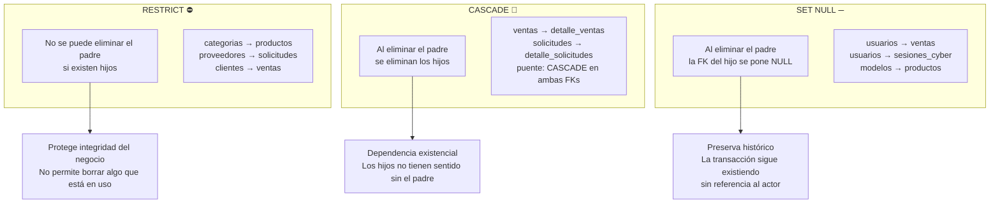

---

## 5. Entidades de catálogo (lookup tables)

Estas tablas almacenan valores de referencia que dan contexto al resto del sistema. Su contenido se carga inicialmente con datos semilla y cambia con poca frecuencia. Son el **vocabulario compartido** del sistema.

```
┌────────────────────────────────────────────────────────────┐
│                    CATÁLOGO (LOOKUP)                       │
│  Valores de referencia, baja volatilidad                   │
│                                                            │
│  roles ────────> usuarios (FK: usuarios.rol_id)           │
│  subcategorias ─> categorias (FK: categorias.subcategoria)│
│  marcas ────────> modelos (FK: modelos.marca_id)          │
│  categorias ────> productos (FK: productos.categoria_id)  │
│  modelos ───────> productos (FK: productos.modelo_id)     │
│  tipos_activo ───> activos (FK: activos.tipo_activo_id)   │
│  tarifas_cyber ──> estaciones (FK: estaciones.tarifa_id)  │
└────────────────────────────────────────────────────────────┘
```

---

### 5.1 `roles`

Define los niveles de acceso y permisos.

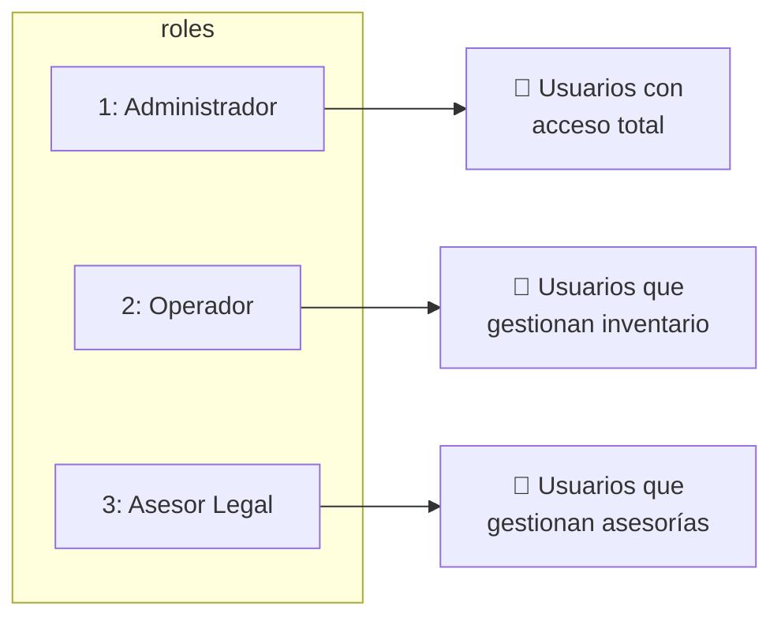

| Columna | Tipo | Restricciones | Descripción |
|---------|------|---------------|-------------|
| `id` | TINYINT UNSIGNED | PK, AUTO_INCREMENT | 1 byte, suficiente para ~255 roles |
| `nombre` | VARCHAR(30) | NOT NULL, UNIQUE | Administrador, Operador, Asesor Legal |
| `descripcion` | VARCHAR(150) | NULL | Opcional |
| `created_at` | TIMESTAMP | DEFAULT CURRENT_TIMESTAMP | |

**¿Por qué TINYINT?** Solo se esperan 3-5 roles como máximo. TINYINT ocupa 1 byte vs 4 de INT.

**Relación:** `roles` 1──< `usuarios` (FK: `usuarios.rol_id`)

---

### 5.2 `subcategorias`

Primer nivel de clasificación de productos.

| Columna | Tipo | Descripción |
|---------|------|-------------|
| `id` | SMALLINT UNSIGNED PK | Hasta ~65,000 subcategorías |
| `nombre` | VARCHAR(50) UNIQUE | "Componentes de PC", "Periféricos" |
| `descripcion` | VARCHAR(200) NULL | |
| `activa` | BOOLEAN DEFAULT TRUE | Borrado lógico |
| `created_at` | TIMESTAMP | |

**Datos semilla:**
1. Componentes de PC
2. Periféricos
3. Consumibles
4. Servicios Digitales

**Relación:** `subcategorias` 1──< `categorias` (FK: `categorias.subcategoria_id`)

---

### 5.3 `categorias`

Segundo nivel de clasificación. Pertenece a una subcategoría.

| Columna | Tipo | Restricciones | Descripción |
|---------|------|---------------|-------------|
| `id` | SMALLINT UNSIGNED | PK | |
| `subcategoria_id` | SMALLINT UNSIGNED | FK → `subcategorias(id)`, ON DELETE RESTRICT, NULL | Puede ser NULL para categorías generales |
| `nombre` | VARCHAR(50) | NOT NULL | |
| `descripcion` | VARCHAR(200) | NULL | |
| `activa` | BOOLEAN | DEFAULT TRUE | |
| `created_at` | TIMESTAMP | | |

**Índice único compuesto:** `(subcategoria_id, nombre)` — No pueden existir dos categorías con el mismo nombre dentro de una misma subcategoría.

**Regla de negocio:** "Dos categorías pueden tener el mismo nombre si están en diferentes subcategorías" (ej: "Memorias" puede existir en "Componentes de PC" y en "Consumibles").

**Relación:** `categorias` 1──< `productos` (FK: `productos.categoria_id`)

---

### 5.4 `marcas`

Fabricantes.

| Columna | Tipo | Restricciones |
|---------|------|---------------|
| `id` | SMALLINT UNSIGNED | PK |
| `nombre` | VARCHAR(100) | NOT NULL, UNIQUE |
| `descripcion` | VARCHAR(200) | NULL |
| `created_at` | TIMESTAMP | |

**Relación:** `marcas` 1──< `modelos` (FK: `modelos.marca_id`)

---

### 5.5 `modelos`

Modelos específicos de cada marca.

| Columna | Tipo | Restricciones |
|---------|------|---------------|
| `id` | INT UNSIGNED | PK |
| `marca_id` | SMALLINT UNSIGNED | FK → `marcas(id)`, ON DELETE RESTRICT, NOT NULL |
| `nombre` | VARCHAR(100) | NOT NULL |
| `descripcion` | VARCHAR(200) | NULL |
| `created_at` | TIMESTAMP | |

**Índice único compuesto:** `(marca_id, nombre)` — No pueden existir dos modelos con el mismo nombre dentro de una misma marca.

**¿Por qué INT (4 bytes) en lugar de SMALLINT?** Porque el volumen de modelos puede crecer mucho más que el de marcas. Cada marca puede tener decenas o cientos de modelos.

**Relación:** `modelos` 1──< `productos` (FK: `productos.modelo_id`, opcional)

---

### 5.6 `tipos_activo`

Clasificación de activos fijos.

| Columna | Tipo | Descripción |
|---------|------|-------------|
| `id` | TINYINT UNSIGNED PK | 4 tipos semilla, TINYINT es suficiente |
| `nombre` | VARCHAR(50) UNIQUE | "Infraestructura y Redes", "Mobiliario" |
| `descripcion` | VARCHAR(200) NULL | |
| `created_at` | TIMESTAMP | |

**Relación:** `tipos_activo` 1──< `activos` (FK: `activos.tipo_activo_id`)

---

### 5.7 `tarifas_cyber`

Tarifas del módulo cybercafé con lógica de tiempo mínimo.

| Columna | Tipo | Descripción |
|---------|------|-------------|
| `id` | SMALLINT UNSIGNED PK | |
| `nombre` | VARCHAR(50) UNIQUE | "Zona Gaming", "Uso Oficina / Estudio" |
| `precio_por_hora` | DECIMAL(8,2) | Precio por hora de uso |
| `tiempo_minimo` | INT UNSIGNED DEFAULT 30 | ⏱️ **Minutos mínimos de cobro** — Regla de negocio clave |
| `activa` | BOOLEAN DEFAULT TRUE | |
| `created_at` | TIMESTAMP | |
| `updated_at` | TIMESTAMP | ON UPDATE CURRENT_TIMESTAMP |

**Regla de negocio del tiempo mínimo:**
```
SI sesión < tiempo_minimo → se cobra como si hubiera durado tiempo_minimo
SI sesión >= tiempo_minimo → se cobra el tiempo real transcurrido
```

**Ejemplo:**
```
Tarifa "Zona Gaming": $2.50/hora, tiempo_mínimo = 30 min
  Sesión de 10 min → se cobran 30 min → $1.25
  Sesión de 45 min → se cobran 45 min → $1.88
```

**Relación:** `tarifas_cyber` 1──< `estaciones_cyber` (FK: `estaciones_cyber.tarifa_id`)

---

## 6. Entidades maestras

Estas tablas representan las entidades fundamentales del negocio. Tienen ciclo de vida propio y son referenciadas por múltiples tablas.

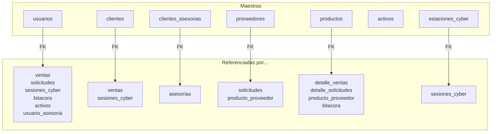

---

### 6.1 `usuarios` — La tabla más conectada (7 relaciones)

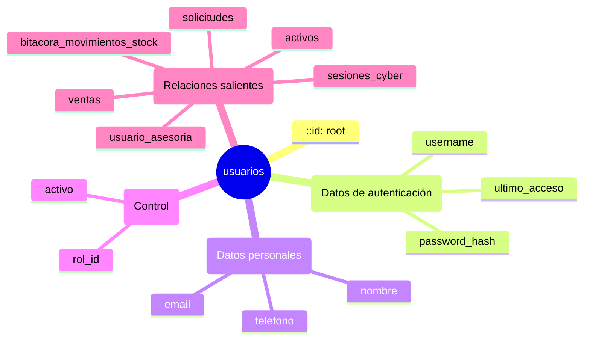

| Columna | Tipo | Descripción | ¿Por qué? |
|---------|------|-------------|-----------|
| `id` | INT UNSIGNED PK | Identificador | Suficiente para miles de usuarios |
| `username` | VARCHAR(30) UNIQUE | Login | Corto, sin espacios |
| `password_hash` | VARCHAR(255) | Hash bcrypt | bcrypt genera 60 chars, pero 255 es estándar para futuros cambios de algoritmo |
| `nombre` | VARCHAR(100) | Nombre completo | |
| `email` | VARCHAR(100) UNIQUE | Correo | Único para notificaciones y recuperación |
| `telefono` | VARCHAR(20) NULL | Contacto | |
| `activo` | BOOLEAN DEFAULT TRUE | Borrado lógico | |
| `rol_id` | TINYINT UNSIGNED FK → roles | Rol | DEFAULT 2 = Operador |
| `ultimo_acceso` | DATETIME NULL | Auditoría de login | |
| `created_at` | TIMESTAMP | | |
| `updated_at` | TIMESTAMP | | ON UPDATE |

---

### 6.2 `clientes`

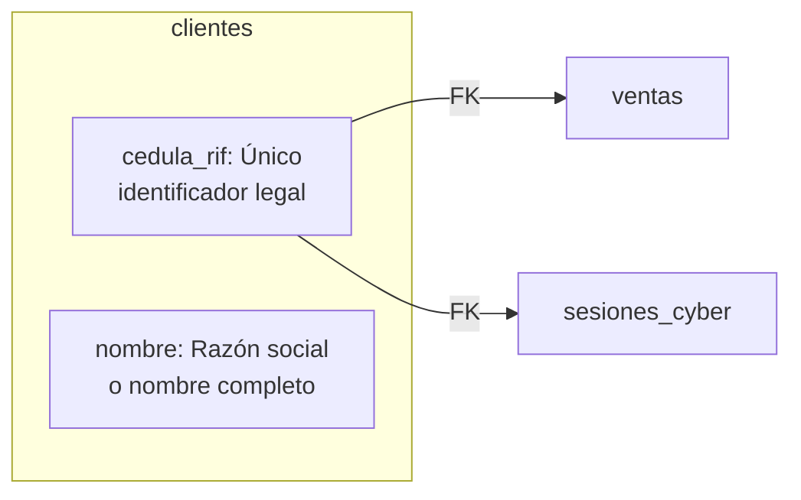

| Columna | Tipo | Observación |
|---------|------|-------------|
| `id` | INT UNSIGNED PK | |
| `cedula_rif` | VARCHAR(20) UNIQUE | Permite V-12345678, J-12345678-0, E-12345678 |
| `nombre` | VARCHAR(150) | |
| `telefono` | VARCHAR(20) NULL | |
| `email` | VARCHAR(100) NULL | |
| `direccion` | TEXT NULL | |
| `activo` | BOOLEAN DEFAULT TRUE | |
| `created_at` / `updated_at` | TIMESTAMP | |

---

### 6.3 `clientes_asesorias`

Separado de `clientes` (ver sección 4.4 para justificación).

| Columna | Tipo | Diferencia con `clientes` |
|---------|------|---------------------------|
| `id` | INT UNSIGNED PK | |
| `cedula` | VARCHAR(20) UNIQUE | Se llama `cedula` no `cedula_rif` |
| `nombre` | VARCHAR(150) | |
| `email` | VARCHAR(100) NULL | |
| `telefono` | VARCHAR(20) NULL | |
| `direccion` | TEXT NULL | |
| `notas_expediente` | TEXT NULL | 🔑 **Columna extra**: información legal del cliente |
| `created_at` / `updated_at` | TIMESTAMP | |

---

### 6.4 `proveedores`

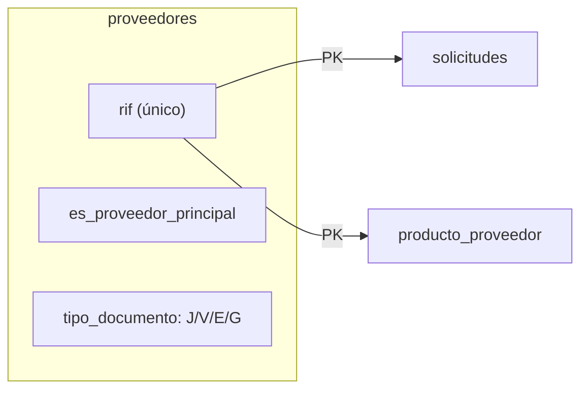

| Columna | Tipo | Descripción |
|---------|------|-------------|
| `id` | INT UNSIGNED PK | |
| `nombre` | VARCHAR(150) NOT NULL | |
| `rif` | VARCHAR(20) UNIQUE NULL | RIF venezolano |
| `tipo_documento` | ENUM('J','V','E','G') | J=Jurídica, V=Venezolano, E=Extranjero, G=Gubernamental |
| `contacto` | VARCHAR(100) NULL | Persona física de contacto |
| `email` / `telefono` / `direccion` | | Datos de contacto |
| `es_proveedor_principal` | BOOLEAN DEFAULT FALSE | 🏷️ Marca al proveedor preferido |
| `activo` | BOOLEAN DEFAULT TRUE | |
| `created_at` / `updated_at` | TIMESTAMP | |

---

### 6.5 `productos` — La segunda más conectada (6 relaciones)

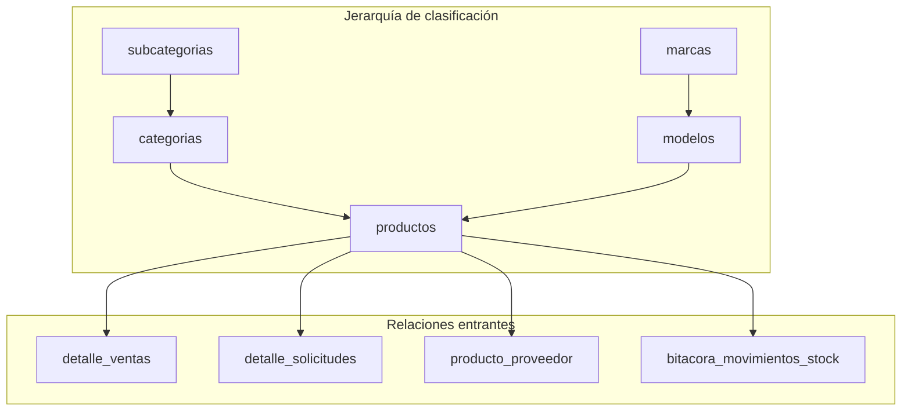

| Columna | Tipo | Descripción clave |
|---------|------|-------------------|
| `id` | INT UNSIGNED PK | |
| `codigo` | VARCHAR(50) UNIQUE | SKU interno del negocio |
| `codigo_barras` | VARCHAR(100) UNIQUE NULL | Lectura por scanner |
| `nombre` | VARCHAR(150) NOT NULL | |
| `categoria_id` | SMALLINT UNSIGNED FK → categorias | ⚠️ RESTRICT: no borrar categoría con productos |
| `modelo_id` | INT UNSIGNED FK → modelos NULL | Opcional, SET NULL si se borra el modelo |
| `unidad_medida` | ENUM | Cómo se mide/vende |
| `stock` | **INT NOT NULL DEFAULT 0** | ⚠️ Controlado por SP transaccional |
| `stock_minimo` | INT NOT NULL DEFAULT 5 | Para alertas de reposición |
| `costo_compra` | DECIMAL(12,2) | Precio de adquisición |
| `precio_venta` | DECIMAL(12,2) | ⚠️ Auditado por trigger (cambios van a bitácora) |
| `permite_descuento` | BOOLEAN DEFAULT TRUE | Control granular por producto |
| `estado_venta` | ENUM('Activo','Inactivo') | Desactiva venta sin desactivar producto |
| `activo` | BOOLEAN DEFAULT TRUE | Borrado lógico |

---

### 6.6 `activos`

| Columna | Tipo | Descripción |
|---------|------|-------------|
| `id` | INT UNSIGNED PK | |
| `nombre` | VARCHAR(150) NOT NULL | |
| `tipo_activo_id` | TINYINT UNSIGNED FK → tipos_activo | |
| `estado` | ENUM('Activo','Mantenimiento','Vencida','Baja') | Ciclo de vida: Activo → Mantenimiento → Baja |
| `valor_adquisicion` | DECIMAL(12,2) NULL | |
| `fecha_adquisicion` / `fecha_vencimiento` | DATE NULL | Para licencias y garantías |
| `responsable_id` | INT UNSIGNED FK → usuarios NULL | SET NULL: el activo sobrevive al responsable |

---

### 6.7 `estaciones_cyber`

Cada PC del cybercafé.

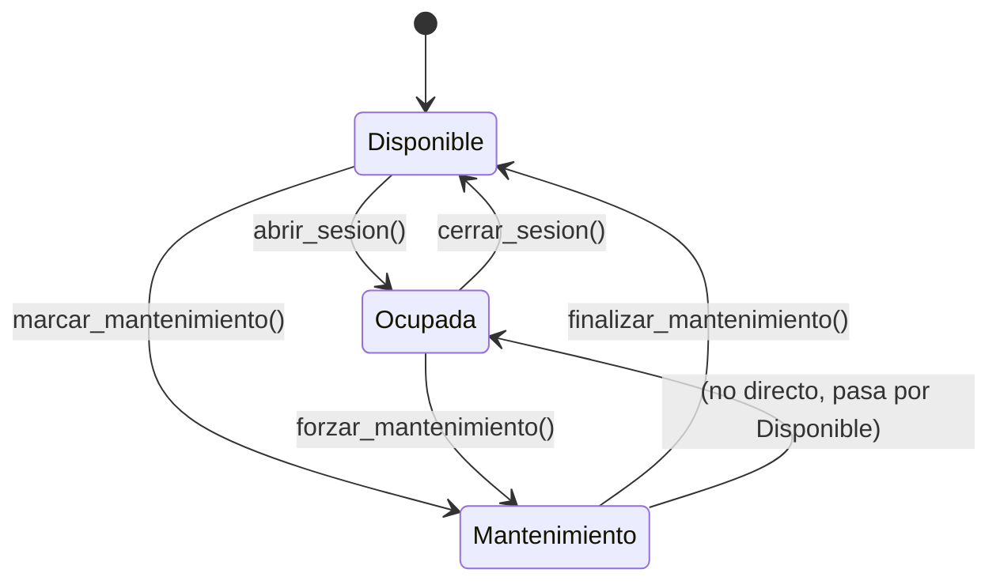

| Columna | Tipo | Descripción |
|---------|------|-------------|
| `id` | INT UNSIGNED PK | |
| `nombre` | VARCHAR(50) UNIQUE | "PC-01", "Zona Gamers #3" |
| `estado` | ENUM | Disponible, Ocupada, Mantenimiento |
| `tarifa_id` | SMALLINT UNSIGNED FK → tarifas_cyber | Tarifa asignada |
| `especificaciones` | VARCHAR(255) | RAM, CPU, GPU (texto libre) |
| `ip_local` | VARCHAR(15) | IPv4 |
| `mac_address` | VARCHAR(17) | Formato AA:BB:CC:DD:EE:FF |

---

## 7. Entidades transaccionales

Registran eventos u operaciones de negocio. Su volumen crece con el tiempo. Siguen el patrón **cabecera-detalle** (Header-Detail).

### 7.1 Patrón Cabecera-Detalle

```
┌──────────────────────┐       ┌──────────────────────────────┐
│      CABECERA        │       │          DETALLE             │
│                      │       │                              │
│  ventas (id=1)       │──┐    │  detalle_ventas (venta_id=1) │
│  cliente: Pérez      │  ├───►│  │──► producto A, qty 2     │
│  total: $150         │  │    │  │──► producto B, qty 1     │
│                      │  │    │  │──► producto C, qty 3     │
│  solicitudes (id=5)  │──┘    │                              │
│  proveedor: XYZ      │       │  detalle_solicitudes (sol=5) │
│  estado: Pendiente   │──┐    │  │──► producto A, cant 10   │
│                      │  ├───►│  │──► producto D, cant 5    │
└──────────────────────┘  │    └──────────────────────────────┘
                          │
                    ON DELETE CASCADE:
                    Si se elimina la cabecera,
                    se eliminan los detalles automáticamente.
                    (Los detalles no tienen sentido sin su cabecera)
```

---

### 7.2 `ventas`

Cabecera de transacciones de venta.

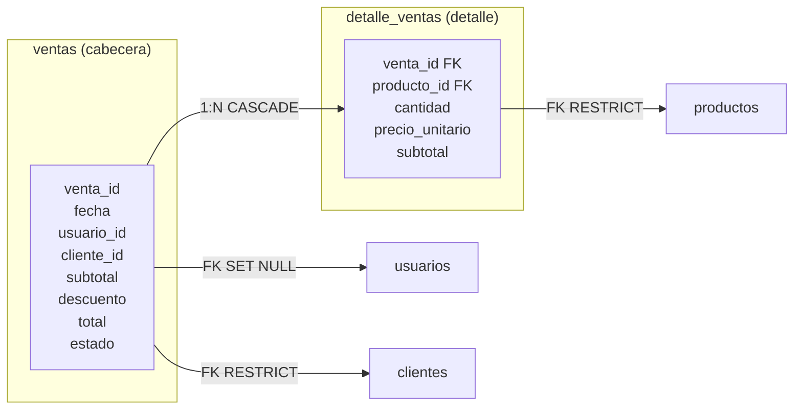

| Columna | Tipo | Regla de negocio |
|---------|------|------------------|
| `subtotal` | DECIMAL(12,2) | Calculado automáticamente por trigger `trg_actualizar_totales_venta` |
| `descuento` | DECIMAL(12,2) | Descuento global (no se detalla por producto aquí) |
| `total` | DECIMAL(12,2) | `subtotal - descuento` (sin IVA en esta versión) |
| `estado` | ENUM | Ver máquina de estados abajo |

**Máquina de estados:**

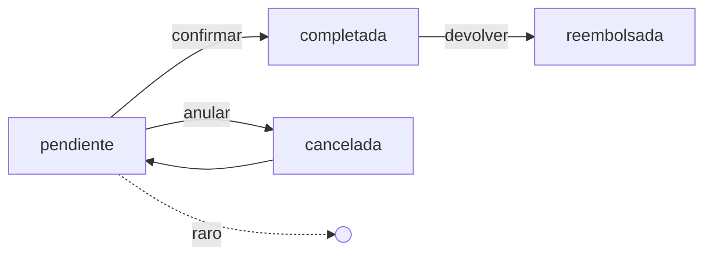

---

### 7.3 `detalle_ventas`

| Columna | Propósito de diseño |
|---------|---------------------|
| `precio_unitario` | 🔒 **Precio congelado**: almacena el precio del producto AL MOMENTO DE LA VENTA. No es el precio actual del producto. Esto garantiza que el histórico sea fiel. |
| `subtotal` | `cantidad × precio_unitario − descuento` |
| `venta_id` | CASCADE: si se elimina la venta, se eliminan los detalles |
| `producto_id` | RESTRICT: no se puede eliminar un producto que aparezca en ventas |

---

### 7.4 `solicitudes`

Órdenes de compra a proveedores.

| Columna | Tipo | Descripción |
|---------|------|-------------|
| `codigo` | VARCHAR(20) UNIQUE | "SOL-2024-001" — código visible para el negocio |
| `estado` | ENUM | Pendiente → Aprobada → Enviada → Recibida (o Cancelada) |
| `proveedor_id` | FK → proveedores | RESTRICT |
| `usuario_id` | FK → usuarios | SET NULL |

**Máquina de estados de solicitudes:**

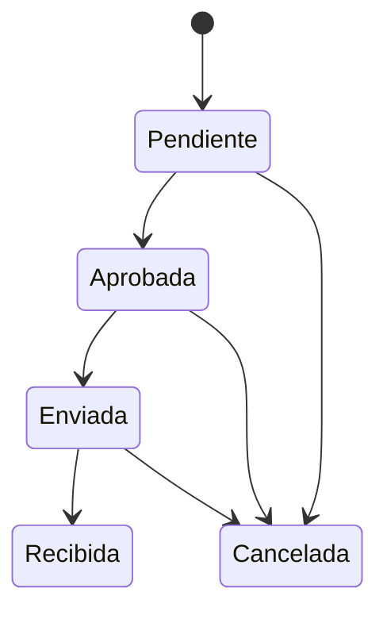

---

### 7.5 `detalle_solicitudes`

| Columna | Diseño destacado |
|---------|------------------|
| `cantidad_solicitada` | Lo que se pidió |
| `cantidad_recibida` | NULL | ✅ **Soporta recepción parcial**: permite recibir menos de lo solicitado. NULL = aún no recibido. |
| `precio_unitario_estimado` | Precio estimado (puede diferir de la factura final) |

---

### 7.6 `sesiones_cyber`

Cada uso de una estación.

| Columna | Descripción del flujo |
|---------|----------------------|
| `hora_inicio` | Se asigna al crear la sesión (DEFAULT CURRENT_TIMESTAMP) |
| `hora_fin` | Se asigna al ejecutar `sp_cerrar_sesion_cyber` |
| `costo_total` | Calculado por el SP según tarifa y tiempo mínimo |
| `estado` | activa → cerrada (o interrumpida) |

---

### 7.7 `asesorias`

Casos de asesoría legal.

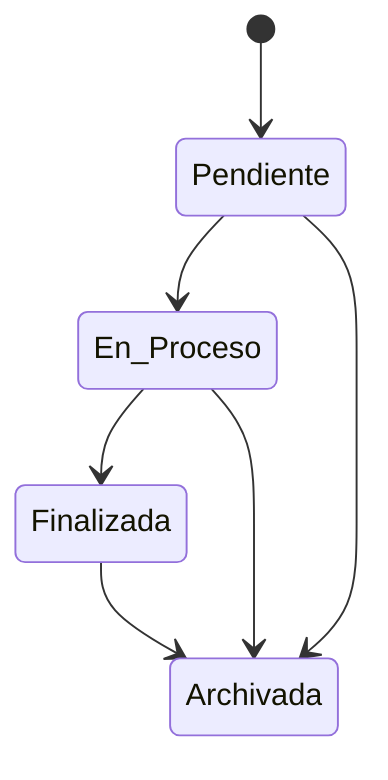

| Columna | Descripción |
|---------|-------------|
| `documento` | Número de expediente o visado |
| `fecha_registro` | DEFAULT CURRENT_TIMESTAMP |
| `fecha_cierre` | Se asigna al finalizar/archivar |
| `cliente_asesoria_id` | FK → clientes_asesorias, RESTRICT |

---

## 8. Tablas puente (relaciones M:N)

### 8.1 ¿Qué es una tabla puente?

```
┌──────────────┐         ┌──────────────────┐         ┌──────────────┐
│   Producto   │         │ producto_         │         │  Proveedor   │
│              │ 1────M  │ proveedor         │ M────1  │              │
│ Teclado G Pro│         │                  │         │ DigitalWorld │
│ Mouse G203   │         │ precio_compra: $45│         │ CompuMega    │
└──────────────┘         │ codigo_prov: X-01│         └──────────────┘
                         └──────────────────┘
                            ▲  Atributos de la relación  ▲
```

**Sin tabla puente, necesitaríamos:**

| Opción | Problema |
|--------|----------|
| `productos.proveedor_id` (1 FK) | Un producto solo podría tener 1 proveedor |
| `proveedores.producto_id` (1 FK) | Un proveedor solo podría tener 1 producto |
| Múltiples columnas `proveedor1_id`, `proveedor2_id`... | Esquema rígido, viola 1FN |

**Solución correcta:** Tabla puente con PK compuesta `(producto_id, proveedor_id)`.

---

### 8.2 `producto_proveedor` — Productos ↔ Proveedores

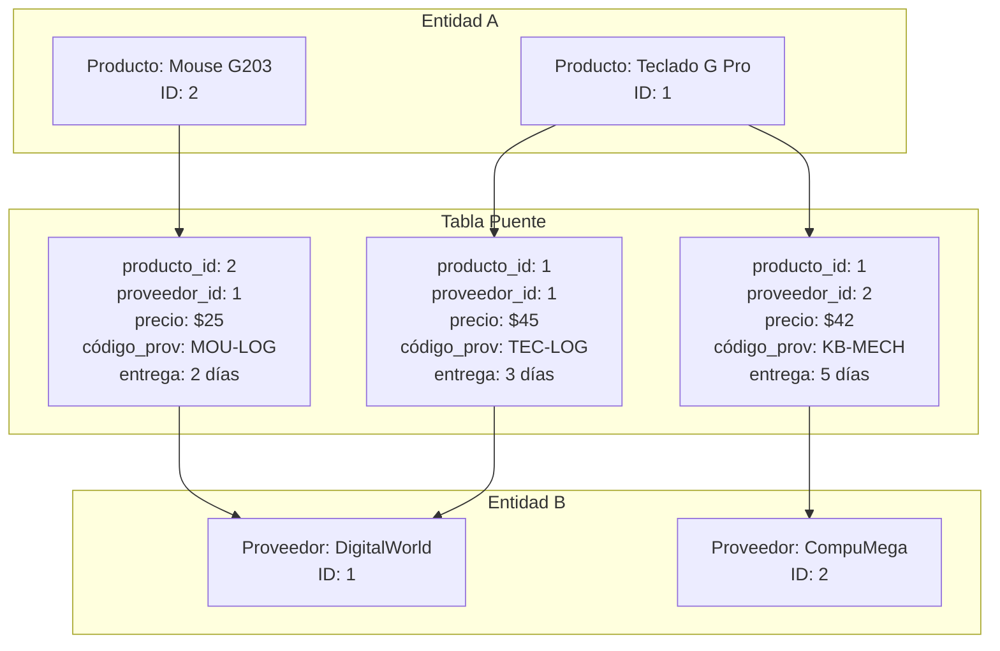

**Atributos de la relación (explicación):**

| Atributo | ¿Por qué va en la tabla puente? |
|----------|--------------------------------|
| `codigo_proveedor` | El proveedor tiene su propio SKU para cada producto. No es del producto ni del proveedor, es del vínculo. |
| `precio_compra` | El precio puede variar por proveedor. Un producto no tiene un solo precio de compra. |
| `tiempo_entrega_dias` | Varía por producto-proveedor. Un proveedor puede tardar 3 días en un producto y 10 en otro. |

**Comportamiento CASCADE en ambas FKs:**
- Si se elimina un producto, se borran todas sus relaciones con proveedores.
- Si se elimina un proveedor, se borran todos sus productos asociados.
- La relación no tiene sentido si alguna de las dos entidades desaparece.

---

### 8.3 `usuario_asesoria` — Usuarios ↔ Asesorías

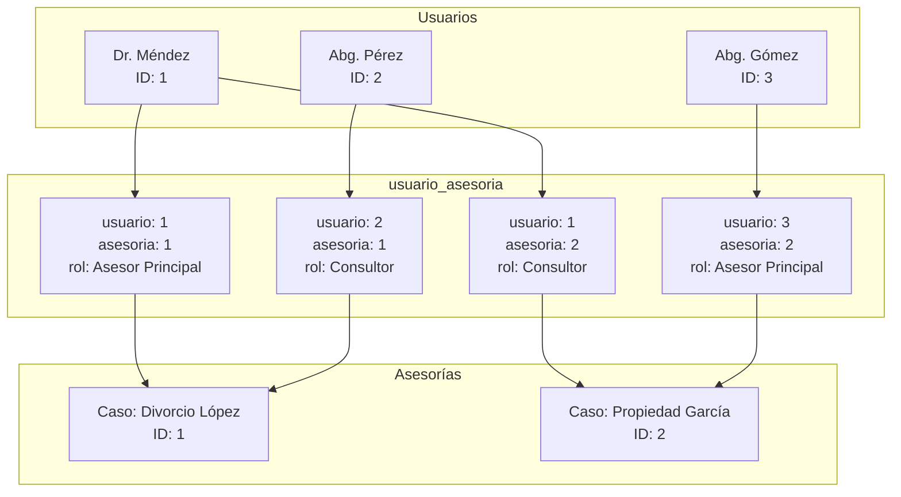

**Atributo de la relación:**

| Atributo | Ejemplos | Explicación |
|----------|----------|-------------|
| `rol_en_asesoria` | 'Asesor Principal', 'Consultor', 'Gestor', 'Auditor' | Un mismo usuario puede tener diferentes roles en diferentes asesorías. No es atributo del usuario ni de la asesoría, es del vínculo. |

---

## 9. Bitácoras y auditoría

### 9.1 `bitacora_movimientos_stock`

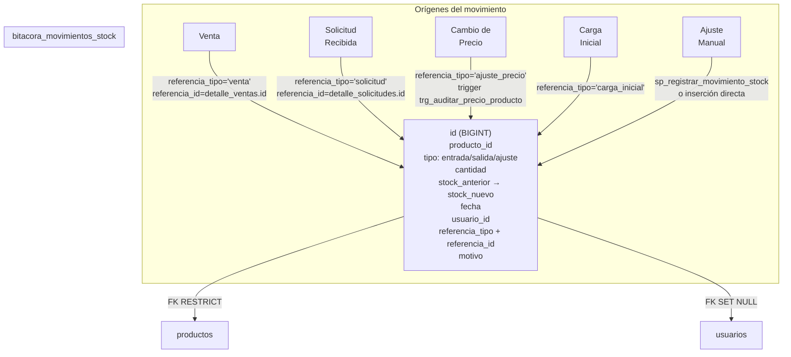

**¿Por qué este diseño de referencia polimórfica?**

Alternativa descartada:
```sql
-- Múltiples columnas FK (mal diseño)
venta_id INT NULL,
solicitud_id INT NULL,
ajuste_id INT NULL,
-- La mayoría serían NULL
```

Problemas de esa alternativa:
- Muchas columnas NULL (desperdicio de espacio).
- No es extensible (si se agrega un nuevo origen, hay que agregar otra columna).
- Difícil de consultar: `WHERE venta_id IS NOT NULL OR solicitud_id IS NOT NULL`.

**Solución elegida: referencia polimórfica**

| Campo | Valor ejemplo | Explicación |
|-------|---------------|-------------|
| `referencia_tipo` | `'venta'` | VARCHAR(30) — identifica la tabla de origen |
| `referencia_id` | `42` | INT — identifica la fila en esa tabla |

Ventajas:
- ✅ Extensible: solo se necesita un nuevo string en `referencia_tipo`.
- ✅ Sin columnas NULL desperdiciadas.
- ✅ Consultas simples: `WHERE referencia_tipo = 'venta'`.

Desventaja:
- ❌ No hay integridad referencial real (no es una FK). La consistencia debe garantizarla la aplicación o el SP.

---

## 10. Diagramas de máquina de estado

### 10.1 Estado de ventas

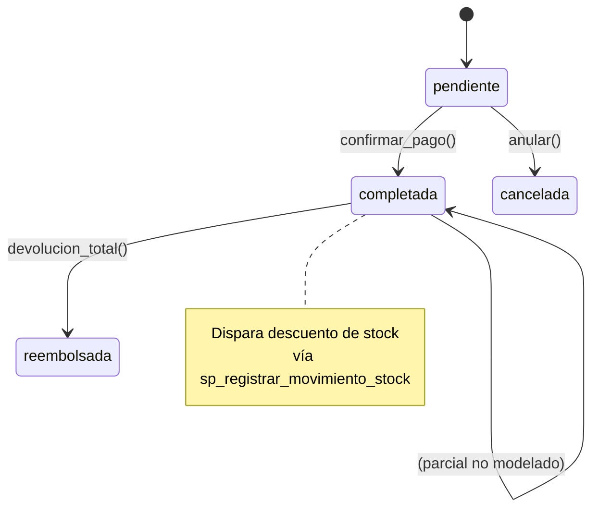

### 10.2 Estado de solicitudes de compra

```mermaid
stateDiagram-v2
    [*] --> Pendiente
    Pendiente --> Aprobada : aprobar()
    Pendiente --> Cancelada : cancelar()
    Aprobada --> Enviada : enviar_a_proveedor()
    Aprobada --> Cancelada : cancelar()
    Enviada --> Recibida : recibir_mercancia()
    Enviada --> Cancelada : cancelar_envio()
    Recibida --> [*] : completado

    note right of Recibida
        Dispara aumento de stock
        vía sp_registrar_movimiento_stock
    end note
```

### 10.3 Estado de sesiones cyber

```mermaid
stateDiagram-v2
    [*] --> activa : abrir_sesion()
    activa --> cerrada : sp_cerrar_sesion_cyber()
    activa --> interrumpida : fallo_tecnico()

    note right of cerrada
        Calcula costo según tarifa
        y tiempo mínimo
        Libera la estación
    end note
```

### 10.4 Estado de asesorías

```mermaid
stateDiagram-v2
    [*] --> Pendiente
    Pendiente --> En_Proceso : iniciar_caso()
    En_Proceso --> Finalizada : resolver_caso()
    Finalizada --> Archivada : archivar_expediente()
    Pendiente --> Archivada : archivar_sin_procesar()
    En_Proceso --> Archivada : archivar_directo()

    note right of En_Proceso
        Puede tener múltiples usuarios
        asignados con diferentes roles
        vía usuario_asesoria
    end note
```

### 10.5 Estado de activos fijos

```mermaid
stateDiagram-v2
    [*] --> Activo
    Activo --> Mantenimiento : enviar_a_reparacion()
    Mantenimiento --> Activo : reparado()
    Activo --> Baja : dar_de_baja()
    Mantenimiento --> Baja : dar_de_baja()
    Activo --> Vencida : vencer_licencia()
```

### 10.6 Estado de estaciones cyber

```mermaid
stateDiagram-v2
    [*] --> Disponible
    Disponible --> Ocupada : abrir_sesion()
    Disponible --> Mantenimiento : marcar_mantenimiento()
    Ocupada --> Disponible : cerrar_sesion()
    Mantenimiento --> Disponible : finalizar_mantenimiento()
```

---

## 11. Diagramas de flujo de procesos

### 11.1 Flujo de una venta completa

```mermaid
sequenceDiagram
    actor V as Vendedor
    participant S as Sistema
    participant P as productos
    participant DV as detalle_ventas
    participant VN as ventas
    participant B as bitacora

    V->>S: Crear venta
    S->>VN: INSERT ventas (usuario_id, cliente_id)
    
    loop Por cada producto
        V->>S: Agregar producto, cantidad, precio
        S->>DV: INSERT detalle_ventas
        DV-->>VN: Trigger: recalcula subtotal y total
        S->>B: INSERT bitacora (salida, producto, cantidad)
        S->>P: UPDATE stock = stock - cantidad
    end

    V->>S: Confirmar venta
    S-->>V: Ticket generado
```

### 11.2 Flujo de una sesión de cyber

```mermaid
sequenceDiagram
    actor E as Empleado
    participant S as Sistema
    participant SC as sesiones_cyber
    participant EC as estaciones_cyber
    participant TC as tarifas

    E->>S: Abrir sesión (cliente, estación)
    S->>EC: SELECT estado = 'Disponible'?
    EC-->>S: OK
    S->>SC: INSERT sesion (estacion_id, hora_inicio)
    S->>EC: UPDATE estado = 'Ocupada'

    Note over S: Pasa el tiempo...

    E->>S: Cerrar sesión (sesion_id)
    S->>SC: SELECT estacion_id, hora_inicio
    S->>EC: SELECT tarifa_id
    S->>TC: SELECT precio_por_hora, tiempo_minimo
    S->>S: Calcular costo
    S->>SC: UPDATE hora_fin, costo_total, estado='cerrada'
    S->>EC: UPDATE estado = 'Disponible'
    S-->>E: Cobro: $X.XX
```

---

## 12. Análisis de relaciones por módulo

### 12.1 Módulo Inventario

```mermaid
graph TB
    subgraph Catálogo
        S[subcategorias] -->|"1:N<br>RESTRICT"| C[categorias]
        M[marcas] -->|"1:N<br>RESTRICT"| MO[modelos]
    end

    subgraph Productos
        C -->|"1:N<br>RESTRICT"| P[productos]
        MO -->|"1:N<br>SET NULL"| P
    end

    subgraph "Proveedores"
        PR[proveedores]
        PP[producto_proveedor]
        P -->|"1:N<br>CASCADE"| PP
        PR -->|"1:N<br>CASCADE"| PP
    end

    subgraph "Auditoría"
        P -->|"1:N<br>RESTRICT"| BMS[bitacora_movimientos_stock]
    end
```

### 12.2 Módulo Ventas

```mermaid
graph TB
    subgraph "Venta"
        V[ventas]
        DV[detalle_ventas]
        V -->|"1:N<br>CASCADE"| DV
    end

    subgraph "Actores"
        U[usuarios] -.->|"SET NULL"| V
        CL[clientes] -.->|"RESTRICT"| V
    end

    subgraph "Producto"
        P[productos] -.->|"RESTRICT"| DV
    end

    subgraph "Trigger"
        DV -.->|"AFTER INSERT<br>trg_totales"| V
    end
```

### 12.3 Módulo Asesorías

```mermaid
graph TB
    subgraph "Clientes Legales"
        CA[clientes_asesorias]
    end

    subgraph "Casos"
        A[asesorias]
        CA -->|"1:N<br>RESTRICT"| A
    end

    subgraph "Asignación M:N"
        UA[usuario_asesoria]
        A -->|"1:N<br>CASCADE"| UA
        U[usuarios] -->|"1:N<br>CASCADE"| UA
    end

    subgraph "Roles en cada caso"
        UA -->|"atributo"| ROL["rol_en_asesoria:<br>Asesor Principal<br>Consultor<br>Gestor<br>Auditor"]
    end
```

### 12.4 Módulo Cybercafé

```mermaid
graph TB
    subgraph "Configuración"
        T[tarifas_cyber]
        T -->|"1:N<br>RESTRICT"| EC[estaciones_cyber]
    end

    subgraph "Sesiones"
        SC[sesiones_cyber]
        EC -->|"1:N<br>RESTRICT"| SC
    end

    subgraph "Quién"
        U[usuarios] -.->|"SET NULL"| SC
        CL[clientes] -.->|"RESTRICT"| SC
    end

    subgraph "Cálculo"
        SC -->|"sp_cerrar_sesion_cyber<br>calcula costo"| T
    end
```

---

## 13. Análisis de cardinalidades

### 13.1 Todas las relaciones 1:N

| # | Tabla "1" | Tabla "N" | FK | ¿Es opcional? |
|---|-----------|-----------|----|---------------|
| 1 | `roles` | `usuarios` | `usuarios.rol_id` | No (DEFAULT 2) |
| 2 | `subcategorias` | `categorias` | `categorias.subcategoria_id` | Sí (puede ser NULL) |
| 3 | `categorias` | `productos` | `productos.categoria_id` | No |
| 4 | `marcas` | `modelos` | `modelos.marca_id` | No |
| 5 | `modelos` | `productos` | `productos.modelo_id` | Sí (NULL) |
| 6 | `tipos_activo` | `activos` | `activos.tipo_activo_id` | No |
| 7 | `tarifas_cyber` | `estaciones_cyber` | `estaciones_cyber.tarifa_id` | No |
| 8 | `estaciones_cyber` | `sesiones_cyber` | `sesiones_cyber.estacion_id` | No |
| 9 | `usuarios` | `ventas` | `ventas.usuario_id` | Sí (SET NULL) |
| 10 | `clientes` | `ventas` | `ventas.cliente_id` | Sí (NULL) |
| 11 | `usuarios` | `solicitudes` | `solicitudes.usuario_id` | Sí (SET NULL) |
| 12 | `proveedores` | `solicitudes` | `solicitudes.proveedor_id` | No |
| 13 | `usuarios` | `sesiones_cyber` | `sesiones_cyber.usuario_id` | Sí (SET NULL) |
| 14 | `clientes` | `sesiones_cyber` | `sesiones_cyber.cliente_id` | Sí (NULL) |
| 15 | `usuarios` | `bitacora_movimientos_stock` | `bitacora.usuario_id` | Sí (SET NULL) |
| 16 | `productos` | `bitacora_movimientos_stock` | `bitacora.producto_id` | No |
| 17 | `usuarios` | `activos` | `activos.responsable_id` | Sí (SET NULL) |
| 18 | `clientes_asesorias` | `asesorias` | `asesorias.cliente_asesoria_id` | No |
| 19 | `ventas` | `detalle_ventas` | `detalle_ventas.venta_id` | No |
| 20 | `solicitudes` | `detalle_solicitudes` | `detalle_solicitudes.solicitud_id` | No |
| 21 | `productos` | `detalle_ventas` | `detalle_ventas.producto_id` | No |
| 22 | `productos` | `detalle_solicitudes` | `detalle_solicitudes.producto_id` | No |

### 13.2 Relaciones M:N (descompuestas en 1:N + tabla puente + N:1)

| Tabla puente | Entidad A | Entidad B | Atributos de la relación |
|-------------|-----------|-----------|-------------------------|
| `producto_proveedor` | `productos` | `proveedores` | `codigo_proveedor`, `precio_compra`, `tiempo_entrega_dias` |
| `usuario_asesoria` | `usuarios` | `asesorias` | `rol_en_asesoria` |

---

## 14. Guía de integridad referencial

### 14.1 Árbol de decisión: ¿qué ON DELETE usar?

```mermaid
flowchart TD
    A["¿El hijo tiene sentido<br>sin el padre?"] -->|"No"| B["¿Es un detalle<br>transaccional?"]
    A -->|"Sí"| C["¿Es una relación<br>opcional?"]
    
    B -->|"Sí<br>Ej: detalle_ventas"| D["CASCADE"]
    B -->|"No<br>Ej: tabla puente"| D

    C -->|"Sí<br>Ej: usuario en ventas"| E["SET NULL"]
    C -->|"No<br>Ej: cliente en ventas"| F["RESTRICT"]

    D --> G["Los hijos se eliminan<br>automáticamente con el padre"]
    E --> H["El hijo se conserva<br>la FK queda NULL"]
    F --> I["No se puede eliminar<br>el padre si tiene hijos"]
```

### 14.2 Tabla de decisión por tipo de tabla

| Tipo de tabla | ON DELETE recomendado | ¿Por qué? |
|---------------|----------------------|-----------|
| Catálogo (roles, marcas...) | RESTRICT | No queremos que se borre un valor referenciado |
| Maestra (productos, clientes...) | RESTRICT | Son entidades de negocio con dependencias |
| Detalle transaccional | CASCADE | No existe sin su cabecera |
| Tabla puente (M:N) | CASCADE (ambas FKs) | No existe sin ninguna de las dos entidades |
| Relación opcional con usuarios | SET NULL | Preservar histórico |

---

## 15. Vistas del sistema

### 15.1 `v_productos_stock`

**Propósito:** Presentar el catálogo de productos desnormalizado para consultas rápidas.

```sql
CREATE OR REPLACE VIEW v_productos_stock AS
SELECT
    p.id, p.codigo, p.codigo_barras, p.nombre,
    c.nombre AS categoria,
    sub.nombre AS subcategoria,
    m.nombre AS marca,
    modl.nombre AS modelo,
    p.stock, p.stock_minimo, p.ubicacion, p.precio_venta,
    CASE
        WHEN p.stock <= 0 THEN 'Sin stock'
        WHEN p.stock <= p.stock_minimo THEN 'Crítico'
        ELSE 'OK'
    END AS estado_stock,
    p.estado_venta, p.activo
FROM productos p
LEFT JOIN categorias c ON p.categoria_id = c.id
LEFT JOIN subcategorias sub ON c.subcategoria_id = sub.id
LEFT JOIN modelos modl ON p.modelo_id = modl.id
LEFT JOIN marcas m ON modl.marca_id = m.id;
```

**JOINs que resuelve:** 4 LEFT JOINs (jerarquía completa de clasificación).

**Columna calculada clave:** `estado_stock` clasifica cada producto:
| Valor | Condición | Acción sugerida |
|-------|-----------|----------------|
| `'Sin stock'` | `stock <= 0` | 🚨 Comprar urgente |
| `'Crítico'` | `stock <= stock_minimo` | ⚠️ Reponer pronto |
| `'OK'` | `stock > stock_minimo` | ✅ Inventario normal |

### 15.2 `v_ventas_diarias`

**Propósito:** Reporte diario de ventas para la toma de decisiones.

```sql
CREATE OR REPLACE VIEW v_ventas_diarias AS
SELECT
    DATE(v.fecha) AS dia,
    COUNT(*) AS total_ventas,
    SUM(v.total) AS monto_total,
    SUM(v.descuento) AS descuentos_total,
    AVG(v.total) AS ticket_promedio
FROM ventas v
WHERE v.estado = 'completada'
GROUP BY DATE(v.fecha)
ORDER BY dia DESC;
```

**KPI que proporciona:**
| Indicador | Fórmula |
|-----------|---------|
| Ventas del día | `COUNT(*)` |
| Ingresos del día | `SUM(total)` |
| Descuentos otorgados | `SUM(descuento)` |
| Ticket promedio | `AVG(total)` |

### 15.3 `v_sesiones_activas`

**Propósito:** Monitoreo en tiempo real del cybercafé.

```sql
CREATE OR REPLACE VIEW v_sesiones_activas AS
SELECT
    s.id, e.nombre AS estacion,
    t.nombre AS tarifa, t.precio_por_hora, t.tiempo_minimo,
    s.hora_inicio,
    cl.nombre AS cliente_nombre,
    u.nombre AS usuario_registra,
    TIMESTAMPDIFF(MINUTE, s.hora_inicio, NOW()) AS minutos_transcurridos,
    ROUND(
        CASE 
            WHEN TIMESTAMPDIFF(MINUTE, s.hora_inicio, NOW()) <= t.tiempo_minimo
            THEN (t.tiempo_minimo / 60.0) * t.precio_por_hora
            ELSE (TIMESTAMPDIFF(MINUTE, s.hora_inicio, NOW()) / 60.0) * t.precio_por_hora
        END, 2
    ) AS costo_estimado
FROM sesiones_cyber s
INNER JOIN estaciones_cyber e ON s.estacion_id = e.id
LEFT JOIN tarifas_cyber t ON e.tarifa_id = t.id
LEFT JOIN clientes cl ON s.cliente_id = cl.id
LEFT JOIN usuarios u ON s.usuario_id = u.id
WHERE s.estado = 'activa';
```

**Regla de negocio aplicada en la vista:**
```
costo_estimado = 
  IF minutos_transcurridos <= tiempo_minimo
    THEN (tiempo_minimo / 60) * precio_por_hora   ← cobro mínimo
    ELSE (minutos_transcurridos / 60) * precio_por_hora  ← cobro real
```

---

## 16. Procedimientos almacenados

### 16.1 `sp_registrar_movimiento_stock`

**¿Por qué existe?** Para garantizar que la actualización de stock y el registro en bitácora ocurran **como una sola operación atómica**. Sin este SP, una falla entre el UPDATE y el INSERT podría dejar inconsistencias.

**Diagrama de flujo:**

```mermaid
flowchart TD
    INICIO["sp_registrar_movimiento_stock<br>(producto_id, tipo, cantidad, usuario, motivo, ref)"]
    INICIO --> TRANS["START TRANSACTION"]
    TRANS --> BLOQ["SELECT stock FROM productos<br>WHERE id = p_producto_id<br>FOR UPDATE"]
    BLOQ --> CALC["Calcular cantidad_efectiva<br>salida → negativo<br>entrada/ajuste → positivo"]
    CALC --> VALID{"stock_nuevo >= 0?"}
    VALID -->|"No"| ERROR["SIGNAL SQLSTATE '45000'<br>'Stock no puede ser negativo'"]
    VALID -->|"Sí"| UPDATE["UPDATE productos<br>SET stock = stock_nuevo"]
    UPDATE --> INSERT["INSERT INTO bitacora_movimientos_stock<br>(producto_id, tipo, cantidad,<br>stock_anterior, stock_nuevo, usuario, motivo, ref)"]
    INSERT --> COMMIT["COMMIT"]
    ERROR --> ROLLBACK["ROLLBACK"]
```

**Aprendizaje de diseño:**
- `SELECT ... FOR UPDATE` bloquea la fila del producto para evitar condiciones de carrera.
- Todo dentro de una transacción: si algo falla, se revierte todo.
- La validación de stock negativo es una **regla de negocio dura** (no permitida por el motor).

### 16.2 `sp_cerrar_sesion_cyber`

**¿Por qué existe?** Centraliza la lógica de cálculo del costo de una sesión, que incluye la regla del tiempo mínimo.

```mermaid
flowchart TD
    INICIO["sp_cerrar_sesion_cyber(sesion_id)"]
    INICIO --> DATOS["Obtener:<br>• precio_por_hora<br>• tiempo_minimo<br>• minutos desde hora_inicio"]
    DATOS --> COMP{"minutos >=<br>tiempo_minimo?"}
    COMP -->|"Sí"| REAL["minutos = minutos reales"]
    COMP -->|"No"| MINIMO["minutos = tiempo_minimo"]
    REAL --> CALC["costo = (minutos / 60) × precio_por_hora"]
    MINIMO --> CALC
    CALC --> UPD1["UPDATE sesiones_cyber<br>SET hora_fin = NOW()<br>    costo_total = costo<br>    estado = 'cerrada'"]
    UPD1 --> UPD2["UPDATE estaciones_cyber<br>SET estado = 'Disponible'"]
```

---

## 17. Disparadores (triggers)

### 17.1 `trg_actualizar_totales_venta`

**Evento:** AFTER INSERT en `detalle_ventas`

**¿Qué hace?** Recalcula `subtotal` y `total` en la cabecera de `ventas`.

**¿Por qué no calcularlo en la aplicación?**
- Garantiza consistencia aunque el INSERT venga de diferentes puntos del código.
- El trigger siempre se ejecuta, no hay riesgo de olvidar llamar a la función de recálculo.

**Limitación actual:** `total = subtotal` (sin IVA ni impuestos). La estructura ya incluye `descuento` a nivel de cabecera, pero el trigger no lo resta actualmente.

### 17.2 `trg_auditar_precio_producto`

**Evento:** BEFORE UPDATE en `productos`

**¿Qué hace?** Si `precio_venta` cambia, inserta un registro en la bitácora.

```sql
INSERT INTO bitacora_movimientos_stock (
    producto_id, tipo, cantidad, stock_anterior, stock_nuevo,
    usuario_id, motivo, referencia_tipo
) VALUES (
    NEW.id, 'ajuste', 0, OLD.stock, NEW.stock,
    NULL,
    CONCAT('Cambio de precio: ', OLD.precio_venta, ' -> ', NEW.precio_venta),
    'ajuste_precio'
);
```

**¿Por qué es importante?** Los cambios de precio afectan directamente la rentabilidad. Tener un registro histórico de cuándo y cómo cambió cada precio permite:
- Auditar cambios sospechosos.
- Calcular márgenes históricos.
- Revertir cambios si es necesario.

---

## 18. Análisis de índices y rendimiento

### 18.1 Índices existentes

| Tabla | Nombre del índice | Columnas | Tipo | Propósito |
|-------|------------------|----------|------|-----------|
| `usuarios` | `idx_usuarios_rol` | `rol_id` | INDEX | Búsqueda de usuarios por rol |
| `categorias` | `idx_categoria_nombre` | `subcategoria_id, nombre` | UNIQUE | Unicidad + búsqueda por subcategoría |
| `modelos` | `idx_modelo_nombre` | `marca_id, nombre` | UNIQUE | Unicidad + búsqueda por marca |
| `productos` | `idx_productos_barras` | `codigo_barras` | UNIQUE | Búsqueda por scanner |
| `productos` | `idx_productos_categoria` | `categoria_id` | INDEX | Filtro por categoría |
| `productos` | `idx_productos_modelo` | `modelo_id` | INDEX | Filtro por modelo |
| `activos` | `idx_activos_tipo` | `tipo_activo_id` | INDEX | Filtro por tipo |
| `ventas` | `idx_ventas_fecha` | `fecha` | INDEX | Rangos de fechas (reportes) |
| `asesorias` | `idx_asesorias_cliente_asesoria` | `cliente_asesoria_id` | INDEX | Búsqueda por cliente |
| `asesorias` | `idx_asesorias_estado` | `estado` | INDEX | Filtro por estado |
| `bitacora_movimientos_stock` | `idx_bms_producto` | `producto_id` | INDEX | Historial por producto |
| `bitacora_movimientos_stock` | `idx_bms_fecha` | `fecha` | INDEX | Rangos de fechas |

### 18.2 ¿Faltan índices? Recomendaciones de asesoría

```mermaid
graph LR
    subgraph "Índices existentes ✅"
        I1["UNIQUE en PKs (automático)"]
        I2["UNIQUE en columnas de negocio"]
        I3["INDEX en FKs más consultadas"]
        I4["INDEX en columnas de filtro"]
    end
    subgraph "Posibles mejoras ⚠️"
        I5["detalle_ventas(producto_id)<br>para reportes de productos más vendidos"]
        I6["solicitudes(proveedor_id, estado)<br>para filtros compuestos"]
        I7["sesiones_cyber(estacion_id, estado)<br>para ver sesiones activas por estación"]
        I8["bitacora(referencia_tipo, ref_id)<br>para rastrear origen de movimientos"]
    end
```

**Recomendaciones:**

| Índice sugerido | ¿Por qué? | Prioridad |
|----------------|-----------|-----------|
| `detalle_ventas(producto_id, venta_id)` | Reportes de productos más vendidos. El índice actual solo tiene PK en `id`. | 🟡 Media |
| `solicitudes(proveedor_id, estado)` | Consulta frecuente: "solicitudes pendientes del proveedor X" | 🟢 Alta |
| `sesiones_cyber(estacion_id, estado)` | "Ver si la estación X está ocupada" | 🟡 Media |
| `bitacora_movimientos_stock(referencia_tipo, referencia_id)` | Rastrear el origen de movimientos (consulta polimórfica) | 🟢 Alta |

### 18.3 Estrategia de índices: guía rápida

| Situación | Tipo de índice | Ejemplo |
|-----------|---------------|---------|
| PK de cualquier tabla | Único (automático) | `id` |
| Columnas que deben ser únicas | UNIQUE | `codigo`, `cedula_rif`, `username` |
| FK más consultadas | INDEX | `productos.categoria_id`, `ventas.usuario_id` |
| Filtros por estado | INDEX | `asesorias.estado` |
| Rangos de fecha | INDEX | `ventas.fecha`, `bitacora.fecha` |
| Combinaciones de columna | Índice compuesto | `(proveedor_id, estado)`, `(marca_id, nombre)` |

**Advertencia:** Los índices aceleran las consultas SELECT pero ralentizan INSERT/UPDATE/DELETE. No indexar en exceso. Priorizar los que se usan en consultas frecuentes.

---

## 19. Análisis de normalización

### 19.1 Formas normales

| FN | ¿Cumple? | Evidencia |
|----|----------|-----------|
| **1FN** | ✅ | Todos los valores son atómicos. No hay grupos repetitivos. |
| **2FN** | ✅ | Las tabulas puente tienen PK compuesta y atributos dependientes de la combinación entera. |
| **3FN** | ✅ | No hay dependencias transitivas. Ej: `productos.modelo_id → modelos.marca_id → marcas.nombre` está correctamente descompuesto en 3 tablas. |
| **BCFN** | ✅ | Toda dependencia funcional es una superclave. |

### 19.2 ¿Dónde hay desnormalización intencional?

| Ubicación | ¿Qué se desnormalizó? | ¿Por qué está bien? |
|-----------|----------------------|---------------------|
| `bitacora_movimientos_stock` | `stock_anterior`, `stock_nuevo` (calculables) | **Congelar el histórico**: saber el stock en el momento del movimiento. Si se calculara desde los datos actuales, el histórico cambiaría. |
| `detalle_ventas` | `precio_unitario`, `subtotal` (calculables) | **Precio congelado**: el precio en el momento de la venta. El precio actual del producto puede cambiar. |
| `ventas` | `subtotal`, `total` (suma de detalles) | **Evita recalcular cada vez**: el trigger los mantiene sincronizados. |
| `solicitudes` | `subtotal`, `total` | Ídem. |

**Regla de oro:** En tablas transaccionales, **está bien desnormalizar** si el valor debe reflejar el estado en el momento de la transacción y no el estado actual.

---

## 20. Patrones de diseño y justificaciones

### 20.1 Borrado lógico (soft delete)

```
❌ DELETE FROM productos WHERE id = 5
   → Se pierde el histórico de ventas, solicitudes, movimientos.

✅ UPDATE productos SET activo = FALSE WHERE id = 5
   → El producto desaparece de la interfaz pero el histórico se conserva.
```

**¿Dónde se usa?**
| Tabla | Columna |
|-------|---------|
| `usuarios` | `activo` |
| `clientes` | `activo` |
| `proveedores` | `activo` |
| `productos` | `activo` |
| `categorias` | `activa` |
| `subcategorias` | `activa` |
| `tarifas_cyber` | `activa` |

**¿Por qué es la decisión correcta aquí?** En un sistema transaccional, los registros históricos son sagrados. Una venta de hace 2 años sigue siendo válida aunque el producto ya no se venda. El borrado lógico preserva el histórico sin ocupar espacio额外 ni complicar consultas ( `WHERE activo = TRUE` filtra los inactivos).

### 20.2 Precio congelado en transacciones

```
Producto A:
  Precio actual: $100
  
  Venta del 1 de enero: precio_unitario = $90 (precio de ese día)
  Venta del 1 de marzo: precio_unitario = $100 (precio actual)
```

**Alternativa descartada:**
```sql
-- Mal diseño: calcular desde productos.precio_venta
SELECT dv.cantidad * p.precio_venta  -- ❌ El precio puede haber cambiado
FROM detalle_ventas dv
JOIN productos p ON dv.producto_id = p.id
```

**Solución correcta:** Almacenar el precio en el momento de la transacción.

### 20.3 Separación `clientes` vs `clientes_asesorias`

```mermaid
graph LR
    subgraph "¿Por qué no una sola tabla?"
        OP1["Opción A: Una tabla<br>clientes con campo tipo"] -->|"❌"| P1["Mezcla dominios<br>NULLS en columnas<br>FKs confusas"]
        OP2["Opción B: Una súpertabla<br>con todas las columnas"] -->|"❌"| P2["Violación 1FN/3FN<br>Muchos NULLS"]
        OP3["Opción C: Separadas<br>(implementado)"] -->|"✅"| P3["Cada dominio vive solo<br>SIN columnas irrelevantes<br>FKs claras<br>Seguridad independiente"]
    end
```

### 20.4 Referencia polimórfica en bitácora

¿Por qué no usar [TABLE] + [ID] genéricos?

```sql
-- Alternativa 1: columnas separadas (descarte)
venta_id INT NULL,         -- mayormente NULL
solicitud_id INT NULL,     -- mayormente NULL
ajuste_id INT NULL,        -- mayormente NULL
-- 3 columnas, ~99% NULL cada una

-- Alternativa 2: FK polimórfica (implementado)
referencia_tipo VARCHAR(30),  -- 'venta', 'solicitud', 'ajuste_precio'
referencia_id INT UNSIGNED,   -- el ID en la tabla origen
-- 2 columnas, 100% útiles
```

**Trade-off:** La alternativa 2 no valida integridad referencial real (no se puede poner FOREIGN KEY a múltiples tablas). La aplicación y los SP deben garantizar que `referencia_tipo` + `referencia_id` apunten a un registro válido.

### 20.5 `sp_registrar_movimiento_stock`: transacción + bloqueo

```mermaid
sequenceDiagram
    participant U as Usuario 1
    participant S as Sistema
    participant U2 as Usuario 2

    U->>S: Vender producto A (stock=10)
    S->>S: SELECT stock FOR UPDATE → 10
    
    U2->>S: Vender producto A (stock=10)
    Note over S, U2: ESPERA (bloqueado por Usuario 1)
    
    S->>S: UPDATE stock = 10 - 3 = 7
    S->>S: INSERT bitácora
    S->>S: COMMIT
    S-->>U: Venta exitosa
    
    Note over S: Se libera el bloqueo
    S->>S: SELECT stock FOR UPDATE → 7 (actualizado)
    S->>S: UPDATE stock = 7 - 5 = 2
    S->>S: INSERT bitácora
    S->>S: COMMIT
    S-->>U2: Venta exitosa
```

**Sin `FOR UPDATE`:**
```
Usuario 1: Lee stock = 10
Usuario 2: Lee stock = 10 (mismo valor!)
Usuario 1: UPDATE stock = 10 - 3 = 7
Usuario 2: UPDATE stock = 10 - 5 = 5 ❌ (debería ser 7 - 5 = 2)
           → Se perdieron 3 unidades de inventario
```

---

## 21. Posibles mejoras y advertencias

### 21.1 Mejoras recomendadas

| # | Mejora | Prioridad | Dificultad |
|---|--------|-----------|------------|
| 1 | Agregar índice compuesto a `bitacora_movimientos_stock(referencia_tipo, referencia_id)` | 🟢 Alta | 🟢 Baja |
| 2 | Agregar índice a `solicitudes(proveedor_id, estado)` | 🟢 Alta | 🟢 Baja |
| 3 | Implementar soft delete en todas las maestras que falten (`modelos`, `marcas`) | 🟡 Media | 🟢 Baja |
| 4 | Migrar ENUMs grandes a tablas lookup si se espera que crezcan | 🟡 Media | 🟡 Media |
| 5 | Agregar columna `iva` a ventas si el negocio lo requiere | 🟡 Media | 🟢 Baja |
| 6 | Agregar columna `tipo_pago` o tabla de formas de pago | 🟡 Media | 🟢 Baja |
| 7 | Considerar `ON DELETE RESTRICT` → `ON DELETE CASCADE` en tablas puente si hay orphan records. Ya está implementado ✅ | — | — |
| 8 | Revisar el trigger `trg_actualizar_totales_venta`: actualmente total = subtotal (no descuenta el descuento global) | 🟡 Media | 🟢 Baja |

### 21.2 Advertencias de diseño

| # | Advertencia | Explicación |
|---|-------------|-------------|
| 1 | **ENUM inflexible** | Para agregar un nuevo valor a un ENUM se requiere `ALTER TABLE`, que puede ser costoso en tablas grandes. Si el negocio crece rápido, considerar migrar a tablas lookup. |
| 2 | **Sin IVA/impuestos** | El modelo no contempla IVA u otros impuestos. Si el negocio requiere facturación fiscal, habrá que agregar columnas de impuestos a `ventas` y `detalle_ventas`. |
| 3 | **Referencia polimórfica sin FK real** | `bitacora_movimientos_stock.referencia_tipo` + `referencia_id` no tienen integridad referencial real. La consistencia depende de la aplicación. |
| 4 | **Stock en `productos`** | El stock es una columna en la tabla de productos. Esto puede ser un cuello de botella en alta concurrencia (aunque `FOR UPDATE` ayuda). Alternativa: tabla separada de stock con versioning. |
| 5 | **Sin particionamiento** | Tablas como `bitacora_movimientos_stock` pueden crecer mucho. Si supera los 10M de registros, considerar particionamiento por fecha. |
| 6 | **Sin tabla de sesiones de usuario** | No hay una tabla de sesiones activas de login. Para sistemas que requieran invalidación de sesiones, sería necesario agregarla. |

### 21.3 Resumen de fortalezas del diseño

| Fortaleza | Explicación |
|-----------|-------------|
| ✅ **Normalización adecuada** | 3FN/BCFN, sin redundancias innecesarias |
| ✅ **Integridad referencial** | 26 FKs con reglas ON DELETE bien pensadas |
| ✅ **Transacciones ACID** | InnoDB + SP con COMMIT/ROLLBACK + FOR UPDATE |
| ✅ **Auditoría** | Bitácora de stock + trigger de precios |
| ✅ **Precios congelados** | Histórico de ventas fiel a cada momento |
| ✅ **Borrado lógico** | Preserva histórico sin pérdida de datos |
| ✅ **Separación de dominios** | clientes/clientes_asesorias bien diferenciados |
| ✅ **Documentación de esquema** | Vistas que facilitan consultas sin conocer el esquema completo |

---

> **Documento generado para asesoría sobre diseño de base de datos**  
> Sistema ZWL v2.1 — Zona Web Lara (EIS)  
> 19 tablas · 26 relaciones · 3 vistas · 2 SP · 2 triggers
