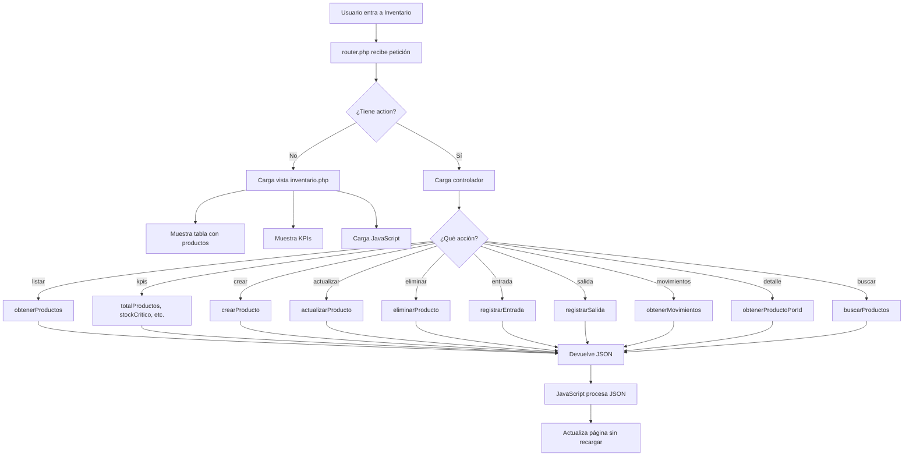
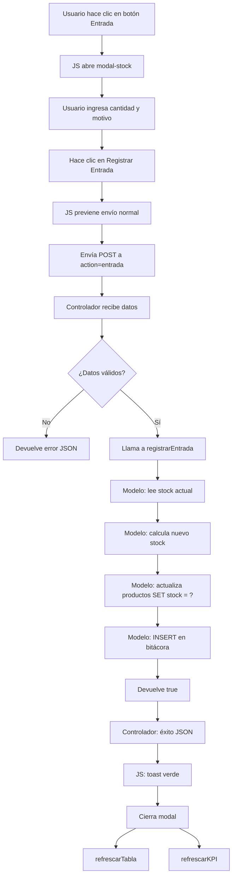
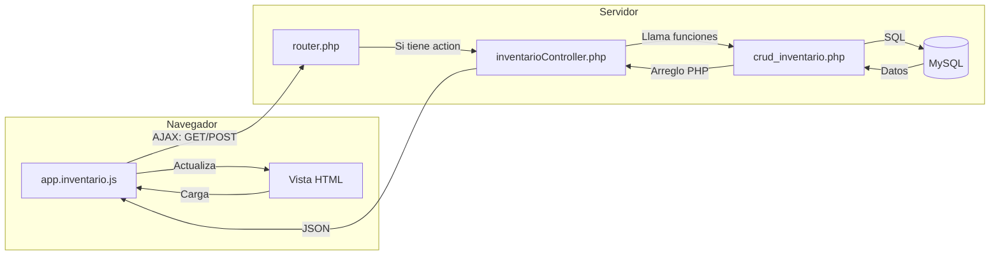

## Sistema EIS Zona Web Lara (ZWL)

  

---

  

# Índice

  

1. [¿Qué es el módulo de inventario?](#1-qu%C3%A9-es-el-m%C3%B3dulo-de-inventario)

2. [Arquitectura del sistema (MVC)](#2-arquitectura-del-sistema-mvc)

3. [Estructura de la base de datos](#3-estructura-de-la-base-de-datos)

4. [Los archivos del módulo](#4-los-archivos-del-m%C3%B3dulo)

5. [El flujo de una petición (paso a paso)](#5-el-flujo-de-una-petici%C3%B3n-paso-a-paso)

6. [Operaciones del inventario](#6-operaciones-del-inventario)

7. [Diagramas de flujo](#7-diagramas-de-flujo)

8. [Glosario para principiantes](#8-glosario-para-principiantes)

  

---

  

# 1. ¿Qué es el módulo de inventario?

  

El **módulo de inventario** es la parte del sistema que permite **gestionar los productos** que la empresa tiene en existencia. Con él puedes:

  

- 📦 **Ver** todos los productos registrados

- ➕ **Crear** productos nuevos

- ✏️ **Editar** productos existentes

- 🗑️ **Eliminar** productos

- 📥 **Registrar entradas** de stock (cuando llega mercancía nueva)

- 📤 **Registrar salidas** de stock (cuando se vende o usa un producto)

- 📊 **Ver indicadores** como: total de productos, stock crítico, stock bajo y valor total del inventario

- 🔍 **Buscar** productos por nombre o código

- 📋 **Ver el historial** de movimientos de cada producto

  

---

  

# 2. Arquitectura del sistema (MVC)

  

El sistema usa un patrón de diseño llamado **MVC** que separa el código en 3 partes:

  

```

┌─────────────────────────────────────────────────────────┐

│                    NAVEGADOR WEB                         │

│              (Chrome, Edge, Firefox, etc.)               │

└──────────────────────┬──────────────────────────────────┘

                       │

             (petición HTTP)

                       │

                       ▼

┌─────────────────────────────────────────────────────────┐

│                     ROUTER (router.php)                  │

│  ❓ ¿Qué página quiere ver el usuario?                  │

│  ▶️ "?pagina=inventario&action=listar"                 │

└──────────────────────┬──────────────────────────────────┘

                       │

          ┌────────────┴────────────┐

          │                         │

          ▼                         ▼

┌──────────────────┐     ┌──────────────────────┐

│  CONTROLLER       │     │       VIEW           │

│  inventario       │     │   inventario.php     │

│  Controller.php   │     │   (HTML + PHP)       │

│  (Lógica)         │     │   (Diseño visual)    │

└────────┬─────────┘     └──────────────────────┘

         │                         ▲

         │                         │

         ▼                         │

┌──────────────────┐               │

│     MODEL         │───────────────┘

│  crud_inventario  │  (datos para

│  .php             │   mostrar)

│  (Base de datos)  │

└──────────────────┘

```

  

### ¿Qué hace cada parte?

  

| Parte | ¿Qué es? | ¿Qué hace? |

|-------|----------|------------|

| **Model** (Modelo) | `crud_inventario.php` | Habla con la base de datos. Recibe peticiones, ejecuta consultas SQL y devuelve datos. |

| **View** (Vista) | `inventario.php` | Es lo que ve el usuario. HTML con diseño bonito (Materialize CSS). |

| **Controller** (Controlador) | `inventarioController.php` | Es el "mensajero". Recibe la orden del usuario, le pide datos al Modelo y se los pasa a la Vista. |

| **Router** (Enrutador) | `router.php` | Es el "portero". Decide qué controlador o vista debe ejecutarse según la URL. |

| **JavaScript** | `app.inventario.js` | Corre en el navegador. Hace que la página sea interactiva sin recargar (AJAX). |

  

---

  

# 3. Estructura de la base de datos

  

El módulo de inventario usa **3 tablas principales** en la base de datos MySQL:

  

## 3.1 Tabla: `productos`

  

Guarda la información de cada producto.

  

```

┌─────────────────────────────────────────────────────────────┐

│                   TABLA: productos                          │

├──────────────┬──────────────────┬───────────────────────────┤

│  Columna      │  Tipo de dato    │  ¿Para qué sirve?        │

├──────────────┼──────────────────┼───────────────────────────┤

│  id          │  Número entero   │  Identificador único      │

│  codigo      │  Texto           │  Código interno (ej: P-001)│

│  nombre      │  Texto           │  Nombre del producto      │

│  categoria_id│  Número          │  ID de su categoría       │

│  stock       │  Número entero   │  Cantidad en inventario   │

│  stock_minimo│  Número entero   │  Mínimo antes de alertar  │

│  costo_compra│  Decimal (dinero)│  Lo que costó comprarlo   │

│  precio_venta│  Decimal (dinero)│  Precio al público        │

│  activo      │  Verdadero/Falso │  ¿Está activo? (no borrado)│

│  created_at  │  Fecha y hora    │  Cuándo se creó           │

│  updated_at  │  Fecha y hora    │  Última modificación      │

└──────────────┴──────────────────┴───────────────────────────┘

```

  

## 3.2 Tabla: `categorias`

  

Clasifica los productos en grupos (ej: "Electrónica", "Oficina", "Limpieza").

  

```

┌──────────────────────────────────────────────────┐

│              TABLA: categorias                   │

├──────────────┬────────────────┬──────────────────┤

│  Columna      │  Tipo          │  ¿Qué guarda?   │

├──────────────┼────────────────┼──────────────────┤

│  id          │  Número        │  Identificador   │

│  nombre      │  Texto         │  Nombre          │

│  activa      │  Verdadero/Falso│ ¿Está activa?   │

└──────────────┴────────────────┴──────────────────┘

```

  

## 3.3 Tabla: `bitacora_movimientos_stock`

  

Registra **todo** lo que pasa con el stock (quién, cuándo, cuánto, por qué).

  

```

┌───────────────────────────────────────────────────────────────┐

│           TABLA: bitacora_movimientos_stock                  │

├──────────────────┬────────────────┬──────────────────────────┤

│  Columna          │  Tipo          │  ¿Qué guarda?           │

├──────────────────┼────────────────┼──────────────────────────┤

│  id              │  Número grande │  Identificador único     │

│  producto_id     │  Número        │  ¿De qué producto?       │

│  tipo            │  Texto         │  "entrada", "salida" o   │

│                  │                │  "ajuste"                │

│  cantidad        │  Número        │  Cuánto entró/salió      │

│  stock_anterior  │  Número        │  Stock antes del cambio  │

│  stock_nuevo     │  Número        │  Stock después del cambio│

│  fecha           │  Fecha y hora  │  Cuándo ocurrió          │

│  usuario_id      │  Número        │  Quién lo hizo           │

│  motivo          │  Texto         │  Por qué (ej: "Venta",   │

│                  │                │  "Reposición")           │

└──────────────────┴────────────────┴──────────────────────────┘

```

  

## ¿Cómo se relacionan las tablas?

  

```

┌──────────────┐       ┌──────────────────┐

│  categorias  │───────│   productos      │

│  (1 registro)│       │  (muchos prod.)  │

└──────────────┘       └────────┬─────────┘

                                │

                                │ (1 producto tiene muchos

                                │  movimientos en la bitácora)

                                │

                                ▼

               ┌──────────────────────────┐

               │ bitacora_movimientos_stock│

               └──────────────────────────┘

```

  

> 📘 **Para principiantes:** Esta relación se llama "uno a muchos". Una categoría puede tener muchos productos. Un producto puede tener muchos movimientos en la bitácora.

  

---

  

# 4. Los archivos del módulo

  

## ¿Dónde está cada archivo?

  

```

src/

├── app/

│   ├── Controllers/

│   │   └── inventarioController.php    ← El controlador

│   ├── Models/

│   │   └── crud_inventario.php         ← El modelo

│   ├── Views/

│   │   └── inventario.php              ← La vista (HTML)

│   └── core/

│       └── router.php                  ← El enrutador

├── Public/

│   └── js/

│       └── app.inventario.js           ← El JavaScript

└── Database/

    ├── estructura.sql                  ← Esquema de BD

    └── datos_prueba.sql                ← Datos de ejemplo

```

  

## 4.1 `router.php` — El enrutador (el portero)

  

**Ubicación:** `src/app/core/router.php`

  

**¿Qué hace?** Cada vez que alguien visita una página, el primer archivo que se ejecuta es este. Es como un portero que pregunta:

  

1. ❓ **¿Qué página quiere ver?** → Lee `?pagina=inventario` de la URL

2. 🔐 **¿Está logueado?** → Si no, lo manda al login

3. 🚦 **¿Es una petición AJAX de inventario?** → Si la URL tiene `?pagina=inventario&action=listar`, carga el controlador `inventarioController.php`

4. 🖼️ **¿Es una página normal?** → Carga la vista correspondiente (`Views/inventario.php`)

5. ❌ **¿No existe la página?** → Muestra error 404

  

**Fragmento clave (líneas 27-30):**

  

```php

// Si la página es "inventario" y tiene una acción (action)

if ($pagina === 'inventario' && isset($_GET['action'])) {

    // En lugar de cargar la vista, carga el controlador

    require __DIR__ . '/../Controllers/inventarioController.php';

    exit; // Termina aquí, no carga el layout

}

```

  

> 🔑 **Esto es importante:** Las peticiones AJAX del JavaScript NO cargan la vista completa (HTML). Solo cargan el controlador que devuelve JSON. Las peticiones normales (cuando entras a la página) cargan la vista completa.

  

---

  

## 4.2 `inventarioController.php` — El controlador (el mensajero)

  

**Ubicación:** `src/app/Controllers/inventarioController.php`

  

**¿Qué hace?** Cuando el JavaScript hace una petición AJAX, este archivo recibe la orden (`action`), ejecuta la función del modelo que corresponda y devuelve el resultado en formato **JSON** (un formato de texto que el JavaScript entiende).

  

### Las acciones que maneja:

  

| Acción (`action=`) | ¿Qué hace? | ¿Qué devuelve? |

|-------------------|------------|----------------|

| `listar` | Obtiene todos los productos | `{success: true, data: [...]}` |

| `kpis` | Calcula los 4 indicadores | `{success: true, data: {total, critico, bajo, valor}}` |

| `detalle&id=X` | Obtiene 1 producto por ID | `{success: true, data: {...}}` |

| `movimientos&id=X` | Historial de movimientos | `{success: true, data: [...]}` |

| `buscar` | Busca productos por texto | `{success: true, data: [...]}` |

| `crear` | Crea un producto nuevo | `{success: true, message: "..."}` |

| `actualizar` | Actualiza un producto | `{success: true, message: "..."}` |

| `eliminar` | Elimina un producto | `{success: true, message: "..."}` |

| `entrada` | Registra entrada de stock | `{success: true, message: "..."}` |

| `salida` | Registra salida de stock | `{success: true, message: "..."}` |

  

### Estructura del código (resumen):

  

```php

<?php

// 1. Incluye el modelo (para poder usar sus funciones)

require_once __DIR__.'/../Models/crud_inventario.php';

  

// 2. Dice que la respuesta será JSON

header('Content-Type: application/json');

  

// 3. Lee la acción de la URL

$action = $_GET['action'] ?? '';

  

// 4. Según la acción, ejecuta el código correspondiente

try {

    switch ($action) {

        case 'listar':

            $productos = obtenerProductos($pdo);  // Llama al modelo

            echo json_encode(['success' => true, 'data' => $productos]);

            break;

        case 'entrada':

            // ... procesa la entrada de stock ...

            break;

        // ... más casos ...

    }

} catch (\Exception $e) {

    // Si algo falla, devuelve el error

    echo json_encode(['success' => false, 'error' => $e->getMessage()]);

}

```

  

> 📘 **Para principiantes:** `json_encode()` convierte un arreglo de PHP (como `['success' => true, 'data' => [...]]`) a un texto en formato JSON que el navegador entiende. Es como traducir del español al inglés.

  

---

  

## 4.3 `crud_inventario.php` — El modelo (el que habla con la BD)

  

**Ubicación:** `src/app/Models/crud_inventario.php`

  

**¿Qué hace?** Contiene todas las funciones que ejecutan consultas SQL en la base de datos. Es el único archivo que toca la base de datos directamente.

  

### Las funciones que contiene:

  

#### CRUD de productos

  

| Función | ¿Qué hace? | SQL que ejecuta |

|---------|-----------|-----------------|

| `crearProducto(...)` | Inserta un nuevo producto | `INSERT INTO productos ...` |

| `obtenerProductos($pdo)` | Trae todos los activos | `SELECT ... FROM productos WHERE activo = TRUE` |

| `obtenerProductoPorId($pdo, $id)` | Trae 1 producto por ID | `SELECT ... WHERE id = ?` |

| `buscarProductos($pdo, $termino)` | Busca por nombre o código | `WHERE nombre LIKE ? OR codigo LIKE ?` |

| `actualizarProducto(...)` | Modifica un producto | `UPDATE productos SET ... WHERE id = ?` |

| `eliminarProducto($pdo, $id)` | Borra un producto | `DELETE FROM productos WHERE id = ?` |

  

#### KPIs (Indicadores)

  

| Función | ¿Qué hace? | SQL |

|---------|-----------|-----|

| `totalProductos($pdo)` | Cuenta todos los activos | `SELECT COUNT(*) FROM productos WHERE activo = TRUE` |

| `stockCritico($pdo)` | Cuenta stock en 0 | `WHERE stock <= 0` |

| `stockBajo($pdo)` | Cuenta stock bajo mínimo | `WHERE stock > 0 AND stock <= stock_minimo` |

| `valorTotalInventario($pdo)` | Suma stock × precio | `SELECT SUM(stock * precio_venta) ...` |

  

#### Movimientos de stock

  

| Función | ¿Qué hace? |

|---------|------------|

| `registrarEntrada(...)` | Suma stock + guarda bitácora |

| `registrarSalida(...)` | Resta stock + guarda bitácora (verifica que no quede negativo) |

| `obtenerMovimientos($pdo, $id)` | Trae el historial de un producto |

  

### ¿Qué es `$pdo`?

  

Es la **conexión a la base de datos**. Se crea en `database.php` y representa el "canal de comunicación" con MySQL. Todas las funciones del modelo lo reciben como primer parámetro.

  

```php

// $pdo permite ejecutar consultas como:

$stmt = $pdo->query("SELECT * FROM productos");

$productos = $stmt->fetchAll();

```

  

### ¿Qué son los `?` en las consultas SQL?

  

```php

$sql = "UPDATE productos SET stock = ? WHERE id = ?";

$stmt = $pdo->prepare($sql);

$stmt->execute([$stock_nuevo, $producto_id]);

```

  

Los signos `?` son **placeholders** (espacios reservados). En lugar de escribir el valor directamente en el SQL, se usa `?` y luego se pasa el valor con `execute()`. Esto evita que un usuario malintencionado pueda "inyectar" código SQL (se llama **inyección SQL** y es un ataque muy común).

  

---

  

## 4.4 `inventario.php` — La vista (el diseño visual)

  

**Ubicación:** `src/app/Views/inventario.php`

  

**¿Qué hace?** Define cómo se ve la página de inventario. Genera el HTML que ves en el navegador. Cuando entras a `?pagina=inventario` por primera vez, este archivo se ejecuta en el servidor y produce el HTML completo con todos los productos.

  

### Secciones de la página:

  

```

┌──────────────────────────────────────────────────┐

│  KPI 1     │  KPI 2     │  KPI 3     │  KPI 4  │

│  Total     │  Crítico   │  Bajo      │  Valor   │

│  productos │            │            │  total   │

├──────────────────────────────────────────────────┤

│  [Buscar producto...]  [Filtro: ▼]  [+ Nuevo]   │

├──────────────────────────────────────────────────┤

│  Lista de Productos                   12 prod.   │

├──────────┬──────┬────────┬───────┬──────┬───────┤

│ Producto │ ID   │ Precio │ Stock │Estado│Acción │

├──────────┼──────┼────────┼───────┼──────┼───────┤

│ Mouse X  │M-001 │ $15.00 │  12   │  OK  │[📋][✏️]│

│ Teclado Y│T-002 │ $25.00 │   2   │⚠️Crít│[📋][✏️]│

│ Monitor Z│M-003 │$120.00 │   0   │ 🚫Sin│[📋][✏️]│

└──────────┴──────┴────────┴───────┴──────┴───────┘

```

  

### La lógica de colores (estado del stock):

  

Cada producto tiene un **estado** que se calcula comparando `stock` con `stock_minimo`:

  

```

┌────────────────────────────────────────────────────┐

│  stock  │  Comparación           │  Estado  │ Color │

├─────────┼────────────────────────┼──────────┼───────┤

│    0    │  stock <= 0            │ Sin stock│  🔴   │

│    2    │  stock <= stock_minimo │ Crítico  │  🔴   │

│   50    │  stock > stock_minimo  │   OK     │  🟢   │

└─────────┴────────────────────────┴──────────┴───────┘

```

  

> **Ejemplo:** Un producto con `stock_minimo = 5` y `stock = 2` → Estado "Crítico" porque 2 es menor que 5.

  

### Los modales (ventanas emergentes):

  

La vista incluye 3 ventanas modales que aparecen encima de la página:

  

1. **Modal de producto** → Para crear o editar productos

2. **Modal de movimientos** → Para ver el historial de un producto

3. **Modal de stock** → Para registrar entrada o salida

  

Estos modales están ocultos hasta que el usuario hace clic en un botón.

  

---

  

## 4.5 `app.inventario.js` — El JavaScript (el que da vida)

  

**Ubicación:** `src/Public/js/app.inventario.js`

  

**¿Qué hace?** Este archivo corre en el **navegador del usuario** (no en el servidor). Hace que la página sea interactiva:

  

- ❌ **Sin JavaScript:** Si haces clic en "Guardar", la página se recarga completa

- ✅ **Con JavaScript:** Si haces clic en "Guardar", se envía una petición en segundo plano (AJAX) y la página se actualiza sin recargar

  

### AJAX — ¿Cómo funciona?

  

```

┌──────────────────────┐         ┌──────────────────────┐

│   NAVEGADOR           │         │   SERVIDOR (PHP)     │

│                       │         │                      │

│   app.inventario.js   │         │  inventarioController│

│                       │         │  .php                │

│   $.post(API+'crear', │ ──────► │                      │

│     {codigo, nombre,  │  POST   │  Lee los datos       │

│      categoria...})    │         │  Llama al modelo     │

│                       │ ◄────── │  Devuelve JSON       │

│   if (r.success) {    │  JSON   │                      │

│     toast("Creado!")  │         │                      │

│     refrescarTabla()  │         │                      │

│   }                   │         │                      │

└──────────────────────┘         └──────────────────────┘

```

  

### Las funciones principales del JavaScript:

  

| Función | ¿Qué hace? | ¿Cuándo se ejecuta? |

|---------|------------|---------------------|

| `refrescarKPI()` | Actualiza las 4 tarjetas de indicadores | Después de crear, editar, eliminar, entrada o salida |

| `refrescarTabla()` | Vuelve a cargar toda la tabla de productos | Después de cualquier cambio |

| `aplicarFiltro()` | Filtra las filas visibles en la tabla | Cuando el usuario escribe o cambia el filtro |

| `abrirModalProducto(titulo, datos)` | Abre el modal de producto (vacío o con datos) | Al hacer clic en "Nuevo" o "Editar" |

| `abrirModalMovimientos(id, nombre)` | Abre el modal con el historial | Al hacer clic en el botón de movimientos |

| `abrirModalStock(tipo, id, nombre)` | Abre el modal de entrada/salida | Al hacer clic en "Entrada" o "Salida" |

  

### ¿Qué es `debounce`?

  

```javascript

$('#searchProducto').on('keyup', debounce(function () {

    aplicarFiltro();

}, 300));

```

  

`debounce` significa "esperar un poco antes de ejecutar". Cuando el usuario escribe en el campo de búsqueda, no se filtra con cada tecla (eso sería muy lento). Se espera **300 milisegundos** (0.3 segundos) después de que el usuario deja de escribir para aplicar el filtro.

  

---

  

# 5. El flujo de una petición (paso a paso)

  

## Caso 1: Entrar a la página de inventario

  

Cuando el usuario hace clic en "Inventario" del menú:

  

```

PASO 1: El navegador va a:

        http://mipagina.com/?pagina=inventario

  

PASO 2: router.php recibe la petición

        └── ¿pagina = "inventario"? Sí

        └── ¿Hay "action" en la URL? No → Es carga de página normal

        └── Carga la vista: Views/inventario.php

  

PASO 3: inventario.php se ejecuta EN EL SERVIDOR

        └── Incluye crud_inventario.php

        └── Llama a obtenerProductos($pdo) → consulta SQL

        └── Llama a totalProductos($pdo) → cuenta productos

        └── Llama a stockCritico($pdo) → cuenta críticos

        └── Llama a stockBajo($pdo) → cuenta bajos

        └── Llama a valorTotalInventario($pdo) → calcula valor

        └── Llama a obtenerCategorias($pdo) → para el formulario

  

PASO 4: PHP genera el HTML completo con todos los datos

  

PASO 5: El HTML viaja al navegador y se muestra

  

PASO 6: El navegador carga app.inventario.js

        └── Inicializa Materialize (tooltips, modales, selects)

        └── El usuario ya puede interactuar

```

  

## Caso 2: Crear un producto nuevo

  

Cuando el usuario llena el formulario y hace clic en "Guardar":

  

```

PASO 1: El JavaScript detecta el clic en "Guardar"

        └── Previene el envío normal del formulario

        └── Toma los datos con $('#form-producto').serialize()

  

PASO 2: Envía una petición POST vía AJAX:

        POST ?pagina=inventario&action=crear

        Datos: codigo=P-001&nombre=Mouse&categoria_id=1&...

  

PASO 3: router.php recibe la petición

        └── ¿pagina = "inventario"? Sí

        └── ¿Hay "action=crear"? Sí → Carga el controlador

  

PASO 4: inventarioController.php procesa:

        └── Lee cada campo del POST

        └── Valida que los obligatorios no estén vacíos

        └── Llama a crearProducto($pdo, $codigo, $nombre, ...)

  

PASO 5: crud_inventario.php ejecuta:

        └── $sql = "INSERT INTO productos (...) VALUES (?, ?, ...)"

        └── $pdo->prepare($sql)

        └── $stmt->execute([$codigo, $nombre, ...])

  

PASO 6: El controlador devuelve JSON:

        {"success": true, "message": "Producto creado exitosamente"}

  

PASO 7: El JavaScript recibe la respuesta:

        └── Muestra un toast verde: "Producto creado exitosamente"

        └── Cierra el modal

        └── Llama a refrescarTabla() → recarga la tabla

        └── Llama a refrescarKPI() → actualiza los indicadores

```

  

## Caso 3: Registrar una entrada de stock

  

```

PASO 1: Usuario hace clic en botón verde 🔽 de un producto

        └── Se abre modal de "Entrada de Stock"

        └── Usuario ingresa cantidad y motivo

  

PASO 2: JavaScript envía:

        POST ?pagina=inventario&action=entrada

        Datos: producto_id=5&cantidad=10&motivo=Reposición

  

PASO 3: Controlador recibe y llama a:

        registrarEntrada($pdo, 5, 10, $usuario_id, "Reposición")

  

PASO 4: El modelo (crud_inventario.php) hace 3 cosas:

        1. Lee el stock actual del producto (ej: stock = 15)

        2. Actualiza el stock: SET stock = 25 (15 + 10)

        3. Guarda en la bitácora:

           producto_id=5, tipo='entrada', cantidad=10,

           stock_anterior=15, stock_nuevo=25, motivo='Reposición'

  

PASO 5: Devuelve éxito → JS actualiza tabla y KPIs

```

  

---

  

# 6. Operaciones del inventario

  

## 6.1 Ver productos (LISTAR)

  

Cuando entras a la página, ves todos los productos en una tabla. Cada producto muestra:

  

- **Icono** de color según su estado (🟢 verde = OK, 🔴 rojo = crítico/sin stock)

- **Nombre** del producto y su categoría

- **Código** interno

- **Precio** de venta

- **Stock** actual con barra de progreso visual

- **Estado** en un badge (etiqueta) de color

- **Botones** de acción

  

## 6.2 Buscar y filtrar

  

- **Buscar por texto:** El campo de búsqueda filtra en tiempo real por nombre o código del producto

- **Filtrar por estado:** Puedes ver solo los productos "OK", "Crítico" o "Sin stock"

  

Ambos filtros se pueden usar al mismo tiempo.

  

## 6.3 Crear producto

  

Campos del formulario:

- **Código** (obligatorio): Identificador único del producto

- **Nombre** (obligatorio): Cómo se llama el producto

- **Categoría** (obligatorio): Grupo al que pertenece

- **Stock**: Cantidad inicial en inventario

- **Stock mínimo**: Límite para mostrar alerta

- **Costo de compra**: Precio al que se compró

- **Precio de venta**: Precio al público

  

## 6.4 Editar producto

  

Mismo formulario que crear, pero precargado con los datos actuales del producto.

  

## 6.5 Eliminar producto

  

Pide confirmación y luego borra el producto **permanentemente** de la base de datos.

  

## 6.6 Entrada de stock

  

Cuando llega mercancía nueva. Solo necesitas:

- **Cantidad**: Cuántas unidades entran (siempre positiva)

- **Motivo**: Por qué (ej: "Reposición de inventario", "Compra a proveedor")

  

El sistema **suma** la cantidad al stock actual y registra todo en la bitácora.

  

## 6.7 Salida de stock

  

Cuando se vende, se usa o se saca un producto. Solo necesitas:

- **Cantidad**: Cuántas unidades salen (siempre positiva)

- **Motivo**: Por qué (ej: "Venta", "Uso interno", "Dañado")

  

El sistema **resta** la cantidad del stock actual y registra en la bitácora.

  

> ⚠️ **Importante:** No puedes sacar más stock del que hay. Si intentas sacar 20 unidades de un producto que solo tiene 10, el sistema rechaza la operación.

  

## 6.8 Ver movimientos

  

Muestra el historial completo de entrada y salida de un producto, con:

- Fecha y hora de cada movimiento

- Tipo (entrada 🟢 / salida 🔴)

- Cantidad

- Stock antes y después

- Usuario que lo hizo

- Motivo

  

---

  

# 7. Diagramas de flujo

  

## 7.1 Flujo general del módulo

  



  

## 7.2 Flujo de entrada de stock

  



  

## 7.3 Relación entre archivos

  



  

---

  

# 8. Glosario para principiantes

  

| Término | Significado |

|---------|-------------|

| **PHP** | Lenguaje de programación que corre en el servidor. Genera páginas web dinámicas. |

| **HTML** | Lenguaje de marcado que define la estructura de una página web. |

| **CSS** | Lenguaje que define el estilo visual (colores, tamaños, fuentes). |

| **JavaScript** | Lenguaje que corre en el navegador y hace páginas interactivas. |

| **AJAX** | Técnica para enviar/recibir datos del servidor sin recargar la página. |

| **JSON** | Formato de texto para intercambiar datos. Ej: `{"nombre": "Juan", "edad": 25}` |

| **SQL** | Lenguaje para hablar con bases de datos. Ej: `SELECT * FROM productos` |

| **MySQL** | Sistema de base de datos (donde se guarda la información). |

| **PDO** | Clase de PHP para conectarse a MySQL de forma segura. |

| **MVC** | Patrón de diseño: Modelo (datos) - Vista (diseño) - Controlador (lógica). |

| **CRUD** | Las 4 operaciones básicas: Crear, Leer, Actualizar, Eliminar. |

| **KPI** | Indicador clave de rendimiento (métrica importante para medir algo). |

| **Placeholder `?`** | Espacio reservado en SQL que se reemplaza con un valor real (evita inyección SQL). |

| **Inyección SQL** | Ataque donde un usuario escribe código SQL malicioso en un formulario. Los placeholders `?` lo evitan. |

| **Toast** | Mensaje pequeño que aparece temporalmente en la pantalla (ej: "Producto creado"). |

| **Modal** | Ventana emergente que se superpone a la página. |

| **Debounce** | Técnica para esperar un tiempo antes de ejecutar una función (evita ejecutar demasiadas veces). |

| **XSS** | Ataque donde se inserta código malicioso en una página. `htmlspecialchars()` lo previene. |

  

---

  

# Resumen visual del flujo completo

  

```

                    ┌─────────────────────────────────────────┐

                    │             USUARIO                      │

                    │  (Ve la página y hace clic en botones)   │

                    └────────────────┬────────────────────────┘

                                     │

                    ┌────────────────▼────────────────────────┐

                    │         NAVEGADOR WEB                    │

                    │                                         │

                    │  ┌─────────────────────────────────┐    │

                    │  │   app.inventario.js              │    │

                    │  │                                  │    │

                    │  │  ● refrescarKPI()                │    │

                    │  │  ● refrescarTabla()              │    │

                    │  │  ● aplicarFiltro()               │    │

                    │  │  ● abrirModalProducto()          │    │

                    │  │  ● abrirModalMovimientos()       │    │

                    │  │  ● abrirModalStock()             │    │

                    │  └──────────┬──────────────────────┘    │

                    │             │ AJAX                      │

                    └─────────────┼──────────────────────────┘

                                  │

                    ┌─────────────▼──────────────────────────┐

                    │           SERVIDOR PHP                  │

                    │                                         │

                    │  ┌─────────────────────────────────┐    │

                    │  │   router.php                     │    │

                    │  │   (¿Qué página? ¿Hay action?)    │    │

                    │  └──────────┬──────────────────────┘    │

                    │             │                            │

                    │  ┌──────────▼──────────────────────┐    │

                    │  │   inventarioController.php       │    │

                    │  │   (Procesa la acción)            │    │

                    │  └──────────┬──────────────────────┘    │

                    │             │                            │

                    │  ┌──────────▼──────────────────────┐    │

                    │  │   crud_inventario.php            │    │

                    │  │   (Ejecuta SQL)                  │    │

                    │  └──────────┬──────────────────────┘    │

                    │             │                            │

                    └─────────────┼──────────────────────────┘

                                  │

                    ┌─────────────▼──────────────────────────┐

                    │        BASE DE DATOS MYSQL              │

                    │                                         │

                    │  ┌─────────────────────────────────┐    │

                    │  │  productos                       │    │

                    │  │  categorias                      │    │

                    │  │  bitacora_movimientos_stock      │    │

                    │  └─────────────────────────────────┘    │

                    └─────────────────────────────────────────┘

```

  

---

  

> **Documentación generada para el sistema EIS Zona Web Lara (ZWL)**

> *"Explicado como si tuvieras 0 experiencia en programación"*