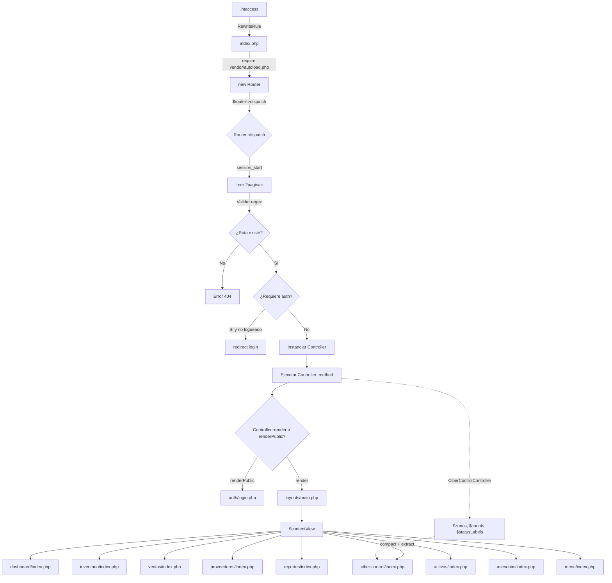
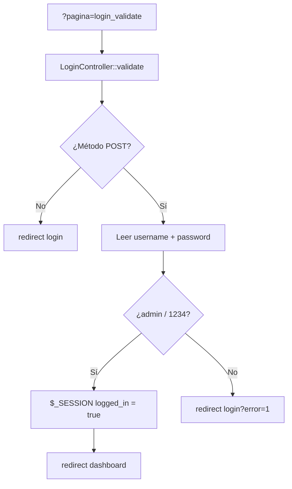

# Diagrama de Clases — EIS Zona Web Lara (Arquitectura MVC)

> **Actualizado (Agosto 2026):** Documento de diseño histórico. La implementación final cuenta con **13 controladores (12 AJAX + `AuthController`) y 13 modelos POO**.

## Estado Actual (Clases PHP con Namespace — Patrón MVC)

```mermaid
classDiagram
    class Router {
        -array $routes
        +__construct()
        +dispatch() void
    }

    class Controller {
        <<abstract>>
        #array $pageTitles
        #array $extraHeaders
        #string $currentPage
        +__construct()
        #render(viewPath, data) void
        #renderPublic(viewPath, data) void
    }

    class LoginController {
        +index() void
        +validate() void
    }

    class DashboardController {
        +index() void
    }

    class InventarioController {
        +index() void
    }

    class VentasController {
        +index() void
    }

    class CiberControlController {
        +index() void
    }

    class ProveedoresController {
        +index() void
    }

    class ReportesController {
        +index() void
    }

    class ActivosController {
        +index() void
    }

    class AsesoriasController {
        +index() void
    }

    class MenuController {
        +index() void
    }

    class crud_users_php {
        +crearUsuario(pdo, username, password, nombre, email, telefono, rol_id) bool
        +obtenerUsuarios(pdo) array
        +obtenerUsuarioPorId(pdo, id) array~false
        +obtenerUsuarioPorUsername(pdo, username) array~false
        +autenticarUsuario(pdo, username, password) array~false
        +actualizarUsuario(pdo, id, nombre, email, telefono, rol_id, activo) bool
        +actualizarPassword(pdo, id, password) bool
        +eliminarUsuario(pdo, id) bool
    }

    class crud_asesorias_php {
        +crearAsesoria(pdo, ciudadano, cedula, documento, descripcion, estado, usuario_id) bool
        +obtenerAsesorias(pdo) array
        +obtenerAsesoriasPorEstado(pdo, estado) array
        +obtenerAsesoriaPorId(pdo, id) array~false
        +buscarAsesoriasPorCedula(pdo, cedula) array
        +actualizarAsesoria(pdo, id, ciudadano, cedula, documento, descripcion, estado) bool
        +eliminarAsesoria(pdo, id) bool
        +contarAsesoriasPorEstado(pdo) array
    }

    class database_php {
        +$host : string
        +$db : string
        +$user : string
        +$pass : string
        +$charset : string
        +$dns : string
        +$options : array
        +$pdo : PDO
        +conectar() void
    }

    class layouts_main_php {
        +$pageTitle : string
        +$pagina : string
        +$headerExtra : string
        +$contentView : string
        +render_sidebar() void
        +render_navbar() void
        +render_content() void
        +render_scripts() void
    }

    class auth_login_php {
        +render_form() void
    }

    class dashboard_index_php {
        +render_kpi_cards() void
        +render_tables() void
        +render_activity() void
    }

    class inventario_index_php {
        +render_search_toolbar() void
        +render_table() void
        +render_pagination() void
    }

    class ventas_index_php {
        +render_pos_header() void
        +render_catalog() void
        +render_cart_modal() void
    }

    class proveedores_index_php {
        +render_search_toolbar() void
        +render_table() void
        +render_pagination() void
    }

    class reportes_index_php {
        +render_kpi_cards() void
        +render_generator_form() void
        +render_recent_list() void
    }

    class activos_index_php {
        +render_search_toolbar() void
        +render_categories() void
        +render_summary() void
    }

    class ciber_control_index_php {
        +render_metrics() void
        +render_filters() void
        +render_station_grid() void
    }

    class asesorias_index_php {
        +render_banner() void
        +render_form() void
        +render_history() void
        +render_allowed_docs() void
    }

    class menu_index_php {
        +render_menu_links() void
    }

    class app_js {
        +EIS.toast() void
        +init_materialize_components() void
        +digital_clock() void
        +theme_toggle() void
        +page_transition() void
        +animate_counters() void
        +search_table_debounce() void
        +pos_cart_system() void
        +cyber_station_interaction() void
        +back_to_top() void
        +legal_document_validation() void
    }

    index_php --> Router : new + dispatch
    Router --> LoginController : instancia
    Router --> DashboardController : instancia
    Router --> InventarioController : instancia
    Router --> VentasController : instancia
    Router --> CiberControlController : instancia
    Router --> ProveedoresController : instancia
    Router --> ReportesController : instancia
    Router --> ActivosController : instancia
    Router --> AsesoriasController : instancia
    Router --> MenuController : instancia

    Controller <|-- LoginController : extends
    Controller <|-- DashboardController : extends
    Controller <|-- InventarioController : extends
    Controller <|-- VentasController : extends
    Controller <|-- CiberControlController : extends
    Controller <|-- ProveedoresController : extends
    Controller <|-- ReportesController : extends
    Controller <|-- ActivosController : extends
    Controller <|-- AsesoriasController : extends
    Controller <|-- MenuController : extends

    Controller --> layouts_main_php : render() require
    Controller --> auth_login_php : renderPublic() require
    Controller --> dashboard_index_php : render()
    Controller --> inventario_index_php : render()
    Controller --> ventas_index_php : render()
    Controller --> ciber_control_index_php : render()
    Controller --> proveedores_index_php : render()
    Controller --> reportes_index_php : render()
    Controller --> activos_index_php : render()
    Controller --> asesorias_index_php : render()
    Controller --> menu_index_php : render()

    layouts_main_php --> dashboard_index_php : require $contentView
    layouts_main_php --> inventario_index_php : require $contentView
    layouts_main_php --> ventas_index_php : require $contentView
    layouts_main_php --> ciber_control_index_php : require $contentView
    layouts_main_php --> proveedores_index_php : require $contentView
    layouts_main_php --> reportes_index_php : require $contentView
    layouts_main_php --> activos_index_php : require $contentView
    layouts_main_php --> asesorias_index_php : require $contentView

    crud_users_php --> database_php : require_once
    crud_asesorias_php --> database_php : require_once
```

---

## Flujo de Datos Actual (MVC)

---

## Flujo de Autenticación

---

## Leyenda

| Símbolo | Significado |
|---------|-------------|
| `+` | Público |
| `-` | Privado |
| `#` | Protegido |
| `<<abstract>>` | Clase abstracta |
| `-->` | Asociación / dependencia |
| `<|--` | Herencia (extends) |
| `-.->` | Dependencia indirecta (paso de datos) |

---

## Cambios respecto a la versión anterior (Procedural → MVC)

| Archivo antiguo | Archivo nuevo | Cambio |
|-----------------|---------------|--------|
| `app/core/router.php` | `app/Core/Router.php` | Convertido a clase con namespace, mapa de rutas, dispatch() |
| — | `app/Core/Controller.php` | Nuevo: clase base abstracta con render() y renderPublic() |
| — | `app/Controllers/*.php` (10) | Nuevos: controladores por módulo |
| `app/template/layout.php` | `app/Views/layouts/main.php` | Movido a Views/layouts/ |
| `app/Views/login.php` | `app/Views/auth/login.php` | Movido a subdirectorio |
| `app/Views/dashboard.php` | `app/Views/dashboard/index.php` | Movido a subdirectorio |
| `app/Views/ciberControl.php` | `app/Views/ciber-control/index.php` | Datos PHP movidos al controlador |
| `app/Views/login_validate.php` | (eliminado) | Lógica movida a `LoginController::validate()` |
| `index.php` | `index.php` | Ahora carga autoloader + Router::dispatch() |
| `composer.json` | `composer.json` | PSR-4 actualizado: `"App\\": "src/app/"` |

---

## Nota

La aplicación actual utiliza **clases con namespace PHP** para los componentes del patrón MVC (Router, Controller, Controllers), cargadas automáticamente vía PSR-4. Los Models (`crud_users.php`, `crud_asesorias.php`) permanecen como funciones procedurales y se incluyen manualmente donde se necesitan. Las vistas son archivos PHP/HTML sin lógica de negocio.
