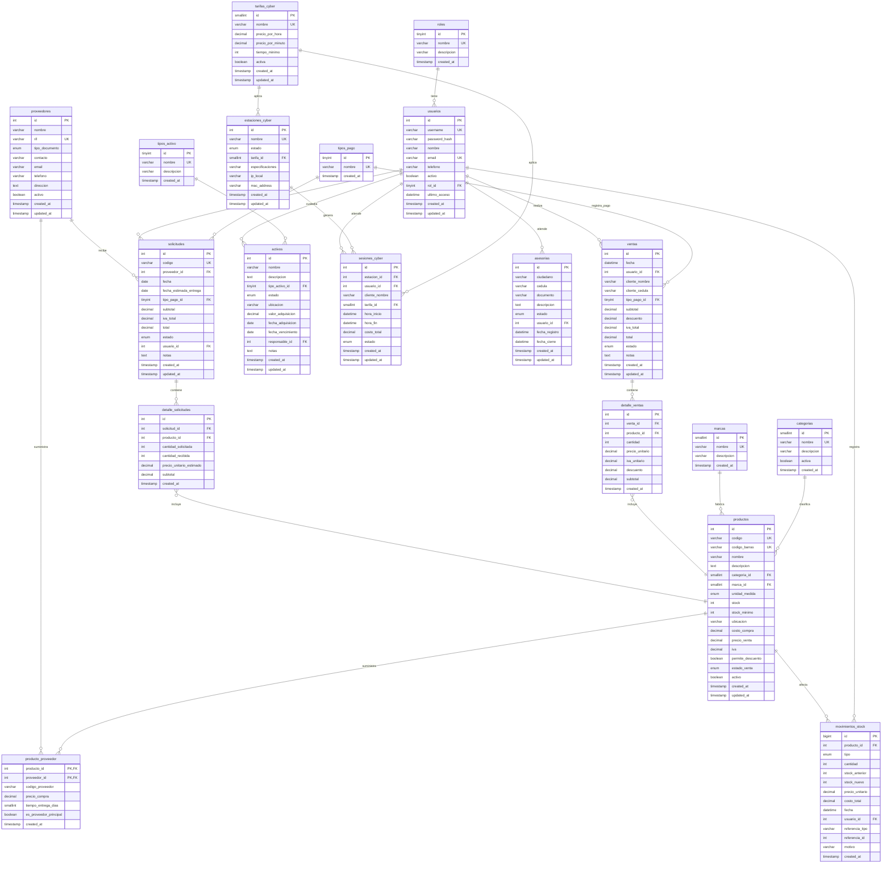

# Diagrama Entidad-Relación — Sistema ZWL (EIS_Zona_Web_Lara)

## Leyenda

| Símbolo | Significado                    |
|---------|--------------------------------|
| `||--o{` | Uno a Muchos (1:N)            |
| `}o--||` | Muchos a Uno (N:1)            |
| `||--o{` | También usado como 1 a Muchos |
| `PK`     | _Primary Key_ (Clave Primaria) |
| `FK`     | _Foreign Key_ (Clave Foránea)  |
| `UK`     | _Unique Key_ (Clave Única)     |

## Resumen de tablas

| # | Tabla | Tipo | Descripción |
|---|-------|------|-------------|
| 1 | `roles` | Catálogo | Roles de usuario (Admin, Vendedor, Cyber, Asesor, Consultor) |
| 2 | `categorias` | Catálogo | Categorías de productos |
| 3 | `marcas` | Catálogo | Marcas de productos |
| 4 | `tipos_activo` | Catálogo | Tipos de activos fijos |
| 5 | `tarifas_cyber` | Catálogo | Tarifas del cyber (Gaming, Oficina, Premium, Estudiante) |
| 6 | `tipos_pago` | Catálogo | Formas de pago |
| 7 | `usuarios` | Maestra | Usuarios del sistema |
| 8 | `productos` | Maestra | Productos e inventario |
| 9 | `proveedores` | Maestra | Proveedores |
| 10 | `producto_proveedor` | Puente | Relación M:N productos ↔ proveedores |
| 11 | `ventas` | Transaccional | Cabecera de ventas |
| 12 | `detalle_ventas` | Puente | Líneas de detalle de venta (M:N ventas ↔ productos) |
| 13 | `solicitudes` | Transaccional | Solicitudes de compra a proveedores |
| 14 | `detalle_solicitudes` | Puente | Líneas de solicitud (M:N solicitudes ↔ productos) |
| 15 | `activos` | Maestra | Activos fijos de la empresa |
| 16 | `estaciones_cyber` | Maestra | Estaciones/PCS del cyber |
| 17 | `sesiones_cyber` | Transaccional | Sesiones de cyber café |
| 18 | `movimientos_stock` | Transaccional | Histórico de movimientos de inventario (BIGINT) |
| 19 | `asesorias` | Transaccional | Casos de asesoría legal/técnica |
