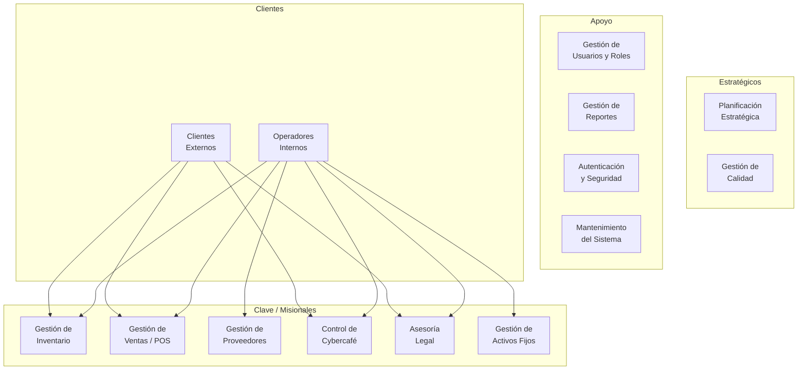
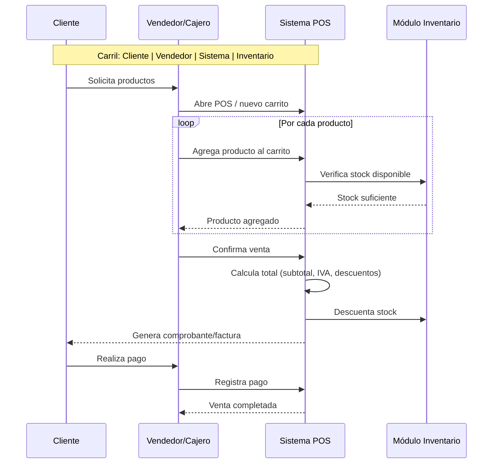
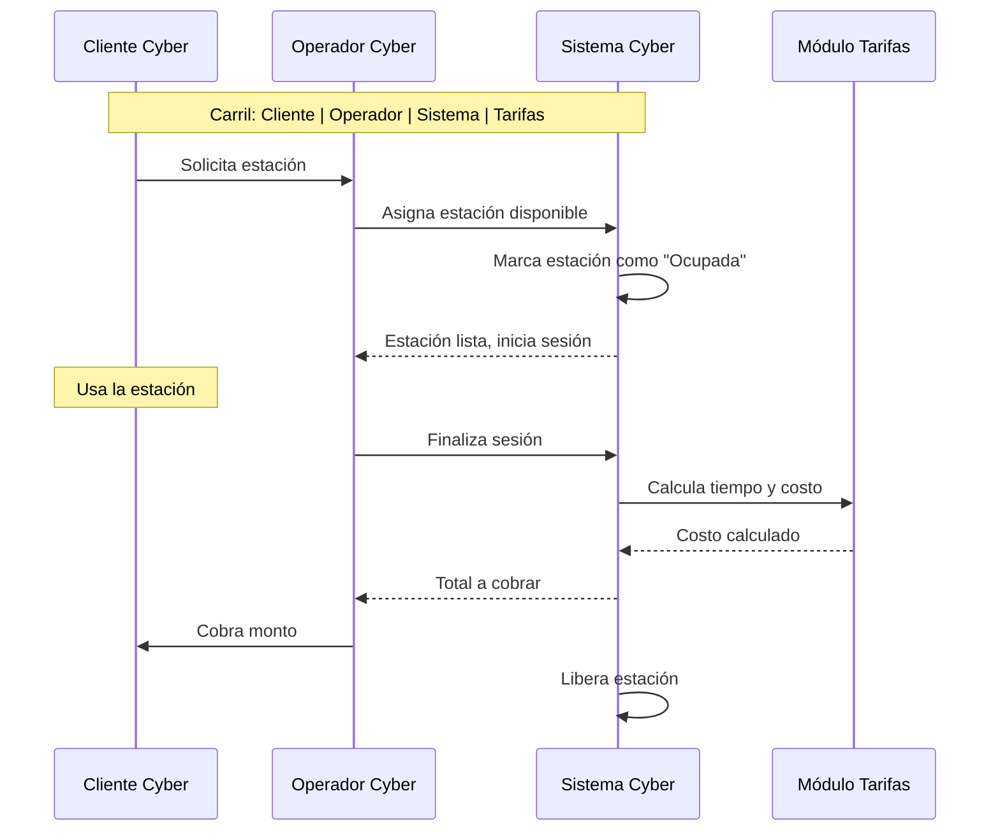
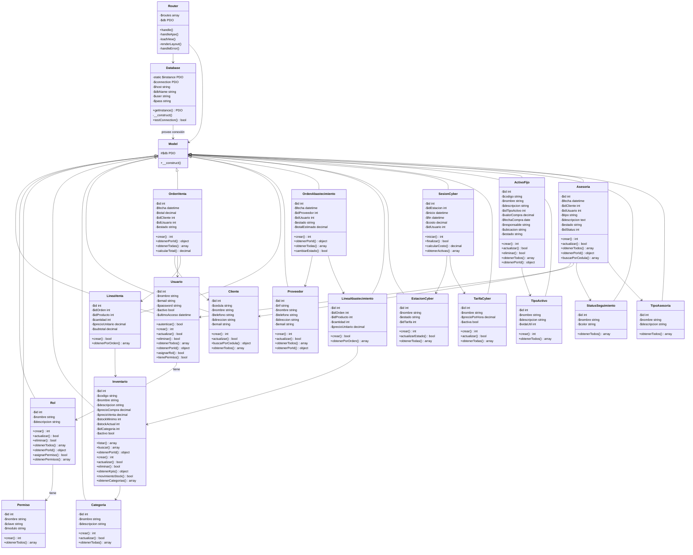
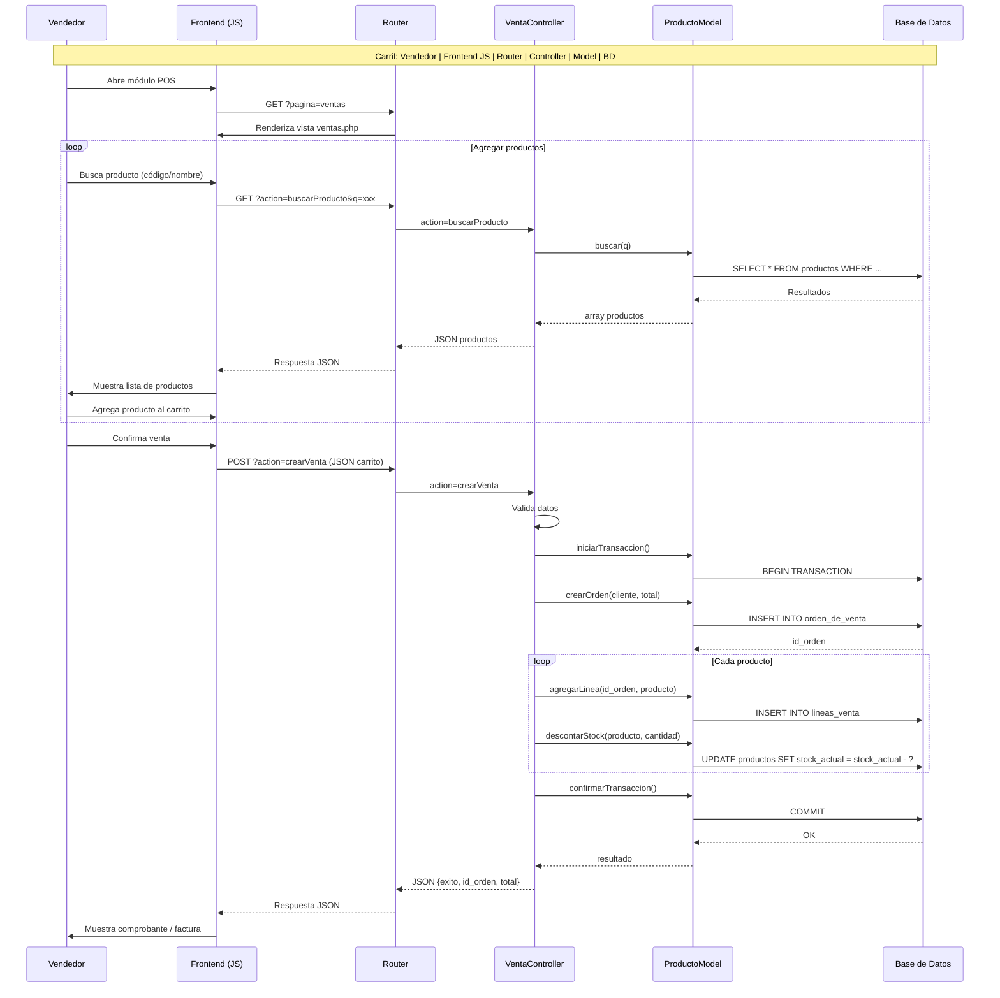
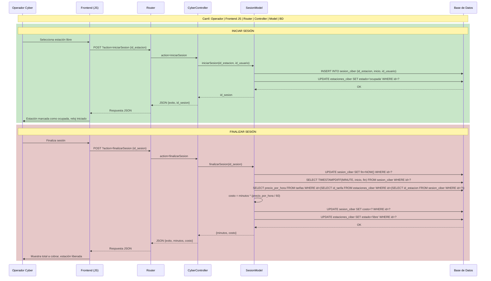

# Planificación de Diseño y Desarrollo — EIS System (Zona Web Lara)

> **Metodología:** RUP (Rational Unified Process) adaptado  
> **Inicio:** Última semana de febrero 2026  
> **Fin estimado:** Diciembre 2026  
> **Autor:** Carlos Páez Guerra

---

## Índice

1. [Cronograma General](#1-cronograma-general)
2. [Modelado del Negocio](#2-modelado-del-negocio)
3. [Modelado del Sistema](#3-modelado-del-sistema)
4. [Fases de Desarrollo](#4-fases-de-desarrollo)
5. [Entregables por Hito](#5-entregables-por-hito)

---

## 1. Cronograma General

```mermaid
gantt
    title Planificación Integral — EIS System
    dateFormat  YYYY-MM-DD
    axisFormat  %b %Y

    section MODELADO DEL NEGOCIO
    Cuadro de procesos (mapa de procesos)          :mn1, 2026-02-23, 7d
    Casos de uso del negocio                       :mn2, after mn1, 5d
    Diagramas de actividad en carriles (negocio)   :mn3, after mn2, 5d
    HITO: Modelado del negocio aprobado            :milestone, mmn1, after mn3, 0d

    section MODELADO DEL SISTEMA
    Diagrama de casos de uso del sistema           :ms1, after mn3, 7d
    Diagrama de clases (análisis)                  :ms2, after ms1, 7d
    Diseño conceptual de la BD (MER)               :ms3, after ms1, 7d
    Diseño lógico de la BD                         :ms4, after ms3, 5d
    Diseño físico de la BD (MySQL)                 :ms5, after ms4, 5d
    Diccionario de datos                           :ms6, after ms5, 5d
    Diagramas de actividad en carriles (sistema)   :ms7, after ms2, 7d
    Planillas IBM (formularios)                    :ms8, after ms7, 5d
    Documento SRS (Especificación de Requisitos)   :ms9, after ms8, 7d
    HITO: Modelado del sistema completo            :milestone, mms1, after ms9, 0d

    section CONSTRUCCIÓN - Núcleo
    Implementación del núcleo (Router, DB, Model)  :c1, after ms9, 10d
    Implementación de autenticación                :c2, after c1, 7d
    HITO: Base del sistema funcional               :milestone, mc1, after c2, 0d

    section CONSTRUCCIÓN - Módulo Inventario
    CRUD productos + categorías + stock            :ci1, after c2, 15d
    KPIs y dashboard de inventario                 :ci2, after ci1, 5d
    HITO: Inventario completo                      :milestone, mci, after ci2, 0d

    section CONSTRUCCIÓN - Módulo Ventas/POS
    Carrito de compras con BD                      :cv1, after ci2, 10d
    Líneas de venta y actualización de stock       :cv2, after cv1, 5d
    Historial de ventas                            :cv3, after cv2, 5d
    HITO: POS funcional con BD                     :milestone, mcv, after cv3, 0d

    section CONSTRUCCIÓN - Módulo Proveedores
    CRUD proveedores + solicitudes                 :cp1, after cv3, 10d
    Líneas de abastecimiento                       :cp2, after cp1, 5d
    HITO: Proveedores completo                     :milestone, mcp, after cp2, 0d

    section CONSTRUCCIÓN - Módulo Cybercafé
    Gestión de estaciones + tarifas                :cc1, after cp2, 7d
    Sesiones y cálculo automático                  :cc2, after cc1, 5d
    HITO: Cybercafé completo                       :milestone, mcc, after cc2, 0d

    section CONSTRUCCIÓN - Módulo Asesoría Legal
    CRUD asesorías + clientes                      :cal1, after cc2, 7d
    Búsqueda y filtros                             :cal2, after cal1, 5d
    HITO: Asesoría Legal completa                  :milestone, mcal, after cal2, 0d

    section CONSTRUCCIÓN - Módulo Activos Fijos
    CRUD activos + tipos de activo                 :caf1, after cal2, 7d
    Asignación a responsables                      :caf2, after caf1, 5d
    HITO: Activos Fijos completo                   :milestone, mcaf, after caf2, 0d

    section CONSTRUCCIÓN - Módulo Usuarios/Roles
    CRUD usuarios + roles                          :cur1, after caf2, 7d
    Permisos y asignación                          :cur2, after cur1, 5d
    HITO: Usuarios/Roles completo                  :milestone, mcur, after cur2, 0d

    section CONSTRUCCIÓN - Dashboard y Reportes
    Dashboard con KPIs reales                      :cdr1, after cur2, 7d
    Reportes PDF/Excel                             :cdr2, after cdr1, 7d
    HITO: Dashboard y Reportes listos              :milestone, mcdr, after cdr2, 0d

    section CONSTRUCCIÓN - Seguridad y PWA
    CSRF, hashing, sanitización                    :csp1, after cdr2, 7d
    PWA completo (SW + offline + manifest)         :csp2, after csp1, 5d
    HITO: Sistema completo funcional               :milestone, mcsp, after csp2, 0d

    section PRUEBAS
    Pruebas unitarias (modelos y controladores)    :tp1, after mcsp, 10d
    Pruebas de integración (flujos completos)      :tp2, after tp1, 10d
    Pruebas de aceptación del usuario (UAT)        :tp3, after tp2, 10d
    Corrección de errores                          :tp4, after tp3, 7d
    HITO: Sistema probado y estable                :milestone, mtp, after tp4, 0d

    section TRANSICIÓN
    Documentación técnica completa                 :td1, after mtp, 10d
    Manuales de usuario                            :td2, after td1, 7d
    Capacitación a usuarios                        :td3, after td2, 5d
    Configuración de producción                    :td4, after td3, 5d
    Despliegue en producción                       :td5, after td4, 3d
    Soporte post-despliegue                        :td6, after td5, 15d
    HITO: Cierre del proyecto                      :milestone, mtd, after td6, 0d
```

---

## 2. Modelado del Negocio

### 2.1 Cuadro de Procesos (Mapa de Procesos)



| Tipo de Proceso | Proceso | Descripción |
|:---|:---|:---|
| **Estratégico** | Planificación Estratégica | Definición de objetivos, metas y recursos del sistema |
| **Estratégico** | Gestión de Calidad | Monitoreo de indicadores y mejora continua |
| **Clave** | Gestión de Inventario | Control de productos, categorías, stock y movimientos |
| **Clave** | Gestión de Ventas / POS | Procesos de venta, carrito de compras y facturación |
| **Clave** | Gestión de Proveedores | Solicitudes de abastecimiento y gestión de órdenes |
| **Clave** | Control de Cybercafé | Administración de estaciones, tarifas y sesiones |
| **Clave** | Asesoría Legal | Registro y seguimiento de casos legales |
| **Clave** | Gestión de Activos Fijos | Control de equipos y activos de la empresa |
| **Apoyo** | Gestión de Usuarios y Roles | Administración de accesos y permisos |
| **Apoyo** | Gestión de Reportes | Generación de informes y estadísticas |
| **Apoyo** | Autenticación y Seguridad | Login, protección CSRF, hashing de contraseñas |
| **Apoyo** | Mantenimiento del Sistema | Respaldo de BD, actualizaciones, monitoreo |

---

### 2.2 Casos de Uso del Negocio

| ID | Caso de Uso del Negocio | Actor(es) | Descripción |
|:---|:---|:---|:---|
| **CUN-01** | Gestionar Inventario | Administrador, Vendedor | Registrar, modificar, eliminar y consultar productos, categorías y stock |
| **CUN-02** | Realizar Venta | Vendedor, Cajero | Procesar una venta desde el POS, agregar productos al carrito y generar comprobante |
| **CUN-03** | Gestionar Proveedores | Administrador | Registrar proveedores y crear solicitudes de abastecimiento |
| **CUN-04** | Controlar Cybercafé | Operador Cyber | Gestionar estaciones, iniciar/finalizar sesiones y calcular costos |
| **CUN-05** | Gestionar Asesoría Legal | Asesor Legal | Registrar casos legales, asociar clientes y dar seguimiento |
| **CUN-06** | Gestionar Activos Fijos | Administrador | Registrar y asignar activos fijos a responsables |
| **CUN-07** | Administrar Usuarios | Administrador | Crear, modificar y desactivar usuarios del sistema |
| **CUN-08** | Gestionar Roles y Permisos | Administrador | Definir roles y asignar permisos a cada rol |
| **CUN-09** | Autenticarse en el Sistema | Todos los actores | Iniciar y cerrar sesión en el sistema |
| **CUN-10** | Visualizar Dashboard | Todos los actores | Consultar KPIs y métricas del negocio |
| **CUN-11** | Generar Reportes | Administrador | Generar reportes en PDF/Excel con filtros |

---

### 2.3 Diagramas de Actividad en Carriles — Negocio

#### CUN-02: Realizar Venta



#### CUN-04: Controlar Cybercafé



---

## 3. Modelado del Sistema

### 3.1 Diagrama de Casos de Uso del Sistema

```mermaid
graph TB
    subgraph Actores
        Admin((Administrador))
        Vend((Vendedor))
        OpeC((Operador<br/>Cyber))
        Asesor((Asesor<br/>Legal))
    end

    subgraph Sistema
        UC1[Iniciar Sesión]
        UC2[Cerrar Sesión]
        UC3[Gestionar Productos]
        UC4[Gestionar Categorías]
        UC5[Controlar Stock]
        UC6[Ver KPIs Inventario]
        UC7[Crear Venta]
        UC8[Gestionar Carrito]
        UC9[Generar Factura]
        UC10[Gestionar Proveedores]
        UC11[Crear Solicitud Abastecimiento]
        UC12[Gestionar Estaciones Cyber]
        UC13[Iniciar Sesión Cyber]
        UC14[Finalizar Sesión Cyber]
        UC15[Calcular Tarifa]
        UC16[Gestionar Casos Legales]
        UC17[Registrar Cliente Asesoría]
        UC18[Gestionar Activos Fijos]
        UC19[Gestionar Usuarios]
        UC20[Gestionar Roles]
        UC21[Asignar Permisos]
        UC22[Ver Dashboard]
        UC23[Generar Reportes]
        UC24[Gestionar Tipo Activo]
        UC25[Gestionar Tarifas Cyber]
    end

    Admin --- UC1
    Admin --- UC3
    Admin --- UC4
    Admin --- UC5
    Admin --- UC6
    Admin --- UC10
    Admin --- UC11
    Admin --- UC18
    Admin --- UC19
    Admin --- UC20
    Admin --- UC21
    Admin --- UC22
    Admin --- UC23
    Admin --- UC24
    Admin --- UC25

    Vend --- UC1
    Vend --- UC3
    Vend --- UC5
    Vend --- UC6
    Vend --- UC7
    Vend --- UC8
    Vend --- UC9
    Vend --- UC22

    OpeC --- UC1
    OpeC --- UC12
    OpeC --- UC13
    OpeC --- UC14
    OpeC --- UC15

    Asesor --- UC1
    Asesor --- UC16
    Asesor --- UC17
    Asesor --- UC22
```



---

### 3.2 Diagrama de Clases



---

### 3.3 Diseño de la Base de Datos (MySQL)

#### Modelo Conceptual (MER)

```
DOMINIO SEGURIDAD:
  [roles] 1---* [permisos_rol] *---1 [permisos]
  [roles] 1---* [rol_usuarios] *---1 [usuarios]

DOMINIO INVENTARIO:
  [categoria] 1---* [productos]

DOMINIO VENTAS:
  [clientes] 1---* [orden_de_venta] 1---* [lineas_venta] *---1 [productos]
  [usuarios] 1---* [orden_de_venta]

DOMINIO PROVEEDORES:
  [proveedores] 1---* [orden_abastecimiento] 1---* [lineas_abastecimiento] *---1 [productos]
  [usuarios] 1---* [orden_abastecimiento]

DOMINIO CYBERCAFÉ:
  [tarifas] 1---* [sesion_ciber] *---1 [estaciones_ciber]
  [usuarios] 1---* [sesion_ciber]

DOMINIO ASESORÍA LEGAL:
  [clientes] 1---* [cliente_asesoria]
  [tipo_asesoria] 1---* [asesoria]
  [status_seguimiento] 1---* [asesoria]
  [usuarios] 1---* [asesoria]

DOMINIO ACTIVOS FIJOS:
  [tipo_activo] 1---* [activos]
```

#### Modelo Físico (MySQL)

**Version:** 2.2  
**Motor:** InnoDB  
**Charset:** utf8mb4  
**Collation:** utf8mb4_unicode_ci  

| Tabla | Descripción | Columnas Clave |
|:---|:---|:---|
| `roles` | Roles de usuario | id (PK), nombre, descripcion |
| `permisos` | Permisos del sistema | id (PK), nombre, clave, modulo |
| `permisos_rol` | Asignación permiso→rol | id (PK), id_rol (FK), id_permiso (FK) |
| `rol_usuarios` | Asignación rol→usuario | id (PK), id_rol (FK), id_usuario (FK) |
| `usuarios` | Usuarios del sistema | id (PK), nombre, email, password, activo, ultimo_acceso |
| `categoria` | Categorías de productos | id (PK), nombre, descripcion |
| `productos` | Productos del inventario | id (PK), codigo, nombre, descripcion, precio_compra, precio_venta, stock_minimo, stock_actual, id_categoria (FK), activo |
| `clientes` | Clientes (ventas + asesorías) | id (PK), cedula, nombre, telefono, direccion, email |
| `orden_de_venta` | Ventas realizadas | id (PK), fecha, total, id_cliente (FK), id_usuario (FK), estado |
| `lineas_venta` | Detalle de cada venta | id (PK), id_orden (FK), id_producto (FK), cantidad, precio_unitario, subtotal |
| `proveedores` | Proveedores registrados | id (PK), rif, nombre, telefono, direccion, email |
| `orden_abastecimiento` | Solicitudes a proveedores | id (PK), fecha, id_proveedor (FK), id_usuario (FK), estado, total_estimado |
| `lineas_abastecimiento` | Detalle de cada solicitud | id (PK), id_orden (FK), id_producto (FK), cantidad, precio_unitario |
| `estaciones_ciber` | Estaciones de cybercafé | id (PK), nombre, estado, id_tarifa (FK) |
| `sesion_ciber` | Sesiones de cybercafé | id (PK), id_estacion (FK), inicio, fin, costo, id_usuario (FK) |
| `tarifas` | Tarifas del cybercafé | id (PK), nombre, precio_por_hora, activa |
| `tipo_activo` | Tipos de activos fijos | id (PK), nombre, descripcion, vida_util |
| `activos` | Activos fijos de la empresa | id (PK), codigo, nombre, descripcion, id_tipo_activo (FK), valor_compra, fecha_compra, responsable, ubicacion, estado |
| `asesoria` | Casos de asesoría legal | id (PK), fecha, id_cliente (FK), id_usuario (FK), tipo (FK→tipo_asesoria), descripcion, estado, id_status (FK) |
| `cliente_asesoria` | Relación cliente→asesoría | id (PK), id_cliente (FK), id_asesoria (FK) |
| `tipo_asesoria` | Tipos de asesoría legal | id (PK), nombre, descripcion |
| `status_seguimiento` | Estados de seguimiento | id (PK), nombre, color |

**Total: 22 tablas**

---

### 3.4 Diccionario de Datos

#### Tabla: `usuarios`

| Campo | Tipo | Nulo | Default | Descripción |
|:---|:---|:---:|:---:|:---|
| id | INT(11) AUTO_INCREMENT | NO | — | Identificador único del usuario |
| nombre | VARCHAR(100) | NO | — | Nombre completo del usuario |
| email | VARCHAR(100) | NO | — | Correo electrónico (único) |
| password | VARCHAR(255) | NO | — | Hash bcrypt de la contraseña |
| activo | TINYINT(1) | NO | 1 | Estado del usuario (1=activo, 0=inactivo) |
| ultimo_acceso | DATETIME | SÍ | NULL | Fecha y hora del último inicio de sesión |
| fecha_creacion | DATETIME | NO | CURRENT_TIMESTAMP | Fecha de registro del usuario |

#### Tabla: `productos`

| Campo | Tipo | Nulo | Default | Descripción |
|:---|:---|:---:|:---:|:---|
| id | INT(11) AUTO_INCREMENT | NO | — | Identificador único del producto |
| codigo | VARCHAR(50) | NO | — | Código interno del producto (único) |
| nombre | VARCHAR(200) | NO | — | Nombre del producto |
| descripcion | TEXT | SÍ | NULL | Descripción detallada |
| precio_compra | DECIMAL(10,2) | NO | 0.00 | Precio de compra unitario |
| precio_venta | DECIMAL(10,2) | NO | 0.00 | Precio de venta unitario |
| stock_minimo | INT(11) | NO | 0 | Stock mínimo para alertas |
| stock_actual | INT(11) | NO | 0 | Cantidad actual en inventario |
| id_categoria | INT(11) | NO | — | FK a `categoria.id` |
| activo | TINYINT(1) | NO | 1 | Estado del producto |
| fecha_creacion | DATETIME | NO | CURRENT_TIMESTAMP | Fecha de registro |

#### Tabla: `orden_de_venta`

| Campo | Tipo | Nulo | Default | Descripción |
|:---|:---|:---:|:---:|:---|
| id | INT(11) AUTO_INCREMENT | NO | — | Identificador único de la venta |
| fecha | DATETIME | NO | CURRENT_TIMESTAMP | Fecha y hora de la venta |
| total | DECIMAL(12,2) | NO | 0.00 | Monto total de la venta |
| id_cliente | INT(11) | SÍ | NULL | FK a `clientes.id` (NULL si es venta al público) |
| id_usuario | INT(11) | NO | — | FK a `usuarios.id` (vendedor) |
| estado | ENUM('pendiente','completada','anulada') | NO | 'pendiente' | Estado de la orden |

#### Tabla: `lineas_venta`

| Campo | Tipo | Nulo | Default | Descripción |
|:---|:---|:---:|:---:|:---|
| id | INT(11) AUTO_INCREMENT | NO | — | Identificador único |
| id_orden | INT(11) | NO | — | FK a `orden_de_venta.id` |
| id_producto | INT(11) | NO | — | FK a `productos.id` |
| cantidad | INT(11) | NO | — | Cantidad vendida |
| precio_unitario | DECIMAL(10,2) | NO | — | Precio al momento de la venta |
| subtotal | DECIMAL(12,2) | NO | — | cantidad × precio_unitario |

#### Tabla: `sesion_ciber`

| Campo | Tipo | Nulo | Default | Descripción |
|:---|:---|:---:|:---:|:---|
| id | INT(11) AUTO_INCREMENT | NO | — | Identificador único |
| id_estacion | INT(11) | NO | — | FK a `estaciones_ciber.id` |
| inicio | DATETIME | NO | CURRENT_TIMESTAMP | Inicio de la sesión |
| fin | DATETIME | SÍ | NULL | Fin de la sesión (NULL si activa) |
| costo | DECIMAL(10,2) | SÍ | NULL | Costo calculado al finalizar |
| id_usuario | INT(11) | NO | — | FK a `usuarios.id` (operador) |

#### Tabla: `asesoria`

| Campo | Tipo | Nulo | Default | Descripción |
|:---|:---|:---:|:---:|:---|
| id | INT(11) AUTO_INCREMENT | NO | — | Identificador único |
| fecha | DATETIME | NO | CURRENT_TIMESTAMP | Fecha del caso |
| id_cliente | INT(11) | SÍ | NULL | FK a `clientes.id` |
| id_usuario | INT(11) | NO | — | FK a `usuarios.id` (asesor) |
| tipo | INT(11) | NO | — | FK a `tipo_asesoria.id` |
| descripcion | TEXT | NO | — | Descripción del caso |
| estado | ENUM('abierto','en_proceso','cerrado') | NO | 'abierto' | Estado del caso |
| id_status | INT(11) | SÍ | NULL | FK a `status_seguimiento.id` |
| fecha_creacion | DATETIME | NO | CURRENT_TIMESTAMP | Fecha de registro |

> El diccionario completo con todas las tablas (22) se encuentra en [`docs/Diccionario_de_Datos.md`](Diccionario_de_Datos.md).

---

### 3.5 Diagramas de Actividad en Carriles — Sistema

#### CU-07: Crear Venta (Flujo del Sistema)



#### CU-13/14: Iniciar / Finalizar Sesión Cyber



---

### 3.6 Planillas IBM (Formularios de Ingeniería de Software)

Se aplican las planillas estándar de IBM Rational para la documentación del sistema:

| ID | Planilla IBM | Propósito | Archivo Asociado |
|:---|:---|:---|:---|
| **IBM-01** | Planilla de Requisitos del Sistema | Documentar cada requisito funcional y no funcional | `docs/IBM/requisitos_sistema.md` |
| **IBM-02** | Planilla de Casos de Uso | Especificación detallada de cada caso de uso | `docs/IBM/casos_de_uso.md` |
| **IBM-03** | Planilla de Especificación Suplementaria | Requisitos no funcionales, restricciones, calidad | `docs/IBM/especificacion_suplementaria.md` |
| **IBM-04** | Planilla de Glosario | Términos y definiciones del dominio | `docs/IBM/glosario.md` |
| **IBM-05** | Planilla de Modelo de Datos | Definición de entidades, atributos y relaciones | `docs/IBM/modelo_de_datos.md` |
| **IBM-06** | Planilla de Plan de Pruebas | Estrategia, casos y procedimientos de prueba | `docs/IBM/plan_de_pruebas.md` |
| **IBM-07** | Planilla de Matriz de Trazabilidad | Rastreo requisito → caso de uso → prueba | `docs/IBM/matriz_trazabilidad.md` |
| **IBM-08** | Planilla de Acta de Cierre | Cierre formal del proyecto | `docs/IBM/acta_cierre.md` |

> El contenido detallado de estas planillas se encuentra en la carpeta [`docs/IBM/`](IBM/).

#### Ejemplo — IBM-01: Planilla de Requisitos del Sistema

| Campo | Valor |
|:---|:---|
| **ID** | REQ-SIS-001 |
| **Nombre** | Autenticación de usuarios |
| **Descripción** | El sistema debe permitir a los usuarios iniciar sesión con correo y contraseña, y cerrar sesión |
| **Prioridad** | Alta |
| **Fuente** | Stakeholder (Administrador) |
| **Caso de Uso Asociado** | CUS-01 (Iniciar Sesión) |
| **Criterio de Aceptación** | Usuario ingresa credenciales válidas → redirigido al dashboard. Credenciales inválidas → mensaje de error |
| **Estado** | Aprobado |

---

### 3.7 Documento SRS (Software Requirements Specification)

El documento SRS sigue la estructura IEEE 830-1998 adaptada a RUP:

| Sección SRS | Contenido | Archivo |
|:---|:---|:---|
| **1. Introducción** | Propósito, alcance, definiciones, referencias | `docs/SRS/01_introduccion.md` |
| **2. Descripción General** | Perspectiva del producto, funciones, características de usuarios, restricciones | `docs/SRS/02_descripcion_general.md` |
| **3. Requisitos Específicos** | Requisitos funcionales (por módulo), no funcionales (rendimiento, seguridad, usabilidad) | `docs/SRS/03_requisitos_especificos.md` |
| **4. Modelado del Sistema** | Diagramas de casos de uso, clases, secuencia, actividad | `docs/SRS/04_modelado_sistema.md` |
| **5. Requisitos de la Base de Datos** | MER, esquema físico, diccionario de datos | `docs/SRS/05_base_de_datos.md` |
| **6. Requisitos de Interfaz** | Interfaz de usuario (layout, módulos JS, tema oscuro/claro), interfaz PWA | `docs/SRS/06_interfaz.md` |
| **7. Atributos del Sistema** | Seguridad, mantenibilidad, portabilidad, disponibilidad offline | `docs/SRS/07_atributos.md` |
| **8. Apéndices** | Glosario, referencias, plan de pruebas | `docs/SRS/08_apendices.md` |

> El documento SRS completo se encuentra en la carpeta [`docs/SRS/`](SRS/).

---

## 4. Fases de Desarrollo

### Fase 0: Modelado del Negocio (23 feb — 14 mar 2026)

| Semana | Actividades | Entregables |
|:---:|:---|:---|
| 1 (23 feb) | Cuadro de procesos, identificación de procesos estratégicos/clave/apoyo | Mapa de procesos del negocio |
| 2 (2 mar) | Casos de uso del negocio (CUN-01 al CUN-11), identificación de actores | Diagrama de casos de uso del negocio |
| 3 (9 mar) | Diagramas de actividad en carriles para procesos clave (ventas, cyber, asesoría) | Diagramas de actividad del negocio |

### Fase 1: Modelado del Sistema (16 mar — 3 may 2026)

| Semana | Actividades | Entregables |
|:---:|:---|:---|
| 4 (16 mar) | Diagrama de casos de uso del sistema (25 casos de uso), especificación de actores | Diagrama CU del sistema |
| 5 (23 mar) | Diagrama de clases (análisis): identificación de entidades, atributos, métodos, relaciones | Diagrama de clases versión análisis |
| 6-7 (30 mar) | Diseño conceptual y lógico de la BD (MER, normalización, 22 tablas) | MER, esquema lógico |
| 8 (13 abr) | Diseño físico de la BD (MySQL: CREATE TABLE, FKs, índices, vistas) | Script SQL (`estructura.sql`) |
| 9 (20 abr) | Diccionario de datos completo | `Diccionario_de_Datos.md` |
| 10 (27 abr) | Diagramas de actividad en carriles del sistema, Planillas IBM, Documento SRS | 8 planillas IBM, SRS completo |

### Fase 2: Construcción — Núcleo e Inventario (4 may — 6 jun 2026)

| Semana | Actividades | Entregables |
|:---:|:---|:---|
| 11 (4 may) | Implementación del núcleo: `Router.php` mejorado, `Database.php` (Singleton), `Model.php` | Base del framework funcional |
| 12 (11 may) | `AuthController` + `Usuario` model (bcrypt, sesiones), login/logout con BD | Autenticación funcional |
| 13-15 (18 may) | `Inventario` model, `InventarioController`, `app.inventario.js`, KPIs, categorías | **YA IMPLEMENTADO** |
| 16 (6 jun) | Conexión de dashboard con KPIs reales de inventario | Dashboard con datos vivos |

### Fase 3: Construcción — Módulos REST (7 jun — 30 ago 2026)

| Semana | Actividades | Entregables |
|:---:|:---|:---|
| 17-19 (7 jun) | `Venta` model + `VentaController` + `app.pos.js` persistente, `LineaVenta`, `Cliente`, stock updates | POS funcional con BD |
| 20-21 (28 jun) | `Proveedor` model + `ProveedorController` mejorado, `OrdenAbastecimiento`, `LineaAbastecimiento` | Proveedores completo |
| 22-23 (12 jul) | `EstacionCyber` + `SesionCyber` + `TarifaCyber` models, `CyberController` (API JSON), `app.cyber.js` persistente | Cybercafé funcional con BD |
| 24-25 (26 jul) | `Asesoria` model completo, `AsesoriaController`, `app.legal.js`, búsqueda por cédula, cliente_asesoria | Asesoría Legal completa |
| 26-27 (9 ago) | `ActivoFijo` + `TipoActivo` models, `ActivoController`, CRUD completo con BD | Activos Fijos completos |
| 28-29 (23 ago) | `Rol` + `Permiso` models, `RolController` extendido, `Usuario` CRUD completo, asignación roles/permisos | Usuarios/Roles completo |

### Fase 4: Dashboard, Reportes, Seguridad, PWA (31 ago — 9 oct 2026)

| Semana | Actividades | Entregables |
|:---:|:---|:---|
| 30 (31 ago) | Dashboard: KPIs reales de ventas, inventario, cyber, asesorías; gráficos (Chart.js u otro) | Dashboard completo |
| 31 (7 sep) | Reportes PDF (DomPDF/TCPDF) y Excel (PhpSpreadsheet): ventas, inventario, asesorías | Reportes funcionales |
| 32 (14 sep) | CSRF tokens, `password_hash()`, sanitización de entradas, prepared statements en todas las vistas | Sistema seguro |
| 33 (21 sep) | Service Worker avanzado (estrategias híbridas), offline.php, manifest.json, SPA offline | PWA optimizada |
| 34-35 (28 sep) | Pruebas unitarias (modelos, controladores), pruebas de integración (flujos completos) | Suite de pruebas |

### Fase 5: Transición (12 oct — dic 2026)

| Semana | Actividades | Entregables |
|:---:|:---|:---|
| 36 (12 oct) | Pruebas de aceptación del usuario (UAT) con usuarios reales | Informe UAT |
| 37 (19 oct) | Corrección de errores encontrados en UAT | Sistema estabilizado |
| 38-39 (26 oct) | Documentación técnica completa, actualización de diagramas | Documentación final |
| 40 (9 nov) | Manuales de usuario por módulo (con capturas de pantalla) | Manuales de usuario |
| 41 (16 nov) | Capacitación a usuarios (sesiones presenciales/virtuales) | Acta de capacitación |
| 42 (23 nov) | Configuración del entorno de producción (servidor, BD, SSL, backup) | Entorno productivo |
| 43 (30 nov) | Despliegue en producción, migración de datos | Sistema en producción |
| 44-46 (7 dic) | Soporte post-despliegue, monitoreo, corrección de bugs | Acta de cierre del proyecto |

---

## 5. Entregables por Hito

| # | Hito | Fecha Estimada | Entregables |
|:---:|:---|:---:|:---|
| **H1** | Modelado del negocio aprobado | 14 mar 2026 | Mapa de procesos, CUN-01 al CUN-11, diagramas de actividad del negocio |
| **H2** | Modelado del sistema completo | 3 may 2026 | Diagrama CU del sistema, diagrama de clases, MER + SQL físico, diccionario de datos, diagramas de actividad del sistema, 8 planillas IBM, SRS completo |
| **H3** | Base del sistema funcional | 18 may 2026 | Router, Database, Model, Autenticación (login/logout con BD y bcrypt) |
| **H4** | Inventario completo | 6 jun 2026 | CRUD productos + categorías + stock + KPIs (ya implementado) |
| **H5** | POS funcional con BD | 27 jun 2026 | Ventas con carrito persistente, descuento de stock, historial |
| **H6** | Proveedores completo | 11 jul 2026 | CRUD proveedores, solicitudes, líneas de abastecimiento |
| **H7** | Cybercafé completo | 25 jul 2026 | Estaciones, sesiones, tarifas, cálculo automático |
| **H8** | Asesoría Legal completa | 8 ago 2026 | CRUD asesorías, clientes, búsqueda, seguimiento |
| **H9** | Activos Fijos completo | 22 ago 2026 | CRUD activos, tipos, asignación a responsables |
| **H10** | Usuarios/Roles completo | 30 ago 2026 | CRUD usuarios + roles + permisos, asignación |
| **H11** | Dashboard y Reportes listos | 13 sep 2026 | KPIs reales, gráficos, reportes PDF/Excel |
| **H12** | Sistema completo funcional | 9 oct 2026 | Sistema asegurado (CSRF, hashing), PWA, pruebas unitarias + integración |
| **H13** | Sistema probado y estable | 25 oct 2026 | UAT completado, errores corregidos |
| **H14** | Cierre del proyecto | Dic 2026 | Documentación final, manuales, producción, acta de cierre |

---

## Resumen de Esfuerzo

| Fase | Duración | % del Total |
|:---|:---:|:---:|
| **Modelado del Negocio** | 3 semanas | 6% |
| **Modelado del Sistema** | 7 semanas | 15% |
| **Construcción (Núcleo + Módulos)** | 21 semanas | 44% |
| **Dashboard, Reportes, Seguridad, PWA, Pruebas** | 6 semanas | 12% |
| **Transición y Despliegue** | 11 semanas | 23% |
| **Total** | **≈48 semanas** | **100%** |
