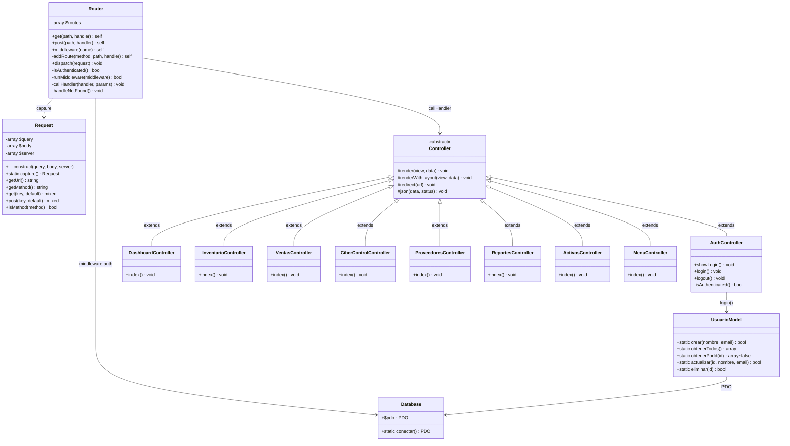
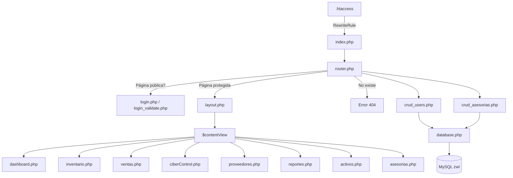

# Diagrama de Clases — EIS Zona Web Lara

## Estado Actual (Código en disco — Arquitectura Procedural)

```mermaid
classDiagram
    class index_php {
        +require_once(router.php)
    }

    class router_php {
        +session_start()
        +$pagina : string
        +$public_pages : string[]
        +$titulos : string[]
        +$extraHeaders : string[]
        +$pageTitle : string
        +$headerExtra : string
        +$contentView : string
        +validar_pagina() : void
        +control_acceso() : void
        +resolver_vista() : void
        +cargar_layout() : void
        +error_404() : void
    }

    class layout_php {
        +$pageTitle : string
        +$pagina : string
        +$headerExtra : string
        +$contentView : string
        +render_sidebar() : void
        +render_navbar() : void
        +render_content() : void
        +render_scripts() : void
    }

    class database_php {
        +$host : string
        +$db : string
        +$user : string
        +$pass : string
        +$charset : string
        +$dns : string
        +$options : array
        +$pdo : PDO
        +conectar() : void
    }

    class crud_users_php {
        +crearUsuario(PDO, nombre, email) : bool
        +obtenerUsuarios(PDO) : array
        +obtenerUsuarioPorId(PDO, id) : array~false
        +actualizarUsuario(PDO, id, nombre, email) : bool
        +eliminarUsuario(PDO, id) : bool
    }

    class crud_asesorias_php {
        +crearAsesoria(PDO, ciudadano, cedula, documento, descripcion, estado, usuario_id) : bool
        +obtenerAsesorias(PDO) : array
        +obtenerAsesoriasPorEstado(PDO, estado) : array
        +obtenerAsesoriaPorId(PDO, id) : array~false
        +buscarAsesoriasPorCedula(PDO, cedula) : array
        +actualizarAsesoria(PDO, id, ciudadano, cedula, documento, descripcion, estado) : bool
        +eliminarAsesoria(PDO, id) : bool
        +contarAsesoriasPorEstado(PDO) : array
    }

    class login_php {
        +render_form() : void
    }

    class login_validate_php {
        +$username : string
        +$password : string
        +$valid_username : string
        +$valid_password : string
        +validar_credenciales() : void
    }

    class dashboard_php {
        +render_kpi_cards() : void
        +render_tables() : void
    }

    class inventario_php {
        +render_search() : void
        +render_table() : void
        +render_pagination() : void
    }

    class ventas_php {
        +render_pos_catalog() : void
        +render_cart_modal() : void
    }

    class ciberControl_php {
        +$zonas : array
        +$todasEstaciones : array
        +$countDisponibles : int
        +$countOcupadas : int
        +$countMantenimiento : int
        +$totalEstaciones : int
        +$statusLabels : string[]
        +render_stations() : void
        +render_filters() : void
    }

    class proveedores_php {
        +render_search() : void
        +render_table() : void
    }

    class reportes_php {
        +render_kpi_cards() : void
        +render_form() : void
        +render_reports_list() : void
    }

    class activos_php {
        +render_search() : void
        +render_categories() : void
        +render_summary() : void
    }

    class asesorias_php {
        +$allowedDocs : string[]
        +$asesoriasRegistradas : array
        +render_form() : void
        +render_history_table() : void
        +render_allowed_docs_list() : void
        +render_search() : void
    }

    class menu_php {
        +render_menu_links() : void
    }

    class app_js {
        +EIS.toast() : void
        +init_components() : void
        +digital_clock() : void
        +theme_toggle() : void
        +page_transition() : void
        +animate_counters() : void
        +search_table_debounce() : void
        +pos_cart_system() : void
        +cyber_station_interaction() : void
        +back_to_top() : void
        +normalizarDoc(texto) : string
        +documentoPermitido(doc) : bool
        +actualizarHistorial() : void
        +mostrarValidacion(tipo, mensaje, esPermitido) : void
    }

    index_php --> router_php : require_once
    router_php --> layout_php : require (protegidas)
    router_php --> login_php : require (pública)
    router_php --> login_validate_php : require (pública)
    router_php --> dashboard_php : $contentView
    router_php --> inventario_php : $contentView
    router_php --> ventas_php : $contentView
    router_php --> ciberControl_php : $contentView
    router_php --> proveedores_php : $contentView
    router_php --> reportes_php : $contentView
    router_php --> activos_php : $contentView
    router_php --> asesorias_php : $contentView
    router_php --> menu_php : $contentView
    layout_php --> dashboard_php : require $contentView
    layout_php --> inventario_php : require $contentView
    layout_php --> ventas_php : require $contentView
    layout_php --> ciberControl_php : require $contentView
    layout_php --> proveedores_php : require $contentView
    layout_php --> reportes_php : require $contentView
    layout_php --> activos_php : require $contentView
    layout_php --> asesorias_php : require $contentView
    crud_users_php --> database_php : require_once
    crud_asesorias_php --> database_php : require_once
    login_validate_php ..> router_php : $_SESSION
```

---

## Arquitectura MVC Planificada (Documentada en `docs/routing-system.md`)

---

## Flujo de Datos Actual

---

## Leyenda

| Símbolo | Significado |
|---------|-------------|
| `+` | Público |
| `-` | Privado |
| `#` | Protegido |
| `<<abstract>>` | Clase abstracta |
| `-->` | Asociación / dependencia |
| `..>` | Dependencia indirecta |
| `<\|--` | Herencia (extends) |

> **Nota:** La aplicación actual es 100% procedural (sin clases PHP). Los diagramas representan cada archivo como una "pseudo-clase" con sus funciones y variables globales. La sección MVC planificada muestra la arquitectura objetivo documentada en `docs/routing-system.md`.
